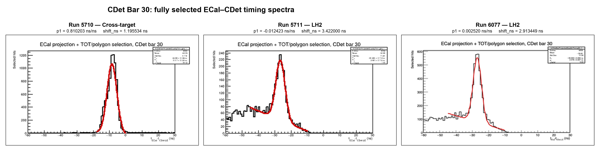

# CDet Bar 30 Timing Comparison Across Three Runs

This comparison shows the fully selected lower-left panel from the Bar 30
amalgamated timing canvas for three calibrated runs. Run 5710 is a
cross-target run; Runs 5711 and 6077 are LH2 coincidence runs.

The constants shown in the figure are:

| Run | Target/trigger category | `p1` (ns/ns) | `shift_ns` (ns) |
|---:|:---|---:|---:|
| 5710 | Cross-target | 0.810203 | 1.195534 |
| 5711 | LH2 | -0.012423 | 3.422000 |
| 6077 | LH2 | 0.002520 | 2.913449 |

For Run 5710, the diagnostic Gaussian-plus-linear fit uses `-18 < t_ECal -
t_CDet < 0 ns`, which contains the complete peak near `-8 ns`. The previous
`-45 to -10 ns` interval ended on the rising shoulder and therefore did not
describe the peak. The regenerated fully selected fit gives `mu = -8.485 ns`
and `sigma = 3.017 ns`.

## Why the peak moves while `shift_ns` remains similar

The horizontal variable in these spectra is not the corrected CDet time by
itself. It is the ECal--CDet difference

$$
x_{\mathrm{plot}} = t_{\mathrm{ECal}} - t_{\mathrm{CDet}}^{\mathrm{corr}}
$$

The corrected CDet leading-edge time is constructed schematically as

$$
\begin{aligned}
t_{\mathrm{CDet}}^{\mathrm{corr}}
={}&t_{\mathrm{CDet}}^{\mathrm{raw+pixel}}
-\left(p_0+p_1t_{\mathrm{ECal}}\right) \\
&+\delta-\mathrm{TW}(\mathrm{ToT})+\mathrm{shift}_{ns}
\end{aligned}
$$

Consequently,

$$
x_{\mathrm{plot}} = t_{\mathrm{ECal}} - t_{\mathrm{CDet}}^{\mathrm{corr}}
$$

Increasing `shift_ns` by $\Delta$ increases the corrected CDet time by
$\Delta$, and therefore moves this histogram to the left by only
$\Delta$. The histogram position also moves directly with the
trigger-relative ECal ADC time.

For Run 5710, ECal supplies the singles trigger timing and its self-timing peak
is near $+22$ ns. For the LH2 coincidence runs, HCal supplies the trigger
timing and the selected ECal ADC-time peak is near 0 ns. After calibration, the
projected-half-bar CDet pair-mean peak is placed near 30 ns in every run. The
expected ECal--CDet peak positions are therefore approximately

$$
\begin{aligned}
\text{Run 5710:}\quad &22\ \mathrm{ns}-30\ \mathrm{ns}
  \simeq -8\ \mathrm{ns}, \\
\text{LH2 runs:}\quad &0\ \mathrm{ns}-30\ \mathrm{ns}
  \simeq -30\ \mathrm{ns}.
\end{aligned}
$$

This accounts for the roughly 18--22 ns displacement between the Run 5710 and
LH2 Bar 30 peaks.

The run-specific `shift_ns` has a different purpose. Its calibration procedure
uses the absolute corrected-CDet projected-half-bar pair-mean spectrum and
recenters its fitted core at 30 ns. It does **not** align the ECal--CDet
difference spectrum to a common position. The similar few-nanosecond values of
`shift_ns` mean that, after applying the pixel offsets, detector-wide `p0` and
`delta`, time-walk correction, and applicable `p1` correction, the remaining
CDet timing-origin correction is only a few nanoseconds for each run.

Thus there is no contradiction between the large displacement in the plotted
ECal--CDet peaks and the relatively similar `shift_ns` constants. Most of the
plotted displacement records the change in the ECal ADC-time origin caused by
the different trigger conditions. A more descriptive name for `shift_ns` would
be `cdet_final_origin_shift_ns` or `cdet_recenter_ns`: it is a residual CDet
recentring constant, not an ECal--CDet trigger-offset measurement.

The same comparison is also available as
[a PDF](CDet_bar30_three_run_comparison.pdf).
