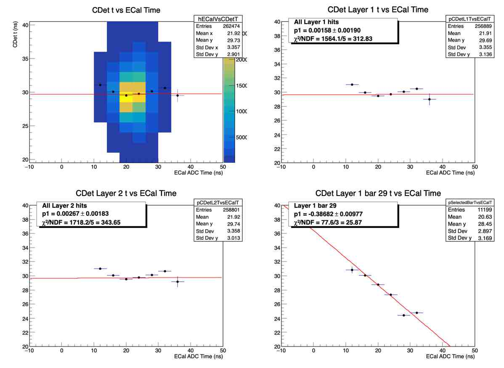
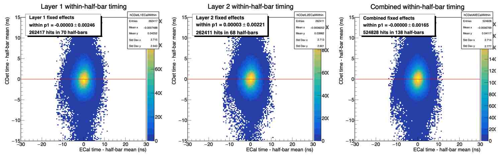
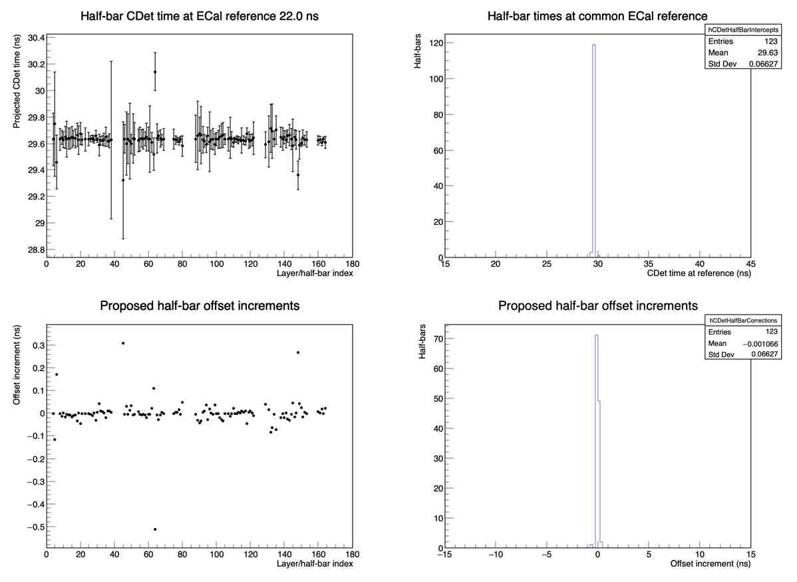
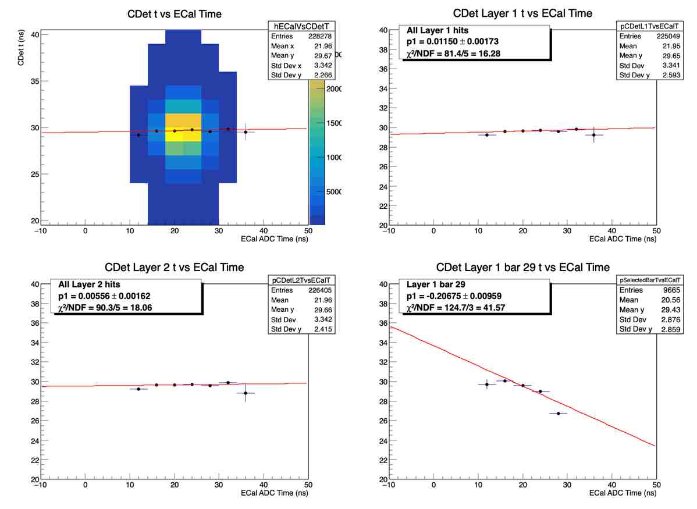

# CDet Cross-Target Timing Calibration

## Purpose

This note documents how the current cross-target analysis calculates and
applies CDet timing offsets. The principal implementation is in
`PlotElastic_Calibration_Master_stageflag_singlefile_crosstarget.C`, with the
automated sequence in `Run_CDet_Calibration_TwoPass_InSession_AllCross.C`.

The current workflow calculates one offset for each of the 2,688 logical CDet
pixel/channel IDs. It does not calculate only one offset for each 16-pixel
bar. Some variable and function names use "paddle" for a logical pixel, so the
logical ID should be checked when interpreting output.

## Timing value retained by the main analysis

For an accepted hit in logical pixel `i`, the stored CDet leading-edge time is

```text
t_CDet,i = 0.01 * t_TDC - t_reference + O_i(existing)
```

where:

- `0.01` converts the stored TDC value to ns;
- `t_reference` is the event reference-channel time when reference timing is
  enabled, and zero otherwise; and
- `O_i(existing)` is the pixel offset loaded from the active calibration file.

The offset is therefore an additive correction to both the CDet leading and
trailing edge. ToT is not shifted.

Before entering the calibration vectors, a hit must pass the main analysis
selection. This includes:

- CDet leading-edge and ToT limits;
- the ECal ADC timing window specified by the authoritative run configuration;
- valid ECal reconstruction;
- ECal-to-CDet x and y matching;
- the configured Layer-1 and Layer-2 occupancy limits; and
- the requested `layer_choice`.

With the usual `layer_choice = 3`, the event must contain at least one accepted
hit in each CDet layer. The later per-pixel extraction does not itself require
that an individual hit be paired with an opposite-layer hit.

## Per-pixel ECal-CDet spectra

The all-cross drivers now use the production hierarchical extractor:

```cpp
extractHierarchicalCDetPixelTimingOffsets(true, "hierarchical_pass1_offsets")
```

For every retained hit in pixel `i`, this function fills

```text
delta_t_i = t_ECal - t_CDet,i
```

into a separate histogram for that logical pixel. It also applies an ECal
energy selection, which defaults to:

```text
1 GeV <= E_ECal <= 12 GeV
```

The current production settings are:

```text
Histogram range:  -60 to +30 ns
Group/broad range: -30 to +10 ns
Minimum group entries: 100
Minimum individual entries: 35
Allowed sigma:    0.5 to 8 ns
Maximum individual chi2/NDF: 15
Minimum signal significance: 1.5
```

## Peak fitting

Each 16-pixel bar is divided into contiguous groups 0--7 and 8--15. Actual
counts from the instrumented pixels in each group are summed without
normalization and fitted with a Gaussian signal plus linear background:

```text
f_i(delta_t) = Gaussian(A_i, mu_i, sigma_i) + a_i + b_i * delta_t
```

The ROOT expression is:

```cpp
gaus(0) + pol1(3)
```

The group centroid seeds an adaptive individual fit window with a half-width
between 4 and 8 ns. A valid constrained individual centroid is used directly.
If that fit fails, the group centroid is used. Group chi-square is diagnostic
only because the sum need not itself be Gaussian.

If the group fit is invalid, sufficiently populated pixels are instead fitted
independently across the full -30 to +10 ns interval. A valid result is labeled
`individual_broad_fallback`; otherwise the existing pixel offset is retained.

A fit is rejected when, among other checks, it has insufficient entries,
invalid parameters or uncertainties, a centroid too close to the fit boundary,
a sigma outside the configured limits, a nonpositive amplitude, an invalid
number of degrees of freedom, or excessive chi2/NDF. Known unused pixels are
also excluded.

## Detector-wide reference

The detector reference `mu_0` is the median of all valid constrained and broad
individual-fit centroids. If none are available, the median of valid group
centroids is used. This robust reference prevents a small number of unusually
precise or pathological fits from dominating the common timing origin.

The residual correction for pixel `i` is

```text
c_i = mu_i - mu_0
```

and the stored total offset becomes

```text
O_i(new) = O_i(existing) + c_i
```

This sign follows from the fact that the offset is added to the CDet time:

```text
delta_t_i(new)
  = t_ECal - (t_CDet,i + c_i)
  = mu_i - (mu_i - mu_0)
  = mu_0
```

Thus, after applying the residual correction, every valid pixel peak should be
aligned with the detector-wide reference. A rejected or low-statistics pixel
receives no new residual; any previously loaded offset is retained.

## Calibration stages and iteration

The clean automatic cross-target sequence is:

1. Stage 0: inspect the uncalibrated timing.
2. Stage 1: fit ECal-CDet pixel offsets.
3. Stage 8: obtain the first absolute ECal fit with pixel offsets applied but
   no pre-existing ECal correction. This fit also stores the detector-wide
   `delta` needed to place corrected times at the target mean.
4. Stage 6: fit the layer-dependent ToT time walk.
5. Repeat stages 1, 3, and 6 with the existing corrections loaded.
6. Stage 7: apply all corrections and perform a final residual pixel-offset
   closure pass.
7. Run stage 7 again to inspect the final calibrated state.

The stages control which corrections are applied while constructing the
in-memory hit times:

```text
Stage 0: no calibration
Stage 1: fit pixel offsets; existing pixel offsets are applied when available
Stage 2: apply pixel offsets
Stage 3: fit ECal timing using pixel offsets
Stage 4: apply pixel offsets and ECal timing correction
Stage 5: inspect time walk after pixel and ECal corrections
Stage 6: fit time walk after pixel and ECal corrections
Stage 7: apply pixel, ECal, and time-walk corrections
Stage 8: refit ECal timing with pixel and time-walk corrections applied
```

Because each offset fit adds a residual to the previously loaded constant, the
sequence is iterative rather than a replacement calculation.

## Running the full workflow

For an ordinary single cross-target run, start a fresh ROOT session and compile
the self-contained driver with ACLiC:

```cpp
.L Run_CDet_Calibration_TwoPass_InSession_AllCross_Individually.C+
Run_CDet_Calibration_TwoPass_InSession_AllCross_Individually(
    "CDet_run5710_projection.conf")
```

The configuration file is authoritative for the run, event selection,
geometric and timing cuts, and diagnostic ranges. A calibration stage may
override only `analysis.calibration_stage`, and an explicit test event limit
may override only `analysis.events`. Every stage prints its configuration and
effective principal cuts. The legacy positional overload remains available
for historical macros but is not the commissioned production interface.

The default cleanup argument is `removeExistingCalibrationFile=true`, which
starts from scratch by removing `CDet_calibration_dt.dat`. Set that final
argument to `false` only when deliberately continuing from the currently
active calibration. Each of the three pixel-offset passes now calls the
hierarchical production extractor and stops the sequence if extraction fails.
On a clean start, the driver explicitly invalidates all legacy in-memory
defaults. The first ECal fit uses Stage 8; using Stage 3 at that point would
incorrectly apply constants merely because an earlier pixel-offset pass had
written them to the shared file.

### Qualified Run 5710 reproduction

Run 5710 has a dedicated, reviewed workflow. The historical gold file was the
endpoint of many developmental and interactive operations and is not expected
to be reproduced parameter-for-parameter by a clean modern fit. Instead, the
qualified workflow must reproduce timing performance that has passed the
matched visual acceptance test.

For the complete commissioned procedure, first preserve and move both
`CDet_calibration_dt.dat` and `CDet_run5710.dat` out of `scripts/cdet`. Then,
from a fresh ROOT session, run:

```cpp
.L Run_CDet_Calibrate_Run5710_FromScratch.C+
Run_CDet_Calibrate_Run5710_FromScratch()
```

This uses `CDet_run5710_projection.conf` authoritatively, builds the accepted
master through `Run_CDet_Calibration_Run5710_Accepted.C`, regenerates the ECal
window proposal for the audit trail, and creates `CDet_run5710.dat` by fitting
the final run timing origin. The driver refuses to run unless both output
calibration files are absent.

To reproduce both commissioned cross-target results from scratch in one ROOT
session, preserve and move all three output files
`CDet_calibration_dt.dat`, `CDet_run5710.dat`, and `CDet_run5992.dat` out of
`scripts/cdet`, then run exactly:

```cpp
.L Run_CDet_Reproduce_5710_5992_FromScratch.C+
Run_CDet_Reproduce_5710_5992_FromScratch()
```

The wrapper first executes the complete accepted Run 5710 calibration and
checks its rounded production constants. It then writes the generated Run
5710 master `p1` into the Run 5992 artifact, fits only Run 5992 `shift_ns`, and
checks both final run files against the commissioned values. It stops before
Run 5992 if Run 5710 does not reproduce. Run it from `scripts/cdet` in a fresh
ROOT process; no positional arguments, manual constant edits, or intermediate
ROOT commands are required.

This procedure:

1. removes `CDet_calibration_dt.dat` and runs the corrected clean automatic
   sequence over all Run 5710 events;
2. applies the preserved set of 102 human-reviewed pixel-quality cuts;
3. refits the within-half-bar ECal slope;
4. applies one half-bar intercept-alignment pass;
5. repeats the ECal closure fit and writes final closure diagnostics; and
6. sets `gLastCalibrationSequenceSucceeded=true` only if every required stage
   and fit succeeds.

Do not substitute a different cut file silently. The default reviewed cut
artifact is:

```text
CDet_run5710_halfbar_aligned_final_archive/
  CDet_pixel_quality_cuts_run5710_halfbar_aligned_final.root
```

The accepted 2026-09-11 result and its side-by-side gold comparison are in:

```text
CDet_run5710_reproducible_workflow_acceptance/
```

Open that directory's `README.md` and repeat its eight-point human review
before accepting a result from a different installation, code revision, ROOT
version, or input dataset. Exact calibration constants are diagnostic; the
acceptance decision is based on matched calibrated observables.

For a combined ECal cross-target group, load and call
`Run_CDet_Calibration_TwoPass_InSession_AllCross.C`; its calibration and
diagnostic output names include the group index.

## Other timing corrections

### ECal timing correlation

Accepted Layer-1 and Layer-2 hits are paired. For each pair,

```text
t_pair = (t_L1 + t_L2) / 2
```

A profile is fitted with

```text
<t_pair> = p0 + p1 * t_ECal
```

When the ECal correction is enabled, the macro applies

```text
t' = t - (p0 + p1 * t_ECal) + delta + s_run
```

where `delta` is the fixed detector-wide shift determined from the calibration
run and stored in the master calibration file. It is not recalculated for each
physics dataset. `s_run` is an optional run-dependent timing shift loaded from
`CDet_run<run>.dat`; it accounts for trigger or run timing changes without
changing the detector calibration.

The master file therefore records all three ECal timing constants explicitly:

```ini
[ECalTiming]
p0 14.807420
p1 0.810203
delta 31.680784
```

For compatibility, a legacy calibration file without `delta` can still be
read. The macro warns and uses the historical sample-dependent recentering for
that invocation. Rewriting the calibration upgrades the file by storing the
resulting `delta`. Production and cross-run comparisons should use a file with
an explicit `delta`.

### ToT time walk

Time walk is fitted separately for Layer 1 and Layer 2 using a dependence on
`1/sqrt(ToT)`. The applied correction is

```text
t' = t - p1_layer * (1/sqrt(ToT) - 1/sqrt(ToT_reference,layer))
```

The correction is zero at the layer's reference ToT.

### Run-dependent timing overrides

For a single run, the macro looks for `CDet_run<runNumber>.dat`. The file may
override the detector-wide ECal timing parameters without changing the pixel
offsets or time-walk calibration:

```ini
[ECalTiming]
p0 <optional run-specific value>
p1 <optional run-specific value>
```

Only keys present in the run file are overridden; omitted keys retain their
values from `CDet_calibration_dt.dat`. A run-specific `p1` should be introduced
only when the run provides statistically compelling evidence that the
detector-wide slope is inadequate. The commissioned Run 5992 result retains
the Run 5710 slope and fits only the additive timing origin.

Before fitting a run-specific `p1`, determine and approve that run's ECal
timing window from the one-dimensional per-block `earm.ecal.a_time` spectrum:

```cpp
.L Run_CDet_Select_ECalTimingWindow.C+
Run_CDet_Select_ECalTimingWindow(RUN)
```

This creates `CDet_runRUN_ECalTimingWindow_PROPOSAL.{png,pdf,root}` and prints
an automatic peak-window proposal. The proposal is advisory: the macro does
not modify the configuration. Inspect the linear and logarithmic panels and choose
the physical peak boundaries. Record the explicit human approval with:

```cpp
Run_CDet_Select_ECalTimingWindow(RUN, true, APPROVED_MIN, APPROVED_MAX)
```

This atomically updates the authoritative run configuration:

```text
analysis.ecal_time_min: <approved lower boundary in ns>
analysis.ecal_time_max: <approved upper boundary in ns>
```

Both run-specific calibration drivers require those explicit keys and stop if
they are absent or invalid. Selection cuts belong only in `.conf`; `p1` and
`shift_ns` remain run calibration constants in `CDet_runRUN.dat`. The control
selections approved here are
10--35 ns for run 5710 and -15--15 ns for run 5992.

The proposal histogram is built from the per-block `earm.ecal.a_time` branch.
The production event selection is applied to the reconstructed-cluster scalar
`earm.ecal.adctime`; therefore, verify that the approved window selects the
same physical peak in both variables. A run with abnormal ECal reconstruction
can have many block ADC entries but few valid reconstructed clusters.

#### Calibrating an additional run

Keep the accepted Run 5710 `CDet_calibration_dt.dat` fixed. Preserve any
existing `CDet_runRUN.dat`, seed the run with the master `p1`, and determine
the run-dependent timing origin first:

```cpp
.L Run_CDet_Calibrate_RunTimingShift.C+
Run_CDet_Calibrate_RunTimingShift(RUN)
```

Then evaluate the combined fixed-effects ECal slope reported by
`plotCDetLayersTimeComp`. If it is statistically consistent with zero, retain
the master `p1`; this is the preferred, parsimonious result. Fit a run-specific
`p1` only if the residual slope is significant and the run has adequate,
representative statistics:

```cpp
.L Run_CDet_Calibrate_RunSpecificP1.C+
Run_CDet_Calibrate_RunSpecificP1(RUN)
```

If `p1` is changed, refit `shift_ns` afterward. Both drivers derive
`CDet_runRUN_projection.conf` from `RUN` and use its analysis selections
authoritatively. The resulting run file contains only calibration constants;
it does not duplicate selection cuts.

For final calibrated analysis in a fresh ROOT session, use the configuration
for both the data-loading call and the plotting call:

```cpp
.L PlotElastic_Calibration_Master_stageflag_singlefile_crosstarget.C+
PlotElastic_Calibration_Master_stageflag_singlefile_crosstarget(
    "CDet_runRUN_projection.conf");
plotCDetLayersTimeComp("CDet_runRUN_projection.conf");
```

Do not mix the legacy positional loader, for example
`PlotElastic_Calibration_Master_stageflag_singlefile_crosstarget(RUN,-1)`,
with a configuration-driven plotting call. The plotting call consumes the
sample already constructed by the loader and cannot retroactively change its
event selection.

Saved per-pixel LE-versus-ToT polygons are essential when deriving or
reviewing the detector-wide pixel offsets. They are not applied by the
run-specific `p1` driver, the `shift_ns` driver, or
`plotCDetLayersTimeComp`. Those paths still apply the rectangular LE/ToT,
ECal, geometry, layer-coincidence, and pair-quality cuts from the analysis and
display configuration.

The same file may also specify a final additive run-dependent shift:

```ini
[GlobalTiming]
shift_ns <value>
```

The complete correction chain is therefore:

```text
raw TDC -> pixel offset -> ECal correction -> time walk -> run-global shift
```

#### Determining the run-global shift

Use the detector-wide Run 5710 ECal slope unless a new run demonstrates a
statistically significant residual dependence. Determine the run timing origin
with that fixed slope by running:

```bash
root -l -b -q 'Run_CDet_Calibrate_RunTimingShift.C+(RUN,-1,30.0,5.0,"CDet_runRUN_projection.conf")'
```

If the final argument is omitted, the driver constructs that filename from
`RUN`. The `analysis.run_number` inside the configuration must match `RUN`.

`Run_CDet_Calibrate_RunTimingShift.C` uses the final Stage-7 correction chain
and defines the run origin from the accepted Layer-1/Layer-2 pair mean

```text
t_pair = (t_L1 + t_L2) / 2.
```

The Gaussian-core interval is centered on the accepted sample mean and extends
5 ns on each side. If its fitted centroid is `mu_core`, the update is

```text
s_run(new) = s_run(loaded) + 30 ns - mu_core.
```

The reporting histogram's bin grid is also centered on the unbinned sample
mean. Centering both that grid and the fit interval on the observed sample,
rather than fixing either one in absolute time, makes the estimator translation
invariant and removes any dependence on the starting `shift_ns`. During this procedure,
the configured hit-time and ECal-minus-CDet cuts are evaluated in the
pre-`s_run` coordinate. Reported and fitted times include `s_run`. Consequently
the before/after analyses must contain exactly the same accepted pairs and the
ECal fixed-effects slope must remain unchanged.

The driver atomically creates or updates only `[GlobalTiming] shift_ns`,
preserving any run-specific ECal keys. It reruns the complete analysis and
requires the fitted centroid to agree with 30 ns within
`max(0.020 ns, 3*sigma_mu)`. One deterministic residual correction is applied
when the first closure pass misses that tolerance. A run is accepted only when
the final centroid and exact accepted-pair population gates both pass.

The commissioned files are:

```ini
# CDet_run5710.dat: the ECal slope comes from the master file
[GlobalTiming]
shift_ns 1.195534
```

```ini
# CDet_run5992.dat
[ECalTiming]
p1 0.810203

[GlobalTiming]
shift_ns 5.171528
```

Their authoritative ECal selection windows are stored separately in
`CDet_run5710_projection.conf` and `CDet_run5992_projection.conf`.

Their full-statistics closure results were:

| Run | Final core centroid (ns) | Accepted pairs before/after | Fixed-effects ECal slope (ns/ns) |
|---:|---:|---:|---:|
| 5710 | 30.0000 +/- 0.0042 | 217367 / 217367 | 0.000005 +/- 0.001681 |
| 5992 | 30.0000 +/- 0.0888 | 1453 / 1453 | -0.013145 +/- 0.015289 |

The configuration-authoritative Run 5992 calibration was conditionally
accepted on 2026-09-11. Its final values are the Run 5710 master slope
`p1 = 0.810203` and the run-dependent `shift_ns = 5.171528`. With `p1` fixed,
the fixed-effects residual slope is statistically consistent with zero and the
timing-origin closure gate passes. Exploratory fits showed that an independent
Run 5992 `p1` is sensitive to the shift-dependent selected sample and is not
warranted by the limited statistics. Retaining the high-statistics detector
slope and fitting only the additive run origin is the commissioned result.

Run 5992 is not statistically comparable to Run 5710. Although raw ECal ADC
data exist in essentially every event, only 196,161 of 1,132,123 events
contain a reconstructed ECal cluster, and only 49,403 reconstructed events
fall in the approved timing window. After that selection, the fully accepted
CDet-event efficiency is 4.18%, versus 9.03% for Run 5710. A cut-flow audit
showed that this remaining factor is dominated by ECal-to-CDet projected
geometry and two-layer coincidence, not by the LE, ToT, multiplicity, or pixel
polygon selections. The ECal reconstruction problem and the distinct trigger
population (`fTrigBits` 4096 rather than Run 5710's 2048) are recorded as an
upstream run-quality limitation outside the scope of CDet timing calibration.
Run 5992 should therefore be described as conditionally accepted, not as an
unqualified reference calibration.

## Output files

For a single cross-target run, the delta-t method normally writes:

```text
CDet_calibration_dt.dat
CDet_pixel_timing_fit_results.dat
```

For combined cross-target groups, it writes:

```text
CDet_calibration_dt_group<groupIndex>.dat
CDet_pixel_timing_fit_results_group<groupIndex>.dat
```

The master calibration file contains:

```ini
[PixelOffsets]
pixelID additive_offset_ns fit_entries

[ECalTiming]
p0 value
p1 value
delta value

[TimeWalk]
p1_L1 value
p1_L2 value
totref_L1 value
totref_L2 value
totmin value
totmax value
```

The `TimeWalk` `totmin` and `totmax` values record the ToT interval used to fit
the layer-dependent time-walk coefficients. They do not limit application of
the correction. Once fitted, the coefficients are applied to every good hit;
the authoritative `analysis.tot_min` and `analysis.tot_max` configuration
values determine which hits enter the analysis.

The detailed fit-results file records each pixel's fit status, centroid,
uncertainty, sigma, residual correction, total offset, detector reference,
chi2/NDF, and rejection reason.

## Older direct-LE method

The macro still contains an older method in `plotAllTDC(true)`. That method
fits the direct CDet leading-edge peak for each pixel and calculates

```text
c_i = mean_global_LE - mean_pixel_LE
```

It writes the legacy `CDet_calibration.dat`. The all-cross workflow instead
uses the ECal-CDet delta-t method and `CDet_calibration_dt*.dat`. Calibration
products from the two methods should not be mixed.

## Driver argument correction

The two-pass cross-target drivers previously contained stale positional calls
of the form:

```cpp
plotCDetLayersTimeComp(true, 1.0, -15, 15, ...)
```

The current function signature starts with:

```cpp
plotCDetLayersTimeComp(bool overwrite, int pixelBase, double Width, ...)
```

That stale call was interpreted as approximately:

```text
pixelBase = 1
Width = -15
```

The negative histogram width failed validation, stopping the automated
calibration sequence at its first stage-3 ECal fit. The affected combined-run,
individual-run, non-group two-pass, and basic drivers have been corrected by
inserting `pixelBase = 416` before the histogram width. Their stage-3 calls now
use the current 10--35 ns ECal ADC timing range and a -60--30 ns ECal-minus-CDet
timing range instead of the obsolete 95--125 ns and -104 to -60 ns ranges.

## Historical artifact caution

The checked-in `CDet_pixel_timing_fit_results.dat` was generated with an older
positive delta-t convention/range, including a 70--120 ns fit interval. It is
useful evidence of the algorithm's previous operation, but it is not evidence
of a calibration generated with the current negative default ranges.

## Hierarchical production method and standalone diagnostic

`extractHierarchicalCDetPixelTimingOffsets()` is the production method used by
the two full cross-target drivers. The underlying
`extractHierarchicalCDetPixelTimingOffsetsDiagnostic()` can still be run
without activating its candidate calibration for focused studies. The method divides each 16-pixel
bar into contiguous groups 0--7 and 8--15, sums the actual counts from all
eight pixels, and requires at least 100 total entries in the -30 to +10 ns
group-fit interval. Individual pixels are not normalized before summing. An
individual fit requires at least 35 entries in that same broad interval and a
fitted signal significance of at least 1.5.

The valid group centroid defines an adaptive individual fit window with a
half-width between 4 and 8 ns. It does not require the fitted individual
centroid to be within 2 ns of the group centroid. Individual fit failures use
the group centroid and are labeled `group_fallback`; other results are labeled
`individual_fit`, `retained_existing`, `unavailable`, or `unused`.

The group fit's chi-square per degree of freedom is retained as a diagnostic,
but it does not invalidate the entire group. A raw-count sum can be
non-Gaussian because its pixels have different offsets or cross-talk peaks;
the group fit is used only to provide a starting centroid for the constrained
individual fits. The chi-square quality requirement remains in force for each
individual fit, with a maximum chi-square per degree of freedom of 15.

If an eight-pixel group fit is invalid, pixels with at least 35 entries fall
back to independent fits over the full -30 to +10 ns interval. These fits use
the same individual quality requirements and are labeled
`individual_broad_fallback`. A pixel retains its existing offset if both its
group fit and broad individual fit are unusable.

The standalone diagnostic never activates its candidate calibration. A
complete stage-0 run for the currently selected problem bars can be launched with:

```cpp
.x Run_CDet_Hierarchical_Timing_Diagnostic.C
```

Its principal outputs are:

```text
CDet_calibration_dt_hierarchical_stage0_candidate.dat
CDet_pixel_timing_fit_results_hierarchical_stage0.dat
CDet_pixel_timing_hierarchical_stage0.root
tdcPlots/hierarchical_stage0/
```

In the comparison plots, the dashed blue curve is the old broad individual
fit, the red curve is the constrained individual fit, and the green line is
the eight-pixel group centroid. The ROOT diagnostic file stores group
histograms under `groups/`, pixel histograms under `pixels/`, and self-contained
copies of the selected-bar histograms with their fitted curves under
`fit_overlays/barNNN/`. Draw one of those fitted histograms directly; for
example:

```cpp
TFile *f = TFile::Open("CDet_pixel_timing_hierarchical_stage0.root");
TH1D *h = f->Get<TH1D>("fit_overlays/bar029/pixel_0472_with_fits");
h->Draw();
```

Keep the file open while using the histogram. The generated PDF and PNG retain
the complete 4-by-4 bar view, including the green group-centroid markers.
With the final diagnostic settings, the run-5710 stage-0 study found 879
accepted constrained individual fits, 6 accepted broad individual fallbacks,
715 group fallbacks, and 1,088 retained existing or unused pixels. The
detector reference was -8.893 ns. The interval was refined to -30 to +10 ns to
include bar 29 group 58's dominant timing structure without as much later-time
background.

During a full workflow, the three production invocations write the active
calibration file and update the in-memory offsets before the next stage. Their
auditable products are kept separately as:

```text
CDet_pixel_timing_fit_results_hierarchical_pass1_offsets.dat
CDet_pixel_timing_hierarchical_pass1_offsets.root
tdcPlots/hierarchical_pass1_offsets/

CDet_pixel_timing_fit_results_hierarchical_pass2_offsets.dat
CDet_pixel_timing_hierarchical_pass2_offsets.root
tdcPlots/hierarchical_pass2_offsets/

CDet_pixel_timing_fit_results_hierarchical_final_closure.dat
CDet_pixel_timing_hierarchical_final_closure.root
tdcPlots/hierarchical_final_closure/
```

The combined-run driver prefixes these output tags with `groupN_` so products
from different ECal cross-target groups do not overwrite one another.

### Optional manual LE-versus-TOT population cuts

Cross-talk can create a one-dimensional timing peak that is larger than the
physical population. For an ambiguous pixel, draw a persistent two-dimensional
selection around the physical LE-versus-TOT band after running the analysis:

```cpp
editCDetPixelLeTotCut(468);
editCDetPixelLeTotCut(471);
```

The default output is `CDet_pixel_quality_cuts.root`. Each pixel directory
contains the `TCutG`, the reference LE-versus-TOT histogram, and the source run
and calibration stage. Inspect a saved selection without editing it with:

```cpp
plotCDetPixelLeVsTot(468);
```

Manual cuts are not applied implicitly. Opt in when running a hierarchical
offset pass:

```cpp
extractHierarchicalCDetPixelTimingOffsets(
    true, "manual_le_tot", "CDet_pixel_quality_cuts.root");
```

The polygon filters only the named pixel before its delta-t histogram and its
eight-pixel group sum are constructed. Pixels without a saved polygon retain
the automatic procedure. Because the polygon uses the corrected LE coordinate,
draw and apply it at the same calibration stage; do not silently reuse it after
changing offsets or time-walk constants.

### Preserved Simpson's-paradox diagnostic

Before changing the ECal timing-slope calibration, the run-5710 state that
revealed a pooled-versus-within-half-bar slope reversal was archived under:

```text
simpsons_paradox_run5710_before_correction/
```

The archive contains the source ROOT file, the 168-row half-bar fit summary,
all four 7-by-6 overview canvases, the pooled diagnostic canvas, checksums, and
a quantitative account of the covariance decomposition. In brief, 130 of
135 successful half-bar fits had negative slopes (122 by more than two
standard errors), even though the pooled CDet-versus-ECal relationship was
nearly flat. The negative within-half-bar covariance is almost cancelled by
positive covariance between half-bar means. See the archive's `README.md`
for the preserved evidence and numerical results.



*The pooled detector trend appeared nearly flat even though the selected bar
and nearly every individual half-bar had a negative slope. This was the visual
signature that motivated the fixed-effects treatment.*

### Definitive run-5710 fixed-effects calibration

The final matched calibration bundle is preserved under:

```text
CDet_run5710_fixed_effects_final_archive/
```

It contains the final calibration (`p0 = 74.192800 ns`, `p1 = 0.812267
ns/ns`), the 102 manual polygon cuts, the complete per-pixel results and ROOT
diagnostics from the final hierarchical extraction, selected fit canvases, and
the final ECal fixed-effects closure plot. After the final pixel-offset pass,
the combined residual slope was `-0.000491710 +/- 0.00165043 ns/ns`, with both
layers independently consistent with zero. The archive README records the
full extraction counts, provenance, interpretation, and primary-file
checksums.



*After the detector-wide ECal-slope correction, the residual within-half-bar
slopes in both layers and in the combined sample are consistent with zero.*

### Final half-bar intercept alignment

The remaining pooled timing dependence was traced to different half-bar
intercepts rather than a common within-half-bar ECal slope. The
`calibrateCDetHalfBarIntercepts()` diagnostic projects each half-bar to a
common ECal time, validates its intercept, and optionally adds one common
increment to the 16 pixel offsets belonging to that half-bar.

For run 5710, 123 of 168 half-bars passed the default requirements of at least
100 accepted hits and an intercept uncertainty no larger than 1 ns. Applying
the proposed increments reduced the hit-weighted between-half-bar intercept
RMS from `1.61545 ns` to `0.03961 ns`. The final common fixed-effects slope was
`0.000000028 +/- 0.00166039 ns/ns`, and the paired-layer mean-time width was
approximately `2.27 ns`. A subsequent diagnostic predicted only `0.00026 ns`
additional RMS improvement, so no further intercept iteration was applied.

The definitive matched bundle is:

```text
CDet_run5710_halfbar_aligned_final_archive/
```

Its calibration uses `p0 = 74.192800 ns` and `p1 = 0.817261 ns/ns`. The bundle
contains the applied and closure correction tables, matched polygon cuts and
pixel diagnostics, final canvases, provenance, and checksums.



*The aligned half-bar intercepts cluster at the common detector reference. The
small proposed increments in the lower panels show that another iteration
would provide negligible improvement.*



*Final run-5710 timing diagnostics, including the paired-layer timing
distribution used to quote the approximately 2.27 ns width.*
