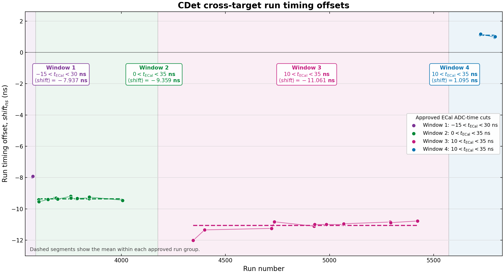
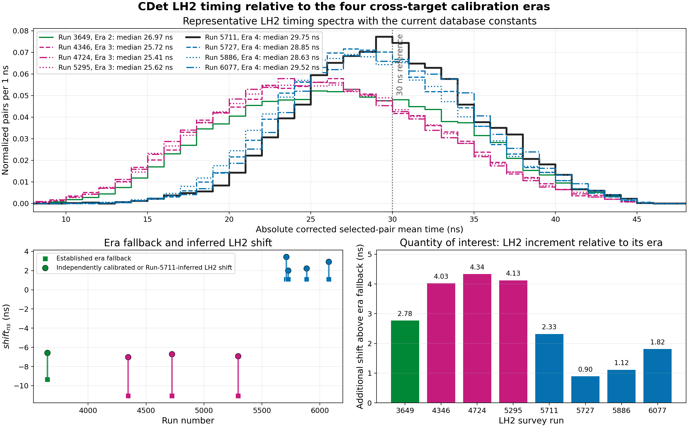

# CDet database timing eras and LH2 shift survey

## Purpose

This document records how the timestamp boundaries and fallback `shift_ns`
values in `DB/db_earm.cdet.dat` were established for the five-pass GEp data,
Run 3573 through Run 6088. It also reports the first direct test of the
additional CDet timing shift needed by representative LH2 runs relative to the
already-established cross-target shift in the same era.

The distinction is important:

- the **era fallback** is the mean `shift_ns` measured from the cross-target
  calibration runs in that stable acquisition period;
- an **LH2 increment** is an additional offset relative to that fallback and
  is permitted to depend on the target/trigger condition;
- the Ben-derived cross-target ECal slope is `p1 = 0.810602`, whereas the
  physically motivated LH2 value is `p1 = 0`.

Pixel offsets, time-walk constants, the TDC conversion, ECal `p0` and `delta`,
geometry, and pulse-quality definitions remain common across the experiment.

## Inputs and reproducibility

The era construction uses:

- `CDet_cross_target_shift_calibrations.tsv`: the accepted cross-target
  `shift_ns` fits;
- `plot_cross_target_shift_vs_run.py`: the checked-in four-group plot;
- `CDet_5pass_CODA_timestamps_updated.csv`: CODA timestamps extracted from
  `gep5_RUN.evio.0.0`;
- `CDet_runs4042_4043_CODA_timestamps.csv`: the explicitly recovered adjacent
  timestamps that fix the otherwise ambiguous Era 2/Era 3 boundary;
- `CDet_run6088_CODA_timestamps.csv`: the timestamp of the final five-pass run;
- `DB/db_earm.cdet.dat`: the timestamp-valid implementation.

The LH2 comparison uses the analyzer-backed histogram
`hCDetSelectedPairMeanCorrectedLE` in each
`CDet_runRUN_good_pulse_tdc/CDetGoodPulse_AllTDC.root`. Regenerate the summary
table and figures with:

```console
python3 plot_cdet_lh2_shift_relative_to_era.py
```

The script writes `CDet_lh2_shift_relative_to_era.tsv`, PNG, and PDF.

## Cross-target measurements and era means

Thirty-eight accepted cross-target runs divide naturally into four timing
groups. The fallback for each group is the unweighted mean of its fitted
run-specific shifts.

| Era | Cross-target calibration runs | ECal ADC-time window | Mean `shift_ns` | Run-to-run sample SD |
|---:|---|---|---:|---:|
| 1 | 3573, 3575 | -15 to 30 ns | -7.937335 ns | 0.020 ns |
| 2 | 3602 through 4006 (17 accepted runs) | 0 to 35 ns | -9.359456 ns | 0.093 ns |
| 3 | 4345 through 5423 (13 accepted runs) | 10 to 35 ns | -11.060945 ns | 0.333 ns |
| 4 | 5722 through 5795 (6 accepted runs) | 10 to 35 ns | 1.095437 ns | 0.087 ns |



The dashed horizontal segments are the four means used as database fallbacks.
The large changes between groups are much larger than the within-group scatter,
which is the empirical basis for a piecewise-constant era model.

## Timestamp boundaries used by the database

The analyzer database selects constants by event timestamp, not by a run-number
comparison. The run ranges below are therefore explanatory labels for the
timestamp-valid intervals.

| Era | Descriptive run interval | Database start timestamp | Boundary evidence |
|---:|---|---|---|
| 1 | 3573--3601 | 2025-05-09 10:09:25 (Run 3573) | First five-pass CDet run and first cross-target group |
| 2 | 3602--4042 | 2025-05-10 02:02:13 (Run 3602) | First run of the second stable cross-target group |
| 3 | 4043--5709 | 2025-05-24 07:09:25 (Run 4043) | Explicit adjacent CODA timestamps for Runs 4042 and 4043; transfers the third-group fallback into the uncalibrated gap before Run 4345 |
| 4 | 5710--6088 | 2025-08-07 01:26:21 (Run 5710) | First run of the fourth timing configuration; Run 6088 at 2025-08-25 03:15:23 closes the requested five-pass scope |

Run 4042 began at 2025-05-24 04:09:43 and Run 4043 began at
2025-05-24 07:09:25. Recovering both timestamps avoided placing the Era 3
validity boundary at a guessed time. The assignment of the Era 3 mean to Run
4043 through the first Era 3 cross-target calibration is an explicit fallback
model; it is not a direct `shift_ns` measurement of Run 4043.

Every individually calibrated cross-target run overrides its era mean with its
own fitted `shift_ns` and uses `p1 = 0.810602`. Every non-cross-target interval
resets to `p1 = 0`, the era fallback shift, the LH2 ECal timing interval, and
the LH2 pairing switches. Independently calibrated Runs 5711 and 6077 override
the fallback with `shift_ns = 3.422000 ns` and `2.913449 ns`, respectively.

## Representative LH2 survey

Five representative runs immediately following nearby cross-target data were
replayed with the current database:

```text
3649  4346  4724  5295  5727
```

Runs 5711 and 6077 supply independently calibrated Era 4 checks. Run 5711 is
used as the spectral reference for inferring the uncalibrated survey runs. The
plotted quantity is the absolute corrected mean time
of each trajectory-time-selected Layer-1/Layer-2 pair. Unlike
`t_ECal - <t_CDet>`, this quantity does not move merely because the ECal timing
centroid changes.

The distributions are broad and visibly non-Gaussian. Consequently, their
medians are used as robust location estimators; the automatic narrow Gaussian
fits are not used to determine the relative shifts.



The top panel shows the measured spectra. The lower-left panel shows the
established era fallback (square) and the LH2 shift inferred from the Run 5711
reference (circle). The lower-right panel isolates the requested quantity: the
additional shift above the contemporaneous era fallback.

## Relative-shift calculation

For a survey run, define:

```text
median correction = median(Run 5711) - median(survey run)

inferred LH2 shift = shift used in the replay + median correction

LH2 increment above era = inferred LH2 shift - cross-target era fallback
```

Run 5711 was replayed with its independently calibrated `shift_ns = 3.422000
ns`, and Run 6077 with its independently calibrated `2.913449 ns`. The five
survey runs were replayed with their era fallback. For an independently
calibrated run, the final two columns use its actual calibrated shift rather
than replacing it with the median-aligned diagnostic value.

| Run | Era | Status | Selected pairs | Era fallback | Replay shift | Pair-time median | Median correction | Comparison LH2 shift | Increment above era |
|---:|---:|---|---:|---:|---:|---:|---:|---:|---:|
| 3649 | 2 | inferred | 22,068 | -9.359456 | -9.359456 | 26.973799 | +2.776658 | -6.582798 | +2.776658 |
| 4346 | 3 | inferred | 23,501 | -11.060945 | -11.060945 | 25.718561 | +4.031896 | -7.029049 | +4.031896 |
| 4724 | 3 | inferred | 41,313 | -11.060945 | -11.060945 | 25.407272 | +4.343185 | -6.717760 | +4.343185 |
| 5295 | 3 | inferred | 30,524 | -11.060945 | -11.060945 | 25.618990 | +4.131467 | -6.929478 | +4.131467 |
| 5711 | 4 | calibrated | 7,081 | +1.095437 | +3.422000 | 29.750457 | 0.000000 | +3.422000 | +2.326563 |
| 5727 | 4 | inferred | 25,885 | +1.095437 | +1.095437 | 28.849810 | +0.900647 | +1.996084 | +0.900647 |
| 5886 | 4 | inferred | 40,917 | +1.095437 | +1.095437 | 28.628412 | +1.122045 | +2.217482 | +1.122045 |
| 6077 | 4 | calibrated | 9,848 | +1.095437 | +2.913449 | 29.520801 | +0.229656 | +2.913449 | +1.818012 |

The three Era 3 measurements are especially informative: their required
increments are `4.032`, `4.343`, and `4.131 ns`, with mean `4.169 ns` and
sample SD `0.159 ns`. That consistency is visible both in the aligned spectral
shapes and in the lower-right panel.

The complete survey does **not** support one universal LH2 increment across all
four eras. Run 3649 requires about `+2.78 ns` relative to Era 2. Within Era 4,
the independently calibrated Runs 5711 and 6077 are respectively `+2.33 ns`
and `+1.82 ns` above the fallback. Their absolute pair-time medians differ by
only `0.230 ns`, providing a useful independent consistency check. The Run
5727 and Run 5886 comparisons give smaller provisional increments of
approximately `+0.90 ns` and `+1.12 ns`. These two fallback-replayed points
agree with one another to `0.22 ns`, but not with the two independently
calibrated increments. This coherent split should be resolved with direct
closure replays rather than hidden by averaging all four Era 4 results.

## Interpretation and remaining closure test

These values answer the relative question more directly than comparing the
absolute `shift_ns` numbers: each number in the final column is the additional
LH2 offset above the cross-target timing already established for that era.

They remain **candidate increments**, not yet commissioned database constants.
The trajectory-time selection includes a timing coordinate, so changing
`shift_ns` can change the selected population slightly. Before installing the
values experiment-wide:

1. add provisional run-specific overrides for the five survey runs;
2. replay the same event samples;
3. regenerate this figure and table;
4. require the corrected medians to close consistently without a material
   change in the selected population.

For a final production determination, a timing-shift-independent frozen pair
sample would remove this last selection-feedback ambiguity.
