# CDet Hydrogen Analysis: Recent Work and Current Status

Last updated: 6 September 2026

## Purpose

This document records the recent CDet hydrogen-analysis work so that the
analysis can be resumed without reconstructing decisions from an interactive
ROOT session. It covers the synchronized hydrogen macro, CDet/ECal coordinate
and timing conventions, the event display, the run-5711 development study,
the later run-6077 validation, run-specific timing overrides, and the
detector-wide bar timing survey.

The work remains analysis-oriented. The timing-survey results described below
are diagnostic recommendations, not a new set of production calibration
constants.

## Hydrogen ECal energy spectrum

The reconstructed ECal cluster-energy spectrum for the LH2 data is strongly
weighted toward low-energy background.  The much smaller enhancement around
`3–4.5 GeV` contains the rare elastic and inelastic `(e,e'p)` candidates that
motivated the high-energy timing slice used below.  The `1.0–2.5 GeV` slice is
a useful accidental-coincidence control sample: it still contains primary
electrons traversing CDet and ECal, but not the desired elastic kinematics.

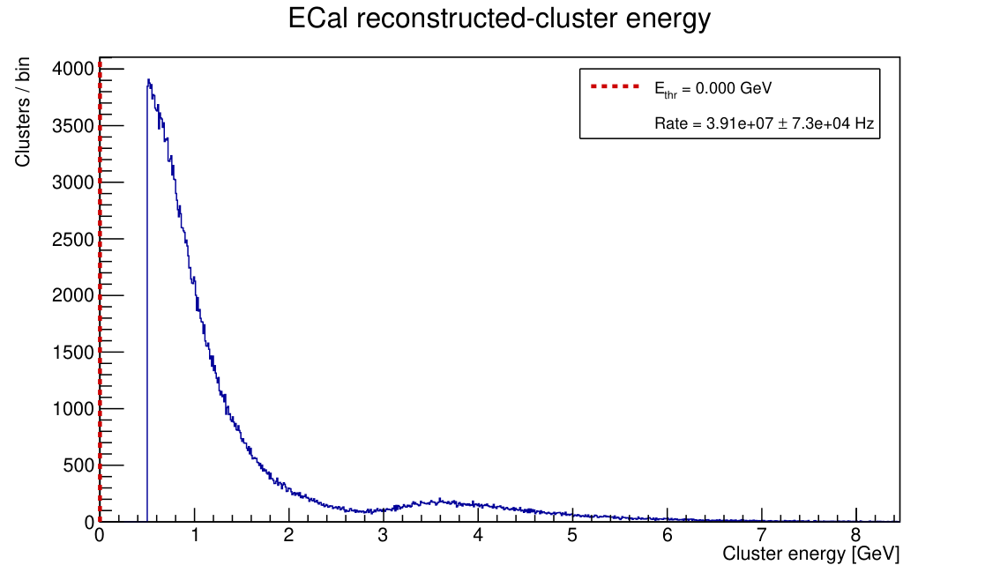

## Hydrogen analysis synchronization

`PlotElastic_Calibration_Master_stageflag_singlefile_hydrogen.C` was brought
into agreement with the authoritative detector-analysis behavior developed in
the cross-target macro while retaining hydrogen-specific run selection and
calibration-stage handling.

The synchronized behavior includes:

- ECal distance `z = 6.144 m`, based on the run database geometry.
- Correct raw-hit multiplicity lookup by physical channel.
- Same-half-bar matching between Layer 1 and Layer 2 CDet hits.
- A common timing convention:

  ```text
  dt(ECal,CDet) = t_ECal - (t_CDet,L1 + t_CDet,L2)/2
  ```

- Correct use of the Layer 2 time for Layer 2 diagnostic spectra.
- Selectable bars in `plotCDetLayersTimeComp` through a Layer 1 pixel ID.
- The same trailing x/z bin-width and range arguments as the cross-target
  routine.
- Layer-specific CDet-versus-ECal residual profiles.
- The interactive CDet event display.

The dedicated workflow is documented in
[CDet_EVENT_DISPLAY_HYDROGEN.md](CDet_EVENT_DISPLAY_HYDROGEN.md).

## CDet x-coordinate convention

CDet x positions use independently adjustable scale and offset constants for
the two layers:

```text
corrected_x(L1) = GoodX * XCorr1 - CDetXOffset1
corrected_x(L2) = GoodX * XCorr2 - CDetXOffset2
```

The current starting values are:

```text
XCorr1 = 1.07
XCorr2 = 1.07
CDetXOffset1 = 0.03 m
CDetXOffset2 = 0.03 m
```

These corrections are applied consistently to hit selection, stored hit
coordinates, CDet/ECal residuals, Layer 1/Layer 2 pairing, profile histograms,
and the event display. ECal x is not rescaled.

## Event display

The event display presents accepted events in four panels:

1. Corrected CDet and ECal positions in x-z.
2. CDet paddle extents and the ECal trajectory in y-z.
3. The CDet x-y face view, including the ECal position projected to both CDet
   layer planes.
4. Event, timing, pair, and residual details.

CDet y is represented by the physical paddle extent rather than a point,
because CDet has very little direct position resolution along a paddle. The
display supports next/previous navigation, terminal output, PNG export, and
safe recreation after its GUI windows have been closed.

Example for bar 29, using pixel 471 (bar 29 covers pixels 464 through 479):

```cpp
plotCDetLayersTimeComp(false,471,1,-15,15,-0.15,0.15,
                       0.02,60,0,70,-20,20,0,60,0,80,
                       62,130,-115,115,true,
                       0.005,-0.9,-0.5,0.01,5,7)
```

## Run-specific timing treatment

The detector-wide ECal timing correction is represented as

```text
t_corrected = t
              - (p0 + p1*t_ECal)
              + delta
              + s_run
```

`p0`, `p1`, and the fixed detector-wide restoration term `delta` belong to the
master calibration. `delta` is now stored explicitly under `[ECalTiming]` in
`CDet_calibration_dt.dat`; it is not supposed to be silently recalculated from
each physics sample.

A per-run file named `CDet_run<run>.dat` may override `p0`, `p1`, or both, but
the preferred policy is to retain the high-statistics detector-wide slope
unless a run demonstrates a significant residual dependence. The file may
also supply the final additive `[GlobalTiming] shift_ns`. Missing keys retain
their master-calibration values. Trigger or run-condition changes should
normally be handled by this additive origin without changing pixel offsets,
time-walk constants, or the ECal slope.

The current run-specific examples are:

- `CDet_run5711.dat`: run-specific `p1` for the run-5711 study.
- `CDet_run5992.dat`: the Run 5710 `p1` with a fitted run-specific
  `shift_ns`; an independent Run 5992 slope was studied but not commissioned.
- `CDet_run6077.dat`: an initial `p1` override seeded from run 5992, the
  temporally closest cross-target reference run.

`CDet_calibration_dt.run5710_established.dat` preserves the established
run-5710 calibration state as a reference snapshot.

## Bar timing survey

`surveyCDetBarTimingPeaks` surveys every physical bar using the same ECal
trajectory projection and per-pixel quality hierarchy as the focused pixel
timing diagnostic.

For each accepted hit, the survey requires:

- ECal energy within the requested slice.
- Projected ECal x within the observed bar x span, with a half-pixel margin.
- Projected ECal y within the CDet half-paddle extent.
- A saved per-pixel LE-versus-TOT polygon when available; otherwise the common
  accepted TOT interval.

The common diagnostic TOT interval is configured with:

```text
diagnostics.accepted_tot_min
diagnostics.accepted_tot_max
```

The cross-target run-5710 configuration uses `4 < TOT < 30 ns`. The LH2
run-5711 and run-6077 projection configurations use the more selective
`8 < TOT < 35 ns`, which suppresses much of the low-energy CDet background
while retaining the correlated peak. Saved per-pixel polygons remain the
highest-priority selection for exceptional channels. Explicit
`AcceptedTotMin` and `AcceptedTotMax` function arguments override the loaded
configuration; when those arguments are omitted, both
`extractCDetBarPixelTimingOffsets` and `surveyCDetBarTimingPeaks` use the
configured values.

Each bar spectrum is fitted over the configured interval with

```text
Gaussian + linear background
```

The summary status codes are:

| Code | Meaning |
|---:|---|
| 0 | Insufficient statistics |
| 1 | Rejected fit |
| 2 | Low fitted-amplitude significance |
| 3 | Excessive Gaussian width |
| 4 | Uncertain centroid |
| 5 | Unstable fitted yield |
| 6 | Recommended fit |

The recommended-fit requirements shown on the canvases are:

- Amplitude divided by amplitude uncertainty greater than 3.
- Gaussian sigma below 10 ns.
- Centroid uncertainty below 3 ns.
- Relative fitted-yield uncertainty below 100%.

Only status-6 bars are included in the centroid, width, significance, and yield
panels. The status panel itself includes every bar.

## Run 5711 focused timing studies: bars 28 and 30

Run 5711 was the development sample for the LH2 workflow. The established
run-5710 pixel offsets, per-pixel polygon selections, and layer time-walk
corrections were carried into this much higher-background coincidence-trigger
environment. The only calibration parameter changed for the run was the
detector-wide ECal timing slope `p1`, supplied by `CDet_run5711.dat`.

Bars 28 and 30 provide concrete examples of the timing structure summarized
by the detector-wide survey. Bar 30 lies in a comparatively favorable,
well-populated detector region and exhibits a particularly distinct timing
peak. Bar 28 is a useful less-ideal comparison: its individual-pixel spectra
are more complicated, but the bar-amalgamated spectrum still contains a
recognizable correlated component.

The 4-by-4 canvases show all 16 logical pixel positions belonging to each bar,
including uninstrumented channels. In each populated panel, the black
histogram is the original ECal–CDet time-difference spectrum, the dashed blue
curve is the local signal fit, the dotted magenta curve is the broad
background model, the green histogram is the background-subtracted estimate,
and the solid red curve is its fitted peak when a reliable fit is available.

The amalgamated canvases show, from upper left to lower right: all
instrumented pixels, the ECal-trajectory-selected population, the trajectory
plus accepted-TOT/manual-polygon population, and selected `dt` versus TOT.

### Physics-energy slice: 3.0–4.5 GeV

#### Bar 30

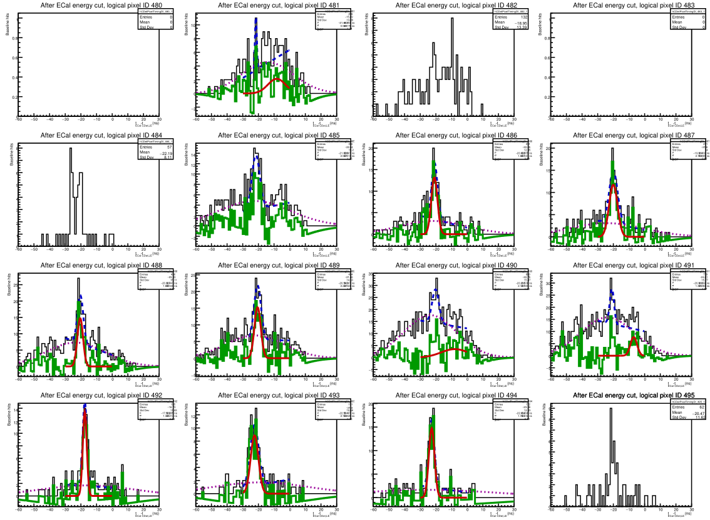

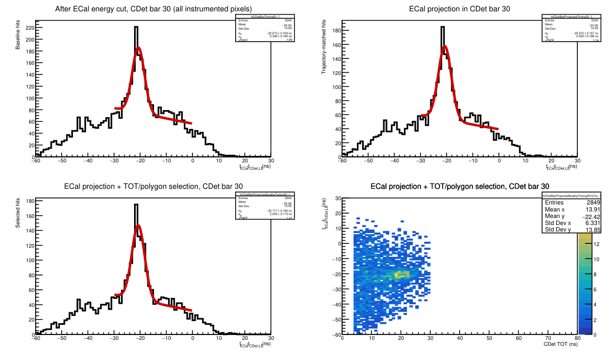

#### Bar 28

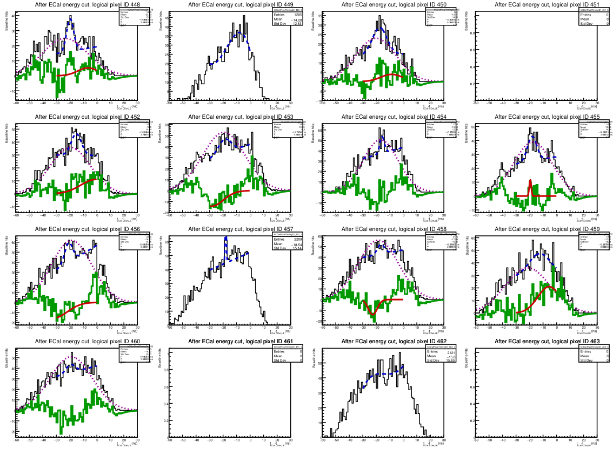

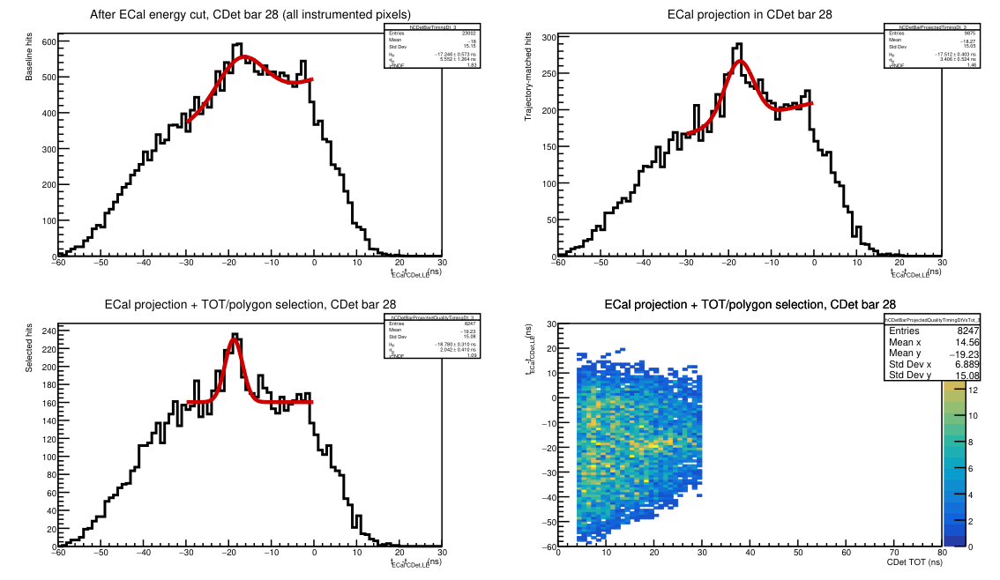

### Accidental-control slice: 1.0–2.5 GeV

#### Bar 30

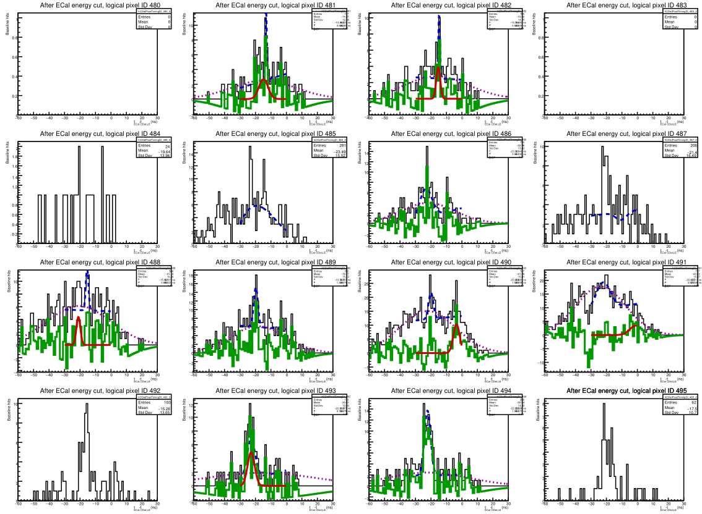

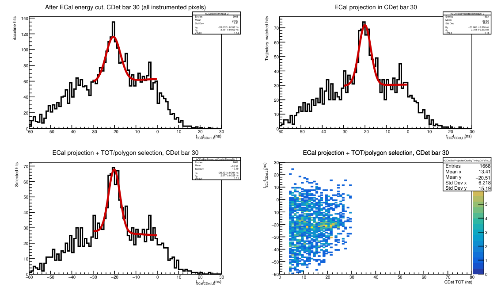

#### Bar 28

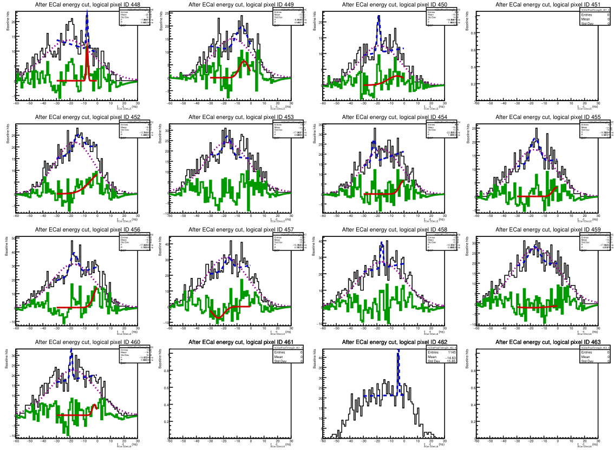

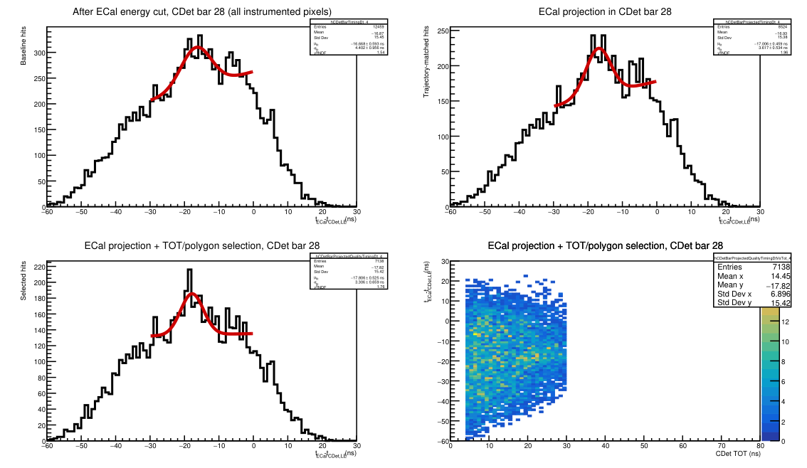

The narrow component near approximately `-20 ns` persists in both energy
slices, especially for bar 30. This is physically reasonable: the lower-energy
sample is dominated by accidental trigger coincidences, but its primary
electron can still traverse CDet and ECal and therefore produce a correlated
CDet–ECal timing peak. Events well outside that component are predominantly
the high-rate, low-energy CDet background that is uncorrelated with ECal.

## Run 5711 detector-wide survey results

The retained summary canvases are:

- [Layer 1, 3.0–4.5 GeV](cCDetBarTimingSurveyLayer1_1.jpg)
- [Layer 2, 3.0–4.5 GeV](cCDetBarTimingSurveyLayer2_1.jpg)
- [Layer 1, 1.0–2.5 GeV](cCDetBarTimingSurveyLayer1_2.jpg)
- [Layer 2, 1.0–2.5 GeV](cCDetBarTimingSurveyLayer2_2.jpg)

### 3.0–4.5 GeV ECal slice

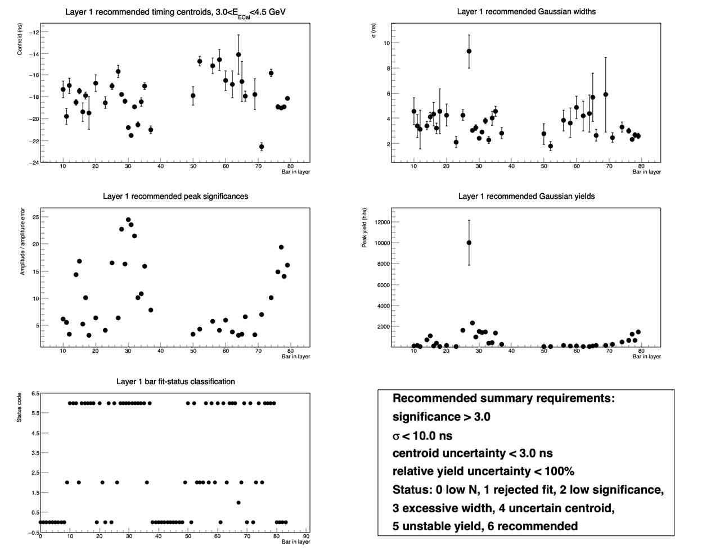

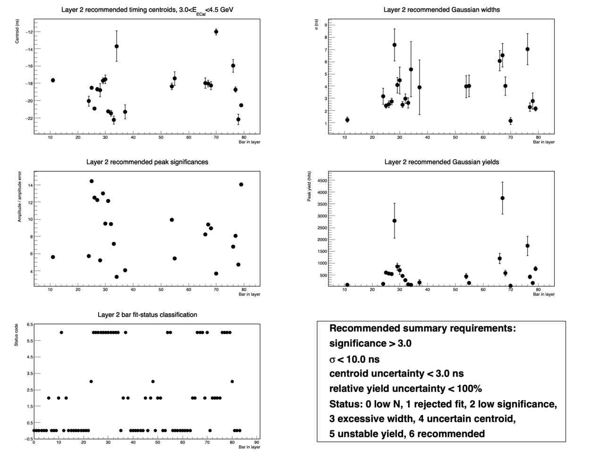

### 1.0–2.5 GeV ECal slice

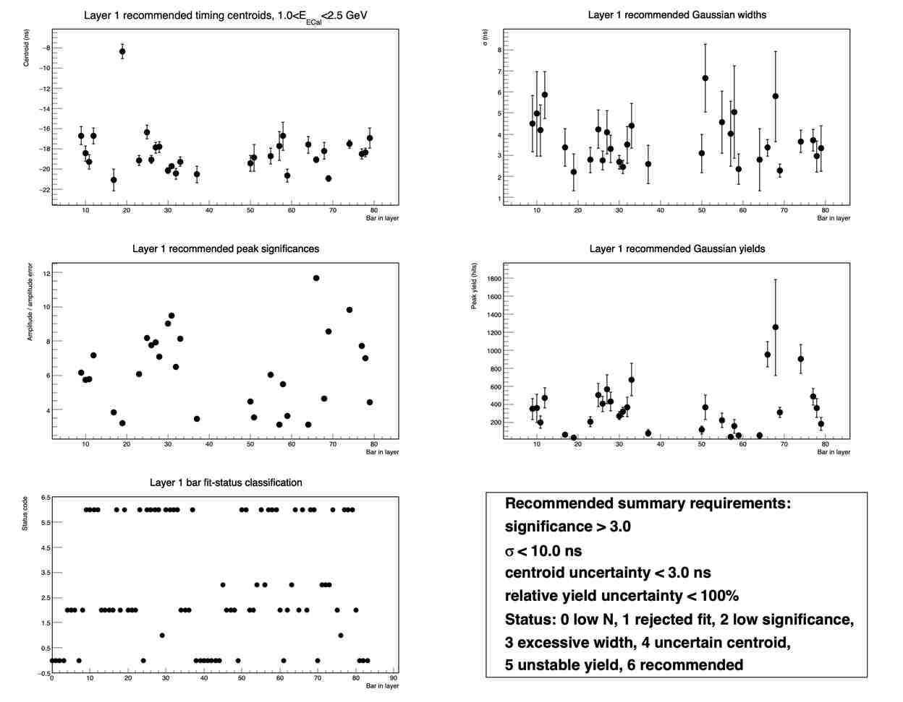

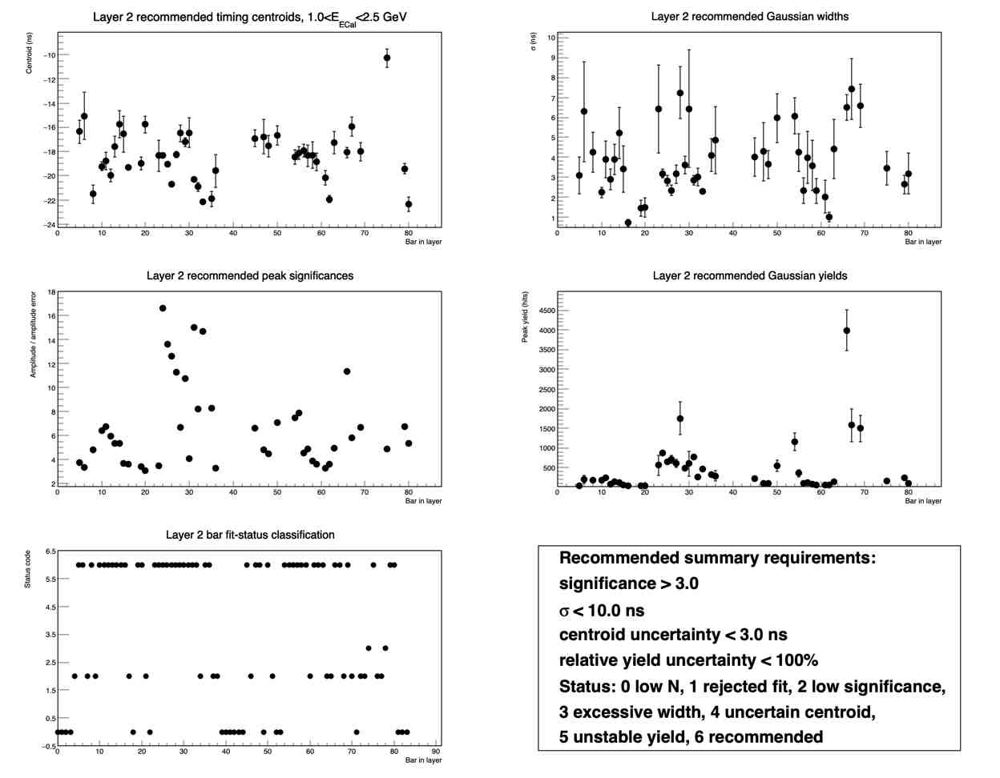

*Only fits passing the recommended-fit criteria appear in the centroid,
width, significance, and yield panels; the status panel retains every bar.*

The principal observations are:

- Most recommended centroids cluster near approximately `-18` to `-20 ns` in
  both layers and both energy ranges.
- The lower-energy sample provides substantially broader bar coverage because
  more bars meet the statistics requirement.
- The higher-energy sample has many status-0 bars. This is mainly a coverage
  and statistics limitation, not evidence that those bars have bad timing.
- Most recommended Gaussian widths are roughly `2–6 ns`, comfortably below
  the 10 ns summary threshold.
- Several well-measured centroid outliers merit inspection of their individual
  spectra, notably approximately:
  - Layer 1, low energy: bar 19 near `-8 ns`.
  - Layer 2, low energy: bar 75 near `-10 ns`.
  - Layer 2, high energy: bar 70 near `-12 ns`.
- Large-yield regions, particularly in Layer 2 near bars 27–31 and 65–69,
  coincide with high fitted-amplitude significance.
- The two energy populations look broadly compatible by eye, but the current
  summary canvases do not constitute a quantitative bar-by-bar energy test.

The plotted “significance” is specifically the fitted Gaussian amplitude
divided by its fitted uncertainty. It measures parameter precision; it should
not be interpreted as a conventional signal-over-background significance.

## Run 6077 validation

Run 6077, taken several weeks later, provided an independent LH2 test of the
workflow developed with run 5711. The established run-5710 pixel offsets,
per-pixel polygon selections, and layer time-walk terms were again retained.
Only the detector-wide ECal timing slope `p1` was changed, through
`CDet_run6077.dat`; its starting value came from run 5992, the temporally
closest cross-target reference. The focused diagnostics use the same LH2
default `8 < TOT < 35 ns` unless a saved per-pixel polygon is present.

Pixel 485 provides a direct comparison with the run-5711 study. Its ECal-CDet
time-difference spectrum retains a localized component near
`t_ECal - t_CDet,LE = -22 ns`, demonstrating that the calibrated pixel-level
timing structure remains recognizable in run 6077.

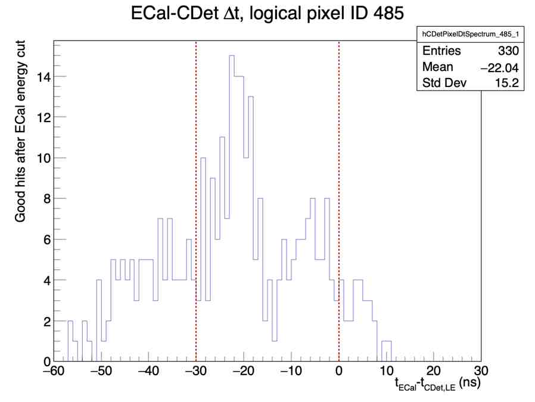

The 4-by-4 bar-30 view shows the corresponding behavior pixel by pixel. The
peak is clearest in the better-populated channels, while the remaining panels
illustrate the large uncorrelated LH2 background and the channels for which a
stable fit is not available.

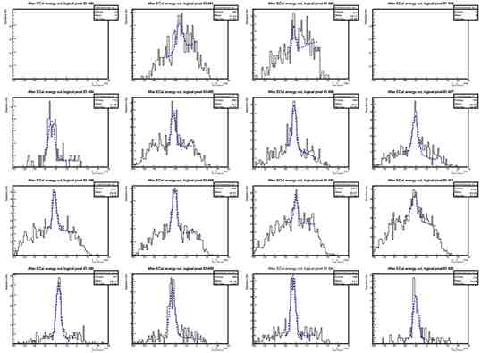

At bar level, ECal trajectory projection followed by the accepted-TOT or
manual-polygon selection makes the correlated component especially clear for
bar 30. Bar 28 is a deliberately less favorable example: it retains more
background, but the same selection exposes a consistent timing enhancement.

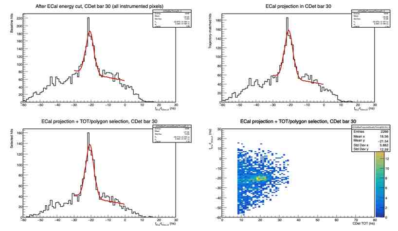

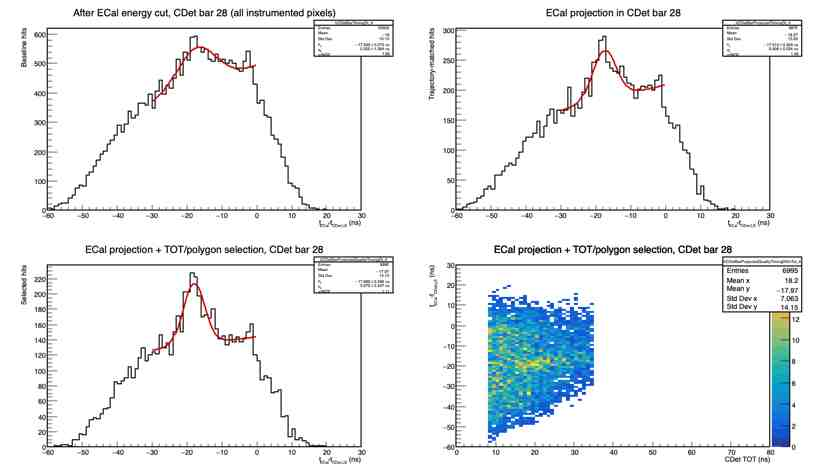

The detector-wide projected-half-bar diagnostic preserves the strong
Layer-1/Layer-2 correlation, but places the corrected-time population near
`35–36 ns` rather than the run-5710 target near `30 ns`. This is evidence for
a run-dependent common timing shift associated with the trigger/ECal timing
relationship; it is not evidence that the run-5710 pixel offsets or time-walk
calibration should be regenerated.

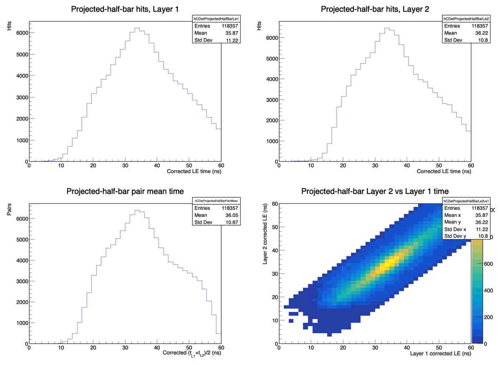

The CDet-versus-ECal diagnostic likewise shows a residual run-dependent time
slope. The appropriate follow-up is therefore to refine the run-6077 entries
in `CDet_run6077.dat`—the ECal timing parameters and, if required, the final
global shift—while keeping the established detector-relative calibration
fixed.

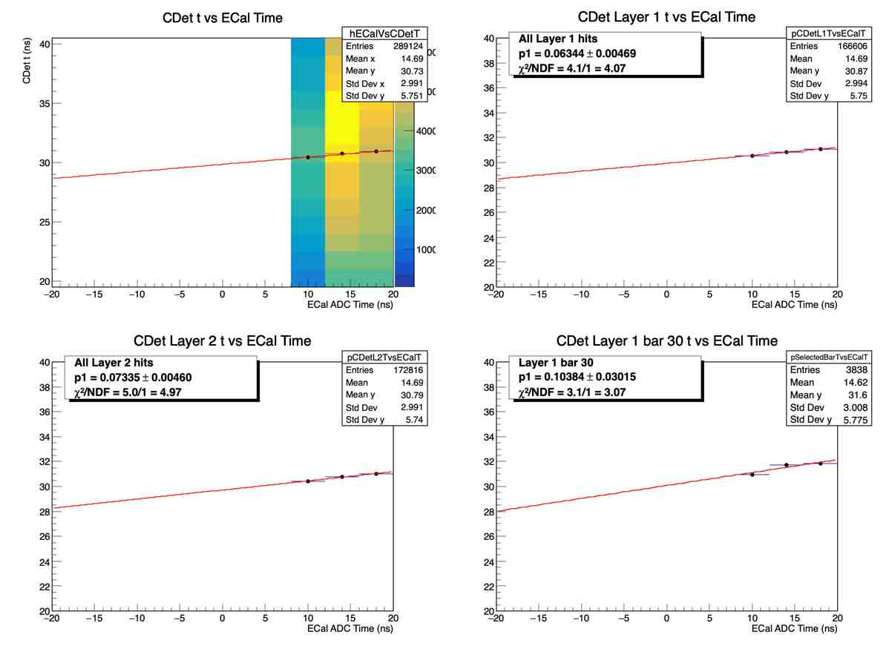

## Run 5711–6077 stability milestone

The important result is not merely that both runs contain a visible timing
peak. Run 6077 reproduces the essential run-5711 behavior several weeks later
without recalibrating the detector-relative quantities:

| Calibration component | Run 5711 to run 6077 treatment |
|---|---|
| Per-pixel timing offsets | Unchanged |
| Per-pixel LE-versus-TOT polygons | Unchanged |
| Layer time-walk corrections | Unchanged |
| LH2 default TOT selection | Unchanged: `8 < TOT < 35 ns` |
| Detector-wide ECal timing slope `p1` | Run-specific: `0.12844` for run 5711 and `1.00869` for run 6077 |

With only this one run-specific calibration parameter changed, both data sets
show a narrow correlated component near `-20` to `-22 ns`, compatible behavior
in bars 28 and 30, and a strong Layer-1/Layer-2 timing correlation. This is an
important CDet stability milestone: the run-5710 pixel-offset and time-walk
calibration transferred across distinct LH2 runs, while the changing external
trigger/ECal timing relationship was isolated in the intended per-run `p1`
override.

## Recommended next analysis

Before adopting survey centroids as calibration constants, compare the two
energy slices directly for every bar that has status 6 in both samples:

```text
Delta_mu = mu(3.0–4.5 GeV) - mu(1.0–2.5 GeV)
sigma(Delta_mu) = sqrt(sigma_mu,high^2 + sigma_mu,low^2)
pull = Delta_mu / sigma(Delta_mu)
```

The next diagnostic should contain:

1. High-energy centroid versus low-energy centroid with a `y=x` line.
2. `Delta_mu` versus bar number for each layer.
3. The centroid-difference pull versus bar number.
4. Distributions of `Delta_mu` and the pull, separated by layer.

This will distinguish among statistical agreement, a common energy-dependent
timing shift, and genuinely bar-dependent residual time walk.

The individual spectra behind the conspicuous centroid outliers should also be
reviewed before any production write. In particular, confirm that the fit has
selected the physical timing peak rather than a neighboring cross-talk peak or
an inadequately modeled background.

## Resume checklist

1. Start a clean Analyzer session and load the current macro with ACLiC.
2. Reproduce both ECal-energy surveys with diagnostic ROOT output enabled.
3. Record the status counts printed by each survey invocation.
4. Build the direct matched-bar energy-comparison plots described above.
5. Inspect the individual spectra for the centroid outliers.
6. Decide whether the energy dependence is global, regional, or bar-specific.
7. Only then generate or promote new production timing constants.
