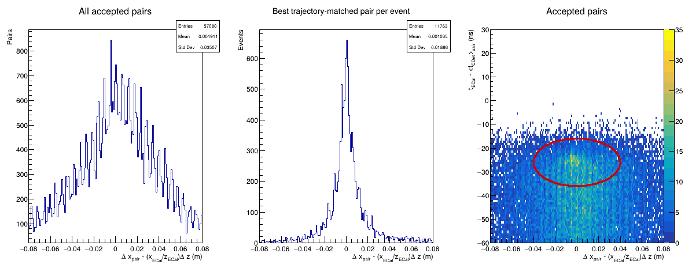
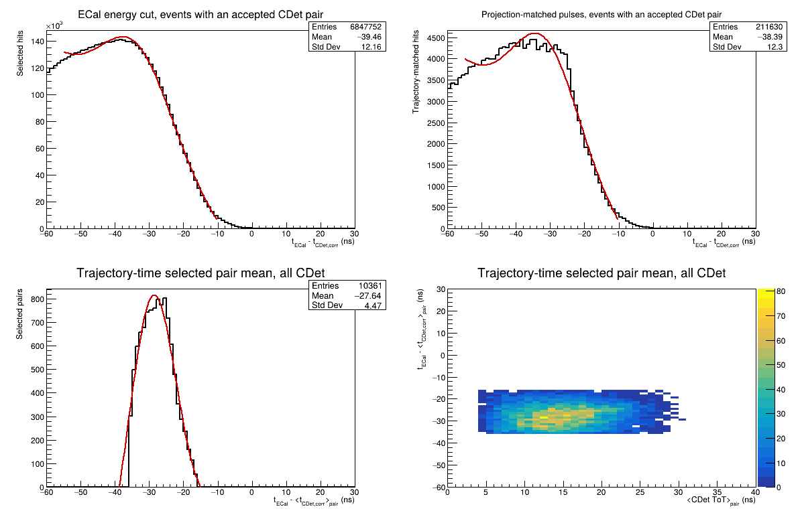
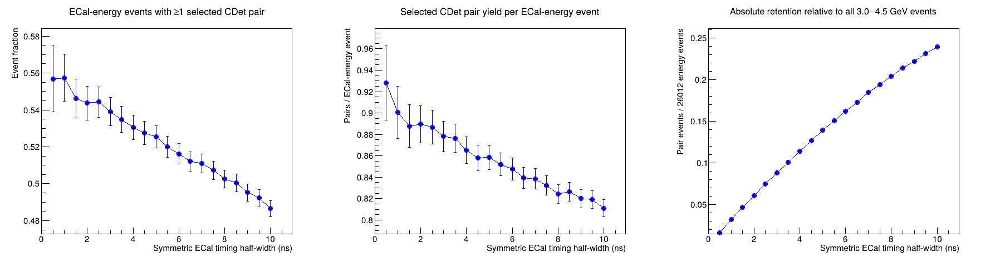
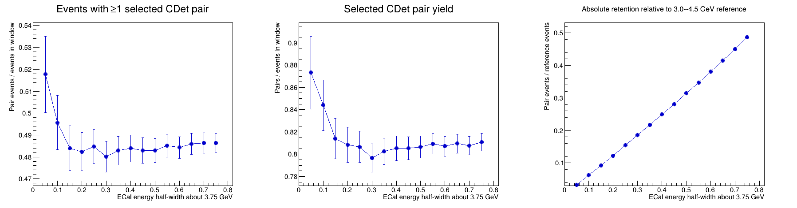

# Run 5711 CDet pair-selection study

This note records the Run 5711 study that turns the replay-level calibrated
CDet pulse and pair collections into a bounded candidate set for a later global
region-of-interest tracking algorithm. That downstream algorithm is expected to
combine ECal, CDet, GEM, and, where applicable, HCal information. Consequently,
the selection here is intended to retain plausible electron-associated CDet
pairs with manageable accidental contamination; it is not intended to make the
final track decision.

The study uses the 100,000-event Run 5711 replay dataset and the analyzer-backed
calibration in `DB/db_earm.cdet.dat`. Run 5711 uses `p1 = 0`, the calibrated
run shift, and the nominal `-10 < t_ECal < 10 ns` ECal timing window. The
figures were generated with `Plot_CDet_GoodPulseCandidates_AllTDC.C` and
`Plot_CDet_PairYieldVsECalTimingWindow.C`.

## Event and pair populations

The relevant populations must be distinguished carefully:

| Population | Count |
| --- | ---: |
| All replayed events | 100,000 |
| Events passing only `3.0 < E_ECal < 4.5 GeV` | 26,012 |
| Events also passing `-10 < t_ECal < 10 ns` | 12,776 |
| Events with at least one replay-level Layer-1/Layer-2 pair | 11,763 |
| Replay-level one-to-one pairs in the energy-selected sample | 57,080 |

The 26,012-event and 12,776-event denominators answer different questions. The
first measures absolute retention relative to all energy-selected events. The
second measures the conditional pair efficiency after the ECal timing cut. No
efficiency quoted below should be interpreted without its stated denominator.

Replay-level pairs are formed greedily and one-to-one from pulses passing the
broad-quality, ECal-eligibility, and projected-position requirements. The
initial replay score uses CDet-to-CDet time and x consistency. Multiple
non-conflicting pairs may be retained in one event.

## ECal-trajectory consistency of a CDet pair

For a straight trajectory from the target through the reconstructed ECal
position, the expected inter-layer x displacement is

```text
delta_x_expected = (x_ECal / z_ECal) * (z_L2 - z_L1).
```

Using `z_ECal = 6.144 m`, define the trajectory residual

```text
r_x = (x_L2,corr - x_L1,corr) - delta_x_expected.
```

This displacement residual is numerically preferable to dividing by the small
Layer-1/Layer-2 z separation. It is nevertheless exactly the proposed slope
comparison expressed at the CDet layer spacing. The ECal-minus-pair-mean timing
residual is

```text
delta_t_pair = t_ECal - (t_L1,corr + t_L2,corr) / 2.
```

The best trajectory-matched pair per event produces a sharp central
concentration in `r_x`: a central Gaussian fit gives a mean of `0.25 mm` and a
width of `8.45 mm`; the full best-pair distribution has an RMS of `18.9 mm`.



## Adjustable trajectory-time ellipse

The final macro-level candidate selection is a circle in normalized
trajectory-time coordinates, which appears as an ellipse on the physical-axis
plot:

```text
R^2 = ((r_x - r_x0) / s_x)^2
    + ((delta_t_pair - delta_t0) / s_t)^2.
```

The adopted center and scales are

```text
r_x0     = 0 m
delta_t0 = -26 ns
s_x      = 0.020 m
s_t      = 5 ns.
```

The radius study gave:

| Radius | Spatial semiaxis | Timing semiaxis | Events with selected pair | Selected pairs | Pair-mean timing mean | Pair-mean timing RMS |
| ---: | ---: | ---: | ---: | ---: | ---: | ---: |
| 1 | 2 cm | 5 ns | 3,008 | 3,688 | -26.28 ns | 2.34 ns |
| 2 | 4 cm | 10 ns | 6,215 | 10,361 | -27.64 ns | 4.47 ns |
| 4 | 8 cm | 20 ns | 9,630 | 25,205 | -31.93 ns | 7.61 ns |

Radius 1 defines a high-purity core. Radius 4 admits substantial asymmetric
background, demonstrated by the shifted mean and enlarged RMS. Radius 2 is the
adopted candidate-generation working point: it recovers roughly twice as many
events as radius 1 while preserving a clearly concentrated population. Some
accidentals are acceptable because the global ROI tracker will add GEM and
calorimeter constraints.

The selected timing histogram contains one entry per pair, using the pair-mean
corrected time. The individual Layer-1 and Layer-2 member residuals remain in
the ROOT output as diagnostics but are not double-counted in the headline
spectrum.



Because timing is one coordinate of the ellipse, the selected spectrum's RMS
is selection-conditioned and must not be quoted as an independent detector
timing resolution.

## Dependence on the ECal timing window

Symmetric ECal ADC-time half-widths were scanned from 0.5 to 10 ns. Pairing was
reconstructed from stored calibrated pulses rather than from the stored
`pair.*` arrays, permitting each trial window to be evaluated consistently.
The ±10 ns endpoint exactly reproduces the adopted radius-2 counts of 6,215
events and 10,361 pairs.



| ECal timing window | Events passing energy and timing | Events with selected pair | Conditional event fraction | Pairs per admitted event |
| --- | ---: | ---: | ---: | ---: |
| ±10 ns | 12,776 | 6,215 | 48.6% | 0.811 |
| ±5 ns | 6,905 | 3,629 | 52.6% | 0.859 |
| ±3 ns | 4,235 | 2,283 | 53.9% | 0.878 |
| ±2 ns | 2,897 | 1,575 | 54.4% | 0.890 |
| ±1 ns | 1,509 | 841 | 55.7% | 0.901 |

Narrowing the timing window modestly enriches the admitted sample but rapidly
reduces the absolute candidate yield. For example, changing from ±10 to ±5 ns
removes 42% of the pair-containing events for only a four-percentage-point
increase in conditional pair fraction. The production recommendation is
therefore to retain `-10 < t_ECal < 10 ns`. A ±5 ns selection is useful as a
tighter systematic or high-purity comparison.

## Dependence on the ECal energy window

The accepted `3.0 < E_ECal < 4.5 GeV` interval is symmetric about 3.75 GeV.
Symmetric windows about 3.75 GeV were scanned inward while retaining the
nominal ±10 ns timing requirement and radius-2 pair ellipse.



| ECal energy window | Admitted events | Events with selected pair | Conditional event fraction |
| --- | ---: | ---: | ---: |
| 3.0--4.5 GeV | 12,776 | 6,215 | 48.65% |
| 3.25--4.25 GeV | 8,309 | 4,013 | 48.30% |
| 3.5--4.0 GeV | 4,074 | 1,975 | 48.48% |
| 3.6--3.9 GeV | 2,442 | 1,182 | 48.40% |

Except for statistically limited fluctuations in the narrowest window, the
conditional CDet-pair fraction is flat. Narrowing the energy window therefore
removes events approximately in proportion to its width without improving the
CDet candidate population. Retain `3.0 < E_ECal < 4.5 GeV` for production
candidate generation.

## Adopted Run 5711 candidate-generation policy

For the present macro-level study and as the recommended starting point for the
global ROI tracker:

```text
3.0 < E_ECal < 4.5 GeV
-10 < t_ECal < 10 ns
pair trajectory-time center = (0 m, -26 ns)
pair trajectory-time scales = (0.020 m, 5 ns)
normalized ellipse radius = 2
```

This policy intentionally favors efficiency over standalone CDet purity. The
global ROI tracker, rather than this local selection, should make the final
track choice.

## Reproduction commands

From `scripts/cdet`, generate the detector-wide timing and pair-trajectory
plots with the radius-2 defaults:

```bash
root -l -b -q 'Plot_CDet_GoodPulseCandidates_AllTDC.C+(5711,"/path/to/Rootfiles","CDet_run5711_good_pulse_tdc_bar30",1.0,0.0,60.0,0.0,40.0,false)'
```

Generate the timing- and energy-window scans with:

```bash
root -l -b -q 'Plot_CDet_PairYieldVsECalTimingWindow.C+(5711,"/path/to/Rootfiles","CDet_run5711_pair_timing_scan",0.5,10.0,0.5,3.0,4.5,0.0,-26.0,0.020,5.0,2.0)'
```

The scan directory also contains CSV and ROOT representations of both studies.
