# Run 5711 Timing-Window Diagnostic Comparison

All three analyses use the final Run 5711 calibration constants, the
`3.0 < E_ECal < 4.5 GeV` energy selection, and the `8 < ToT < 35 ns` CDet
good-hit selection. The columns differ only in the ECal and HCal ADC-time
windows shown below.

| Wide window | Nominal window | Narrow window |
|:---:|:---:|:---:|
| `-50 < t_ECal,t_HCal < 50 ns` | `-10 < t_ECal,t_HCal < 10 ns` | `-5 < t_ECal,t_HCal < 3 ns` |

## Calorimeter timing correlations

### Corrected CDet time versus HCal time

| Wide: -50 to 50 ns | Nominal: -10 to 10 ns | Narrow: -5 to 3 ns |
|:---:|:---:|:---:|
| [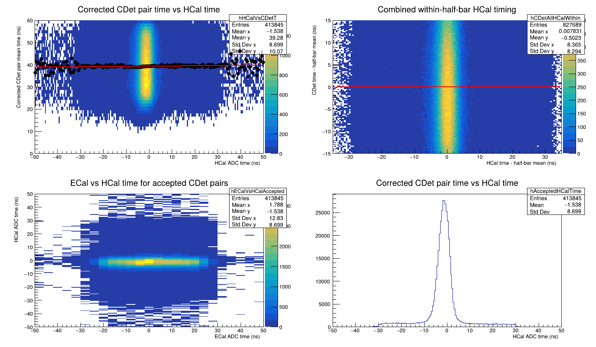](CDet_run5711_shift_diagnostics_wide_time_window/cCDetTvsHCalT.png) [PDF](CDet_run5711_shift_diagnostics_wide_time_window/cCDetTvsHCalT.pdf) | [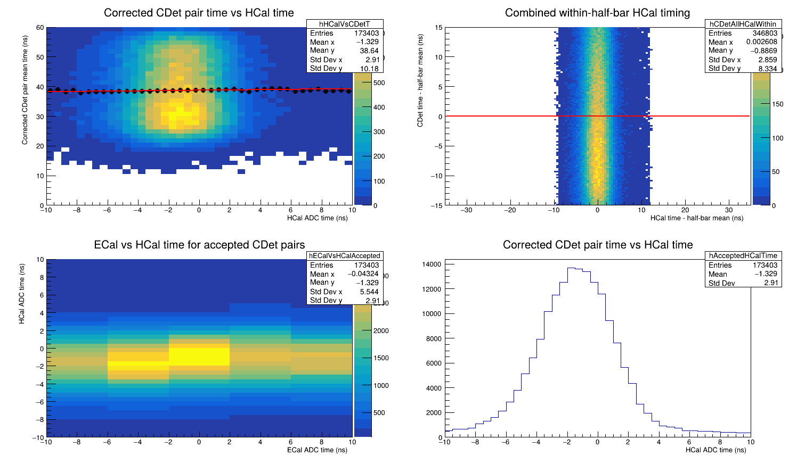](CDet_run5711_shift_diagnostics/cCDetTvsHCalT.png) [PDF](CDet_run5711_shift_diagnostics/cCDetTvsHCalT.pdf) | [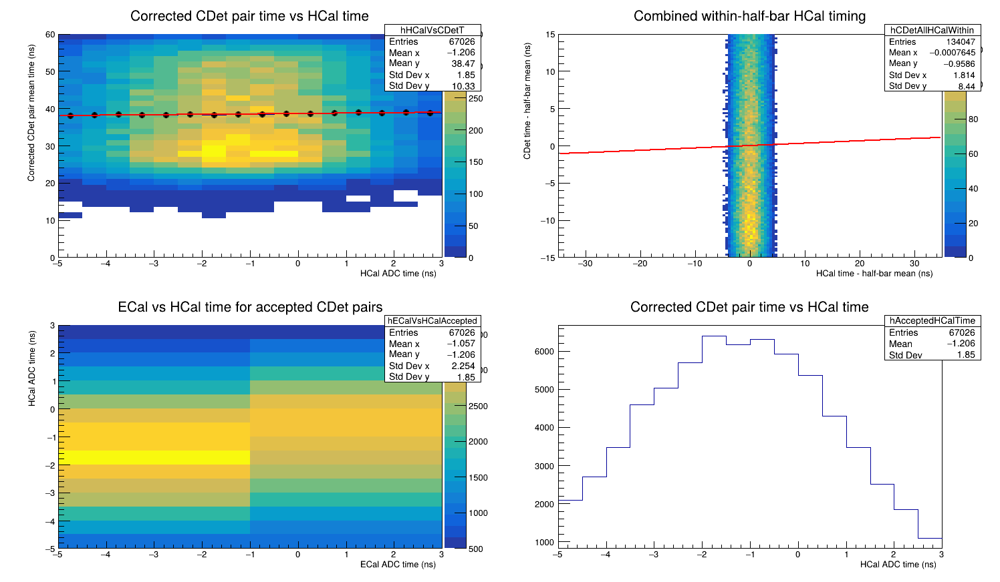](CDet_run5711_shift_diagnostics_narrow_time_window/cCDetTvsHCalT.png) [PDF](CDet_run5711_shift_diagnostics_narrow_time_window/cCDetTvsHCalT.pdf) |

### Corrected CDet time versus ECal time

| Wide: -50 to 50 ns | Nominal: -10 to 10 ns | Narrow: -5 to 3 ns |
|:---:|:---:|:---:|
| [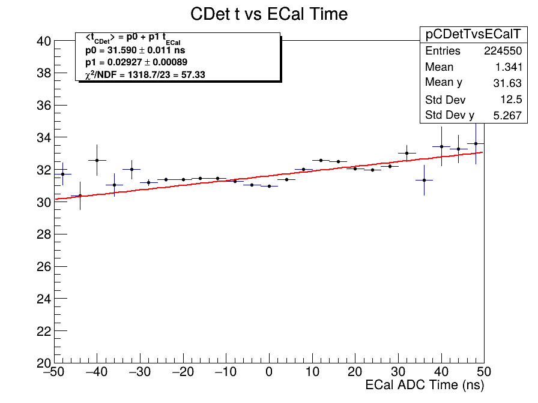](CDet_run5711_shift_diagnostics_wide_time_window/cCDetTvsECalT.png) [PDF](CDet_run5711_shift_diagnostics_wide_time_window/cCDetTvsECalT.pdf) | [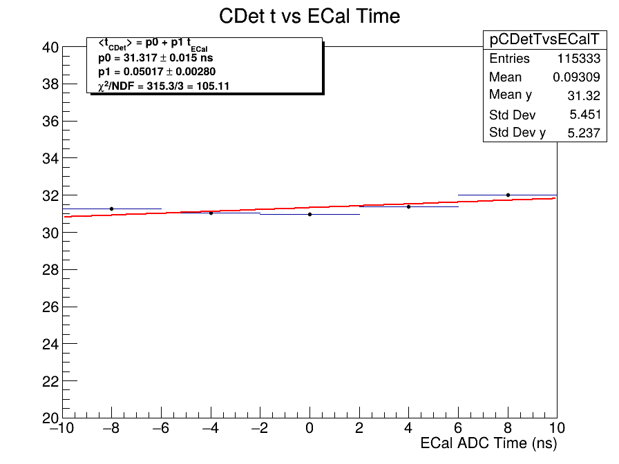](CDet_run5711_shift_diagnostics/cCDetTvsECalT.png) [PDF](CDet_run5711_shift_diagnostics/cCDetTvsECalT.pdf) | [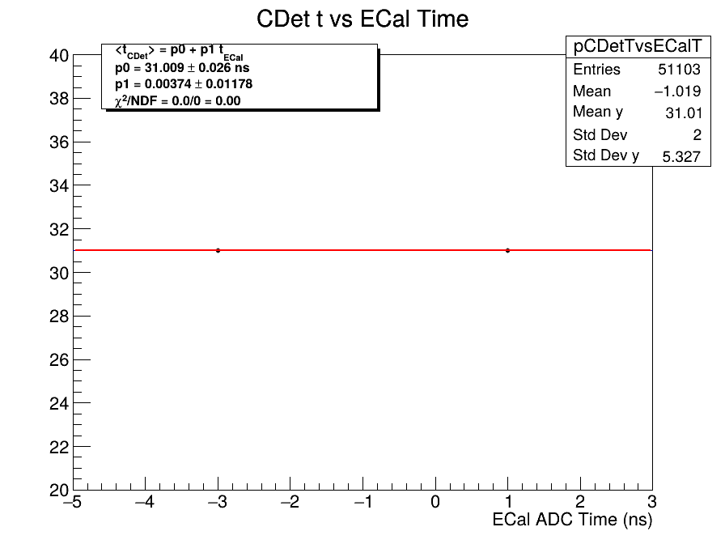](CDet_run5711_shift_diagnostics_narrow_time_window/cCDetTvsECalT.png) [PDF](CDet_run5711_shift_diagnostics_narrow_time_window/cCDetTvsECalT.pdf) |

### CDet-versus-ECal trend diagnostics

| Wide: -50 to 50 ns | Nominal: -10 to 10 ns | Narrow: -5 to 3 ns |
|:---:|:---:|:---:|
| [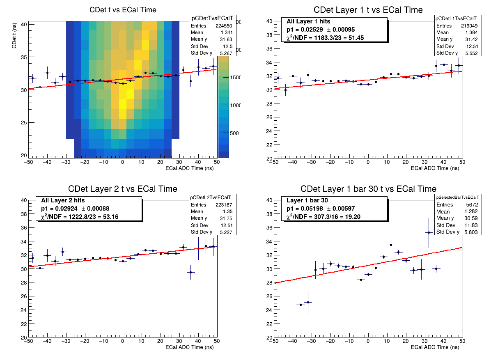](CDet_run5711_shift_diagnostics_wide_time_window/cCDetTvsECalTDiagnostics.png) [PDF](CDet_run5711_shift_diagnostics_wide_time_window/cCDetTvsECalTDiagnostics.pdf) | [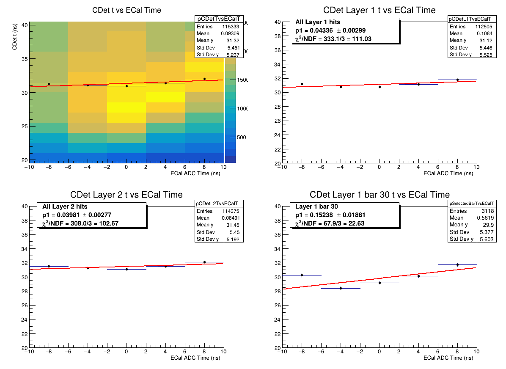](CDet_run5711_shift_diagnostics/cCDetTvsECalTDiagnostics.png) [PDF](CDet_run5711_shift_diagnostics/cCDetTvsECalTDiagnostics.pdf) | [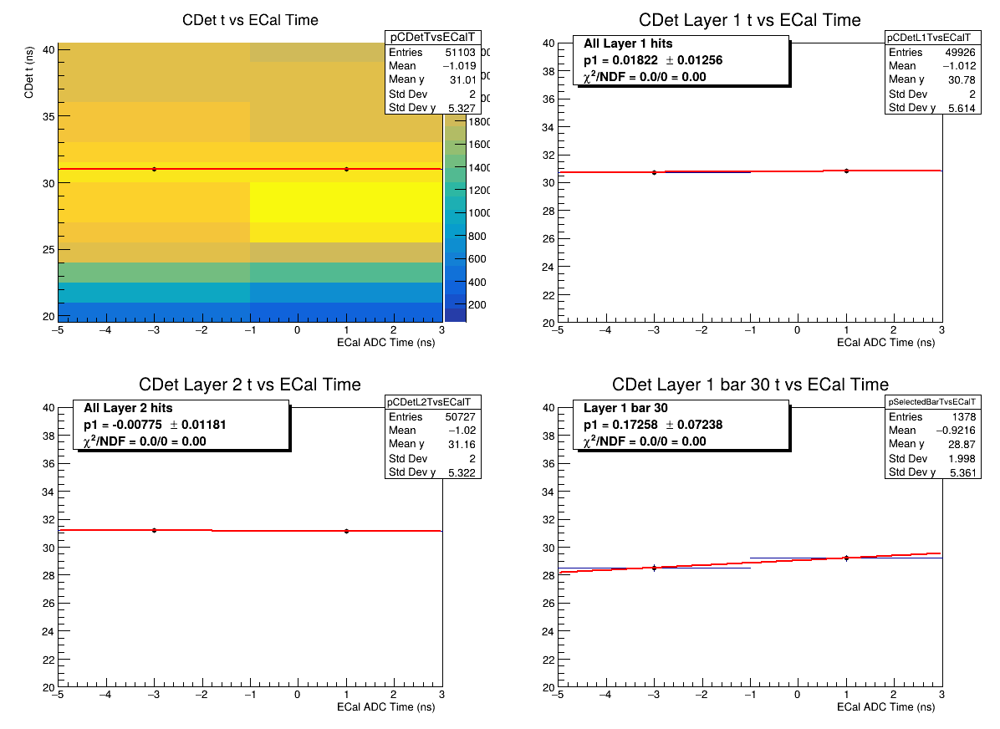](CDet_run5711_shift_diagnostics_narrow_time_window/cCDetTvsECalTDiagnostics.png) [PDF](CDet_run5711_shift_diagnostics_narrow_time_window/cCDetTvsECalTDiagnostics.pdf) |

## CDet timing distributions

### Projected-half-bar timing

| Wide: -50 to 50 ns | Nominal: -10 to 10 ns | Narrow: -5 to 3 ns |
|:---:|:---:|:---:|
| [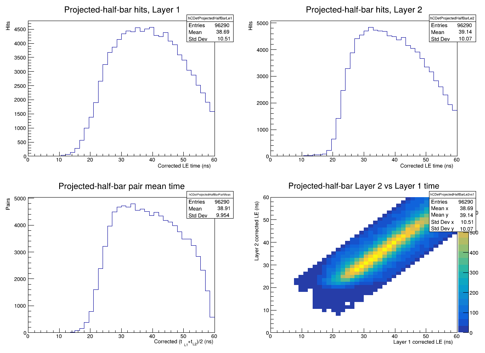](CDet_run5711_shift_diagnostics_wide_time_window/CDet_projected_halfbar_timing.png) [PDF](CDet_run5711_shift_diagnostics_wide_time_window/CDet_projected_halfbar_timing.pdf) | [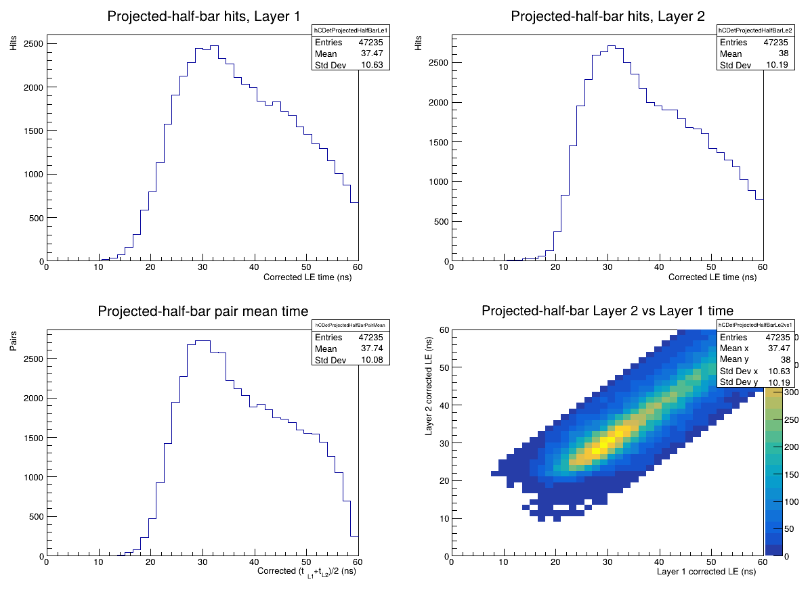](CDet_run5711_shift_diagnostics/CDet_projected_halfbar_timing.png) [PDF](CDet_run5711_shift_diagnostics/CDet_projected_halfbar_timing.pdf) | [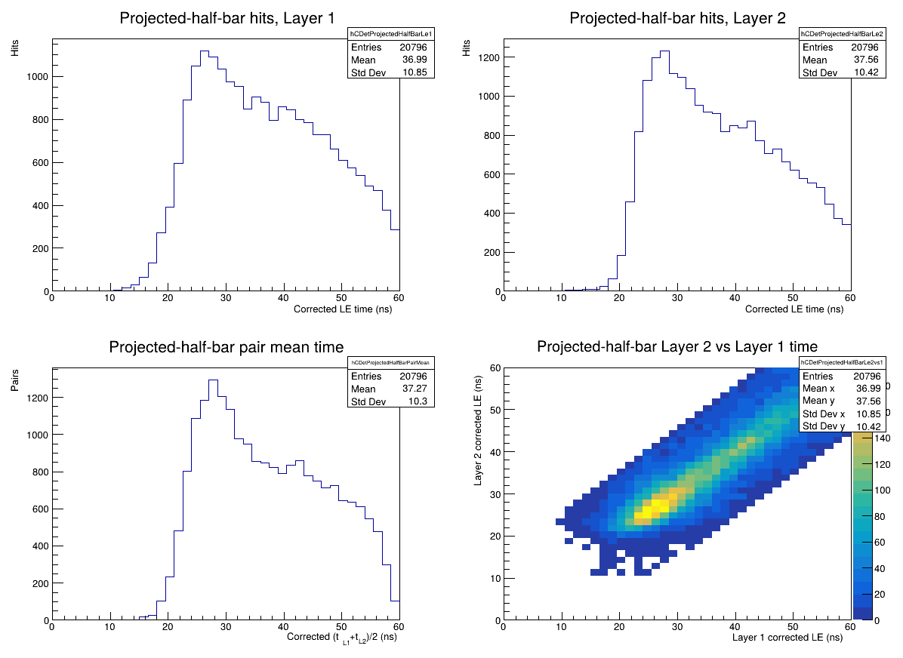](CDet_run5711_shift_diagnostics_narrow_time_window/CDet_projected_halfbar_timing.png) [PDF](CDet_run5711_shift_diagnostics_narrow_time_window/CDet_projected_halfbar_timing.pdf) |

### Layer corrected-LE spectra

| Wide: -50 to 50 ns | Nominal: -10 to 10 ns | Narrow: -5 to 3 ns |
|:---:|:---:|:---:|
| [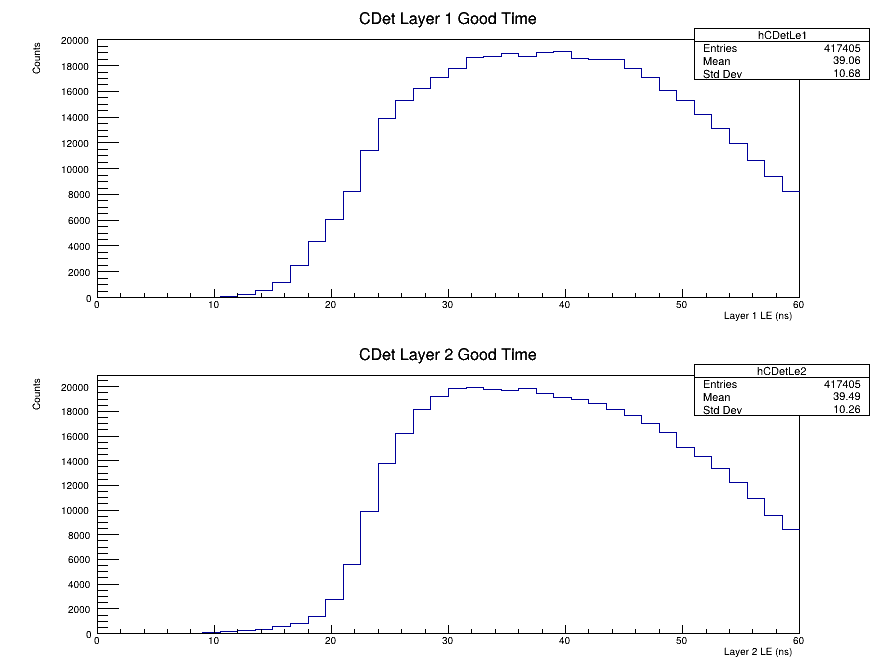](CDet_run5711_shift_diagnostics_wide_time_window/CDet_layer_LE.png) [PDF](CDet_run5711_shift_diagnostics_wide_time_window/CDet_layer_LE.pdf) | [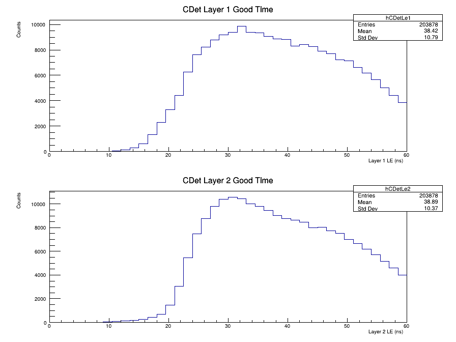](CDet_run5711_shift_diagnostics/CDet_layer_LE.png) [PDF](CDet_run5711_shift_diagnostics/CDet_layer_LE.pdf) | [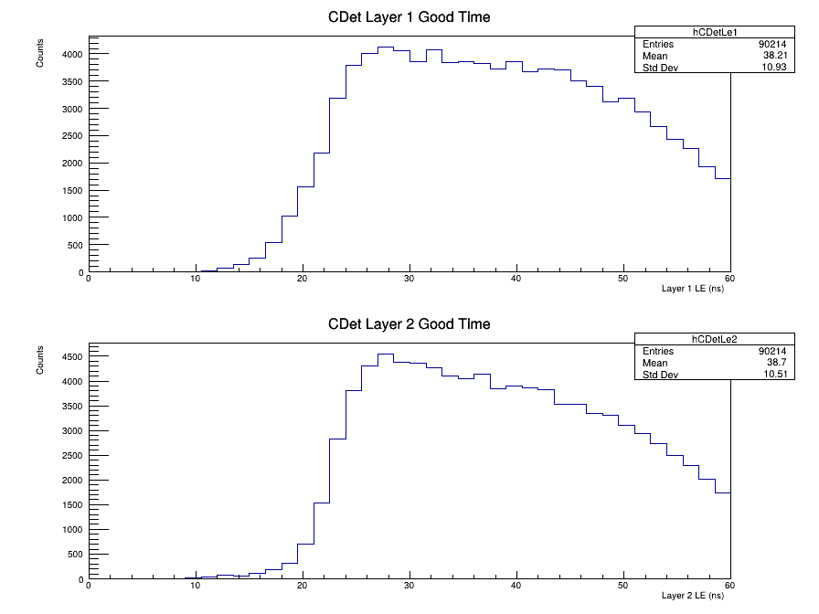](CDet_run5711_shift_diagnostics_narrow_time_window/CDet_layer_LE.png) [PDF](CDet_run5711_shift_diagnostics_narrow_time_window/CDet_layer_LE.pdf) |

### Accepted-pair mean time

| Wide: -50 to 50 ns | Nominal: -10 to 10 ns | Narrow: -5 to 3 ns |
|:---:|:---:|:---:|
| [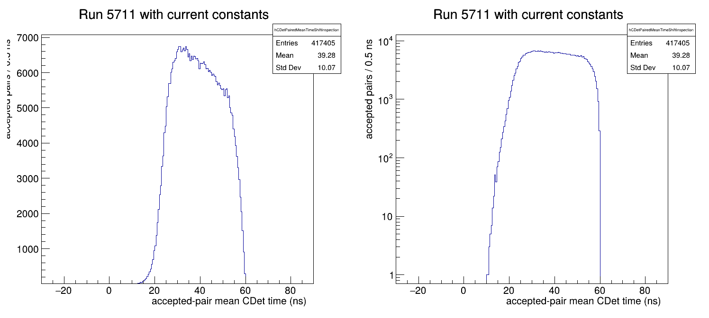](CDet_run5711_shift_diagnostics_wide_time_window/CDet_paired_mean_time.png) [PDF](CDet_run5711_shift_diagnostics_wide_time_window/CDet_paired_mean_time.pdf) | [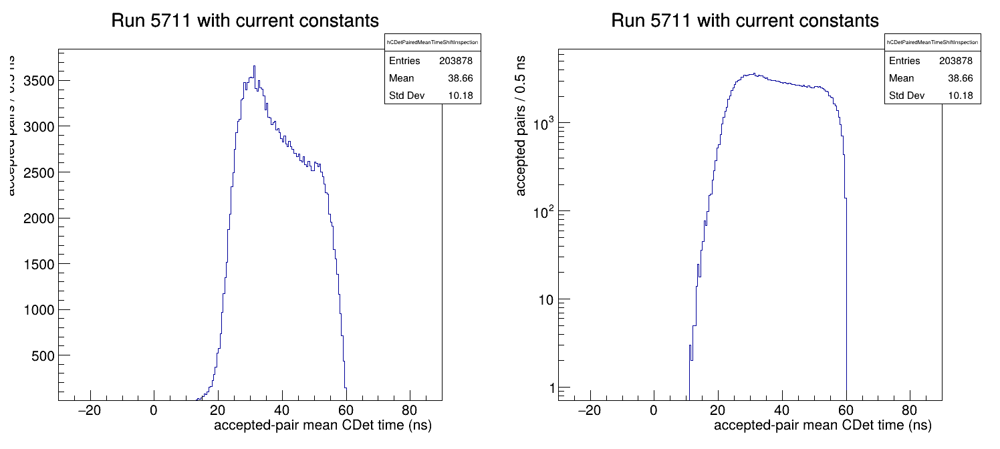](CDet_run5711_shift_diagnostics/CDet_paired_mean_time.png) [PDF](CDet_run5711_shift_diagnostics/CDet_paired_mean_time.pdf) | [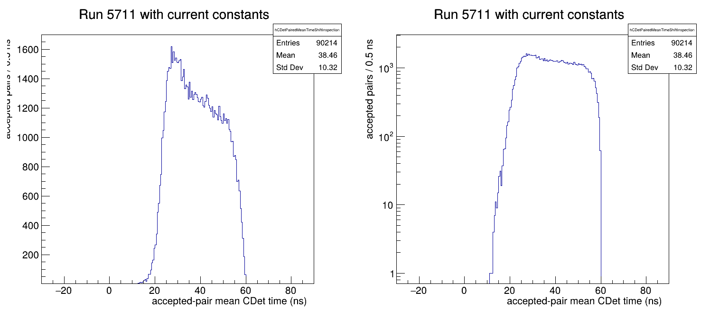](CDet_run5711_shift_diagnostics_narrow_time_window/CDet_paired_mean_time.png) [PDF](CDet_run5711_shift_diagnostics_narrow_time_window/CDet_paired_mean_time.pdf) |

## Bar 30 diagnostics

### Layer 1 corrected LE versus ToT

| Wide: -50 to 50 ns | Nominal: -10 to 10 ns | Narrow: -5 to 3 ns |
|:---:|:---:|:---:|
| [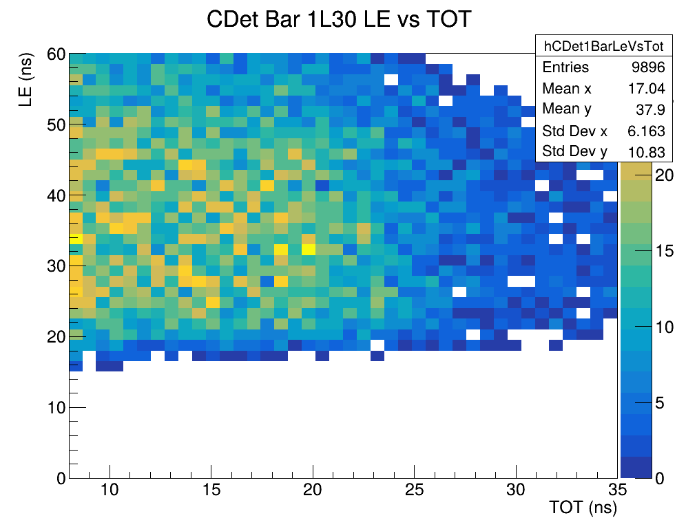](CDet_run5711_shift_diagnostics_wide_time_window/CDet_bar30_layer1_LE_vs_ToT.png) [PDF](CDet_run5711_shift_diagnostics_wide_time_window/CDet_bar30_layer1_LE_vs_ToT.pdf) | [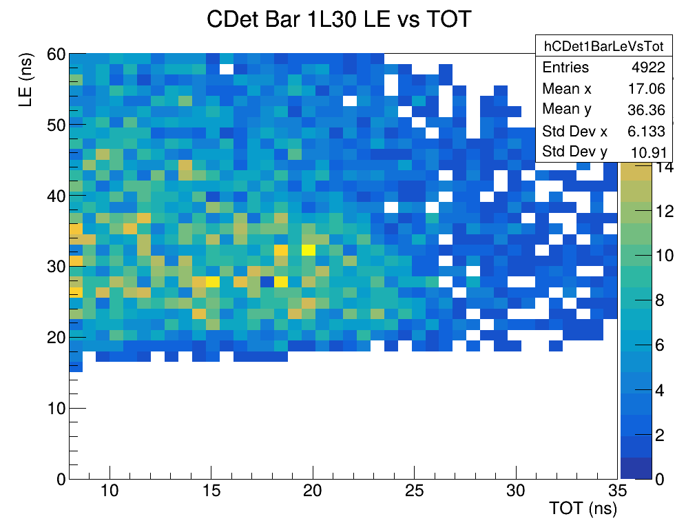](CDet_run5711_shift_diagnostics/CDet_bar30_layer1_LE_vs_ToT.png) [PDF](CDet_run5711_shift_diagnostics/CDet_bar30_layer1_LE_vs_ToT.pdf) | [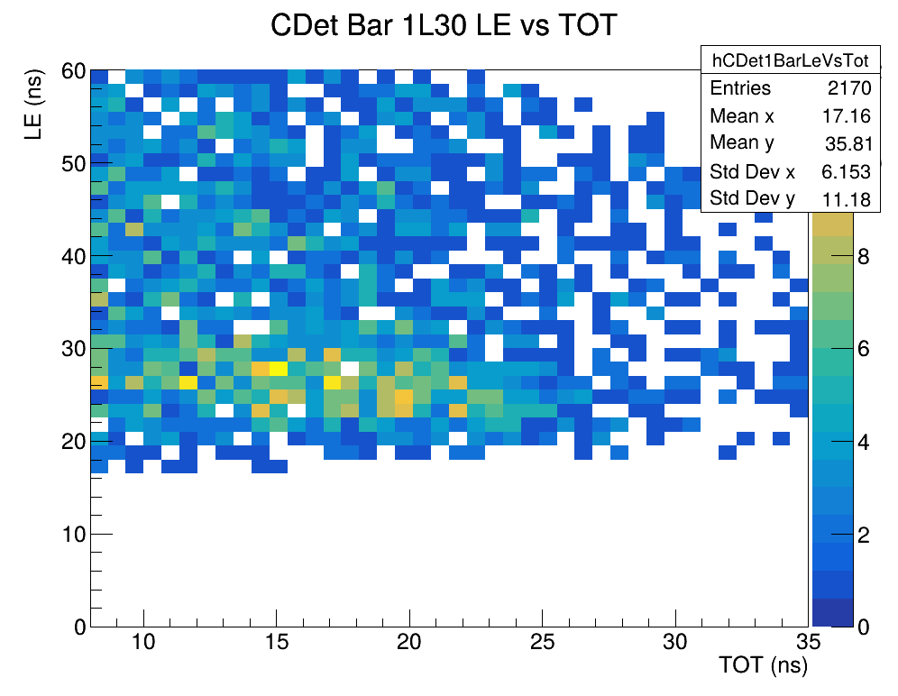](CDet_run5711_shift_diagnostics_narrow_time_window/CDet_bar30_layer1_LE_vs_ToT.png) [PDF](CDet_run5711_shift_diagnostics_narrow_time_window/CDet_bar30_layer1_LE_vs_ToT.pdf) |

### Individual-pixel corrected-LE spectra

| Wide: -50 to 50 ns | Nominal: -10 to 10 ns | Narrow: -5 to 3 ns |
|:---:|:---:|:---:|
| [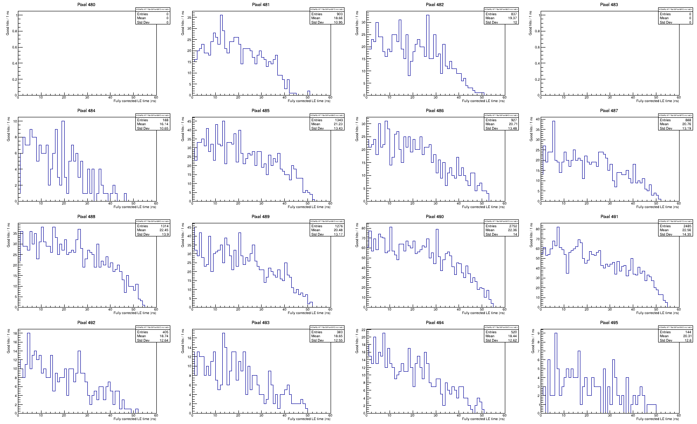](CDet_run5711_shift_diagnostics_wide_time_window/CDet_bar30_layer1_corrected_LE_4x4.png) [PDF](CDet_run5711_shift_diagnostics_wide_time_window/CDet_bar30_layer1_corrected_LE_4x4.pdf) | [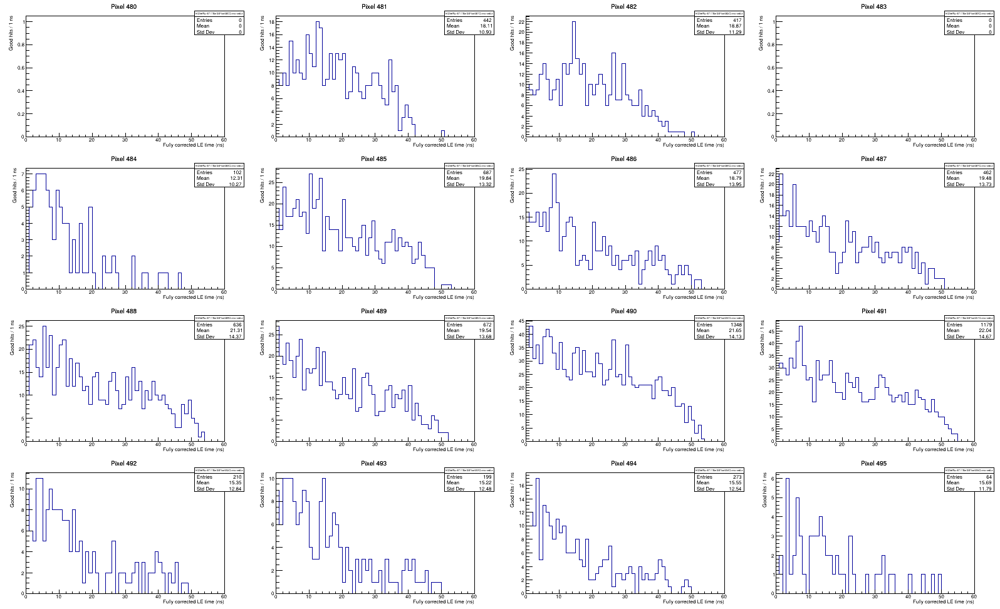](CDet_run5711_shift_diagnostics/CDet_bar30_layer1_corrected_LE_4x4.png) [PDF](CDet_run5711_shift_diagnostics/CDet_bar30_layer1_corrected_LE_4x4.pdf) | [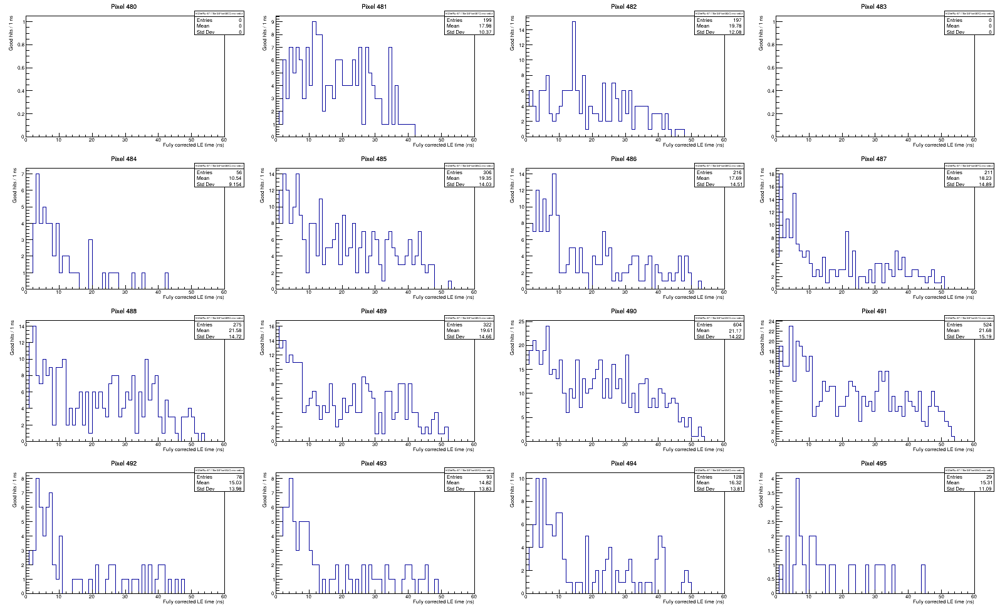](CDet_run5711_shift_diagnostics_narrow_time_window/CDet_bar30_layer1_corrected_LE_4x4.png) [PDF](CDet_run5711_shift_diagnostics_narrow_time_window/CDet_bar30_layer1_corrected_LE_4x4.pdf) |

### Amalgamated ECal-CDet timing

| Wide: -50 to 50 ns | Nominal: -10 to 10 ns | Narrow: -5 to 3 ns |
|:---:|:---:|:---:|
| [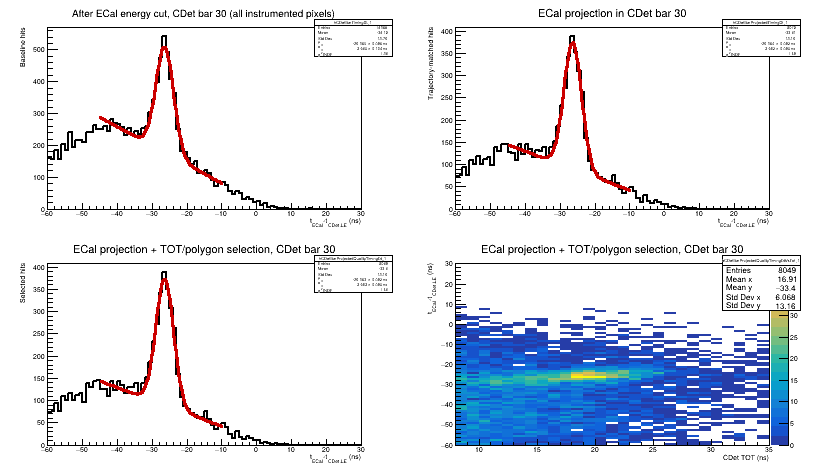](CDet_run5711_shift_diagnostics_wide_time_window/bar_ecal_cdet_timing/run_5711_stage_7/bar_030_amalgamated.png) [PDF](CDet_run5711_shift_diagnostics_wide_time_window/bar_ecal_cdet_timing/run_5711_stage_7/bar_030_amalgamated.pdf) | [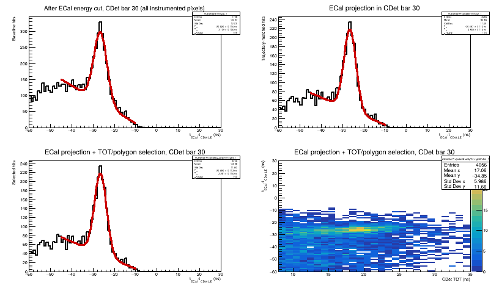](CDet_run5711_shift_diagnostics/bar_ecal_cdet_timing/run_5711_stage_7/bar_030_amalgamated.png) [PDF](CDet_run5711_shift_diagnostics/bar_ecal_cdet_timing/run_5711_stage_7/bar_030_amalgamated.pdf) | [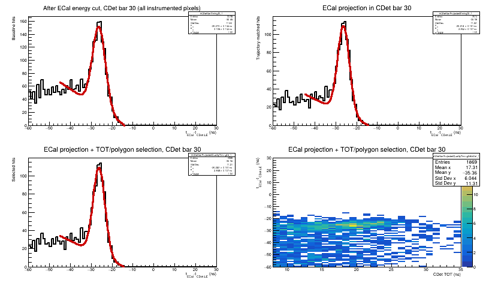](CDet_run5711_shift_diagnostics_narrow_time_window/bar_ecal_cdet_timing/run_5711_stage_7/bar_030_amalgamated.png) [PDF](CDet_run5711_shift_diagnostics_narrow_time_window/bar_ecal_cdet_timing/run_5711_stage_7/bar_030_amalgamated.pdf) |

### Individual-pixel ECal-CDet timing fits

| Wide: -50 to 50 ns | Nominal: -10 to 10 ns | Narrow: -5 to 3 ns |
|:---:|:---:|:---:|
| [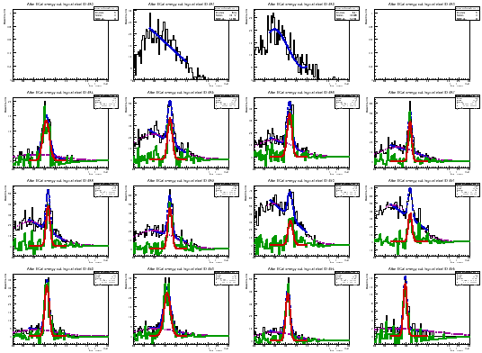](CDet_run5711_shift_diagnostics_wide_time_window/bar_ecal_cdet_timing/run_5711_stage_7/bar_030_pixels_480-495.png) [PDF](CDet_run5711_shift_diagnostics_wide_time_window/bar_ecal_cdet_timing/run_5711_stage_7/bar_030_pixels_480-495.pdf) | [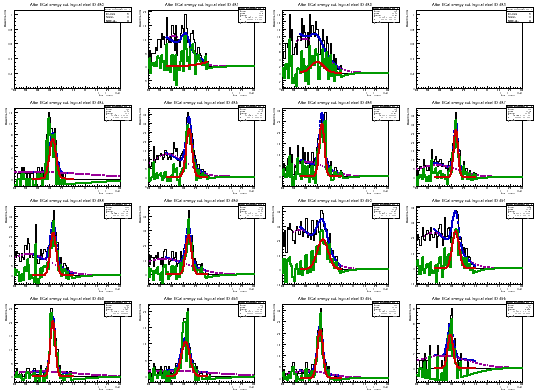](CDet_run5711_shift_diagnostics/bar_ecal_cdet_timing/run_5711_stage_7/bar_030_pixels_480-495.png) [PDF](CDet_run5711_shift_diagnostics/bar_ecal_cdet_timing/run_5711_stage_7/bar_030_pixels_480-495.pdf) | [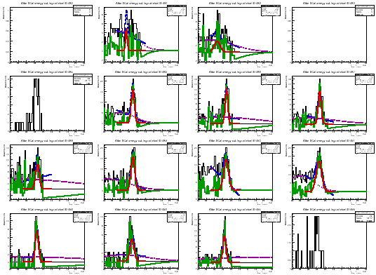](CDet_run5711_shift_diagnostics_narrow_time_window/bar_ecal_cdet_timing/run_5711_stage_7/bar_030_pixels_480-495.png) [PDF](CDet_run5711_shift_diagnostics_narrow_time_window/bar_ecal_cdet_timing/run_5711_stage_7/bar_030_pixels_480-495.pdf) |

### PDF-only Bar 30 diagnostics

| Diagnostic | Wide: -50 to 50 ns | Nominal: -10 to 10 ns | Narrow: -5 to 3 ns |
|:---|:---:|:---:|:---:|
| Background-subtracted timing | [PDF](CDet_run5711_shift_diagnostics_wide_time_window/bar_ecal_cdet_timing/run_5711_stage_7/bar_030_background_subtracted.pdf) | [PDF](CDet_run5711_shift_diagnostics/bar_ecal_cdet_timing/run_5711_stage_7/bar_030_background_subtracted.pdf) | [PDF](CDet_run5711_shift_diagnostics_narrow_time_window/bar_ecal_cdet_timing/run_5711_stage_7/bar_030_background_subtracted.pdf) |
| ECal-CDet timing versus ToT | [PDF](CDet_run5711_shift_diagnostics_wide_time_window/bar_ecal_cdet_timing/run_5711_stage_7/bar_030_dt_vs_tot.pdf) | [PDF](CDet_run5711_shift_diagnostics/bar_ecal_cdet_timing/run_5711_stage_7/bar_030_dt_vs_tot.pdf) | [PDF](CDet_run5711_shift_diagnostics_narrow_time_window/bar_ecal_cdet_timing/run_5711_stage_7/bar_030_dt_vs_tot.pdf) |
| Bar 30 summary | [PDF](CDet_run5711_shift_diagnostics_wide_time_window/bar_ecal_cdet_timing/run_5711_stage_7/bar_030_summary.pdf) | [PDF](CDet_run5711_shift_diagnostics/bar_ecal_cdet_timing/run_5711_stage_7/bar_030_summary.pdf) | [PDF](CDet_run5711_shift_diagnostics_narrow_time_window/bar_ecal_cdet_timing/run_5711_stage_7/bar_030_summary.pdf) |

## Additional nominal-window artifact

The nominal diagnostic directory also contains an earlier Bar 29 Layer-1
corrected-LE-versus-ToT plot; the wide and narrow test directories have no
matching Bar 29 artifact.

[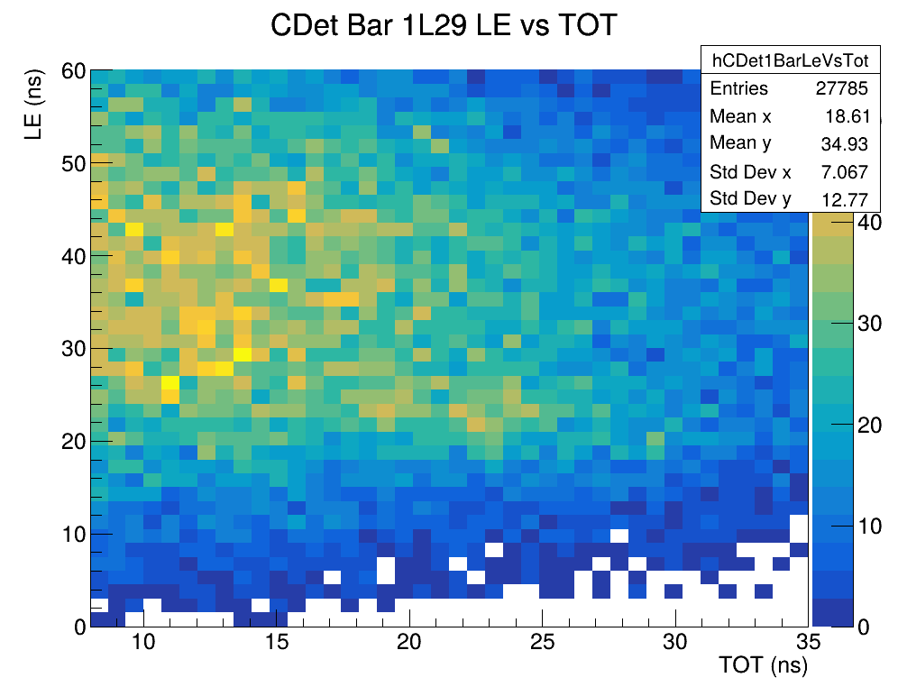](CDet_run5711_shift_diagnostics/CDet_bar29_layer1_LE_vs_ToT.png)

[PDF](CDet_run5711_shift_diagnostics/CDet_bar29_layer1_LE_vs_ToT.pdf)

## Wide-window population split

The following exploratory diagnostic separates the vertical and diagonal
components visible in the wide-window CDet-versus-ECal distribution. The
vertical selection is `-3 < t_ECal < 1 ns` and `23 < t_CDet < 40 ns`. The
disjoint diagonal selection is `1 < t_ECal < 18 ns` and
`|t_CDet - 27 - 0.73 t_ECal| < 3 ns`.

[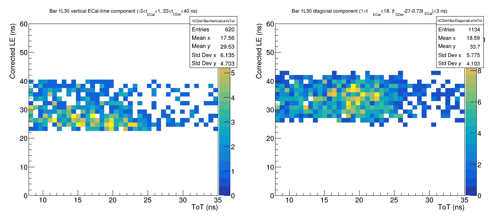](CDet_run5711_shift_diagnostics_wide_time_window/CDet_bar30_vertical_vs_diagonal_LE_vs_ToT.png)

[PDF](CDet_run5711_shift_diagnostics_wide_time_window/CDet_bar30_vertical_vs_diagonal_LE_vs_ToT.pdf)

### All-bars three-region comparison

The higher-statistics all-bars diagnostic divides the vertical component into
`23 < t_CDet < 30 ns` and `30 < t_CDet < 40 ns`, with
`-5 < t_ECal < 1 ns` in both cases. The diagonal component uses
`t_ECal > 1 ns`, `t_CDet > 30 ns`, and the same exploratory corridor
`|t_CDet - 27 - 0.73 t_ECal| < 3 ns`.

[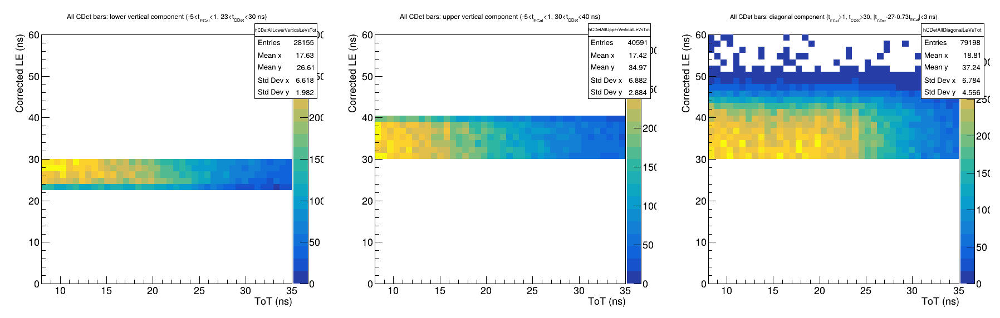](CDet_run5711_shift_diagnostics_wide_time_window/CDet_allbars_three_region_LE_vs_ToT.png)

[PDF](CDet_run5711_shift_diagnostics_wide_time_window/CDet_allbars_three_region_LE_vs_ToT.pdf)

The same three selections were evaluated with the nominal
`-10 < t_ECal,t_HCal < 10 ns` event windows:

| Wide event window: -50 to 50 ns | Nominal event window: -10 to 10 ns |
|:---:|:---:|
|  [PDF](CDet_run5711_shift_diagnostics_wide_time_window/CDet_allbars_three_region_LE_vs_ToT.pdf) | [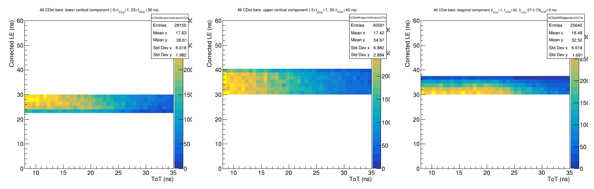](CDet_run5711_shift_diagnostics/CDet_allbars_three_region_LE_vs_ToT.png) [PDF](CDet_run5711_shift_diagnostics/CDet_allbars_three_region_LE_vs_ToT.pdf) |

| Population | Wide entries | Nominal entries | Wide mean ToT (ns) | Nominal mean ToT (ns) |
|:---|---:|---:|---:|---:|
| Lower vertical | 28,155 | 28,155 | 17.63 | 17.63 |
| Upper vertical | 40,591 | 40,591 | 17.42 | 17.42 |
| Diagonal | 79,198 | 25,642 | 18.81 | 18.49 |

## Nominal-window ToT-threshold test

This test keeps the nominal `-10 < t_ECal,t_HCal < 10 ns` windows, the
3.0--4.5 GeV ECal energy selection, and the accepted Run 5711 calibration
constants fixed. Only the good-hit ToT interval changes from 8--35 ns to
12--35 ns. The test uses
`CDet_run5711_projection_totmin12_test.conf`; it does not replace the
authoritative Run 5711 configuration.

| Quantity | ToT 8--35 ns | ToT 12--35 ns | Retained |
|:---|---:|---:|---:|
| Good CDet events | 80,645 | 73,821 | 91.5% |
| Accepted hit pairs | 203,878 | 135,912 | 66.7% |
| Projected-half-bar pairs | 47,235 | 31,963 | 67.7% |
| Bar 30 trajectory + ToT selected hits | 4,056 | 2,871 | 70.8% |
| Bar 30 trajectory-matched peak sigma | 2.852 ns | 2.726 ns | 95.6% |

### Projected-half-bar timing

| ToT 8--35 ns | ToT 12--35 ns |
|:---:|:---:|
|  |  |

### CDet-versus-ECal timing diagnostics

| ToT 8--35 ns | ToT 12--35 ns |
|:---:|:---:|
|  | [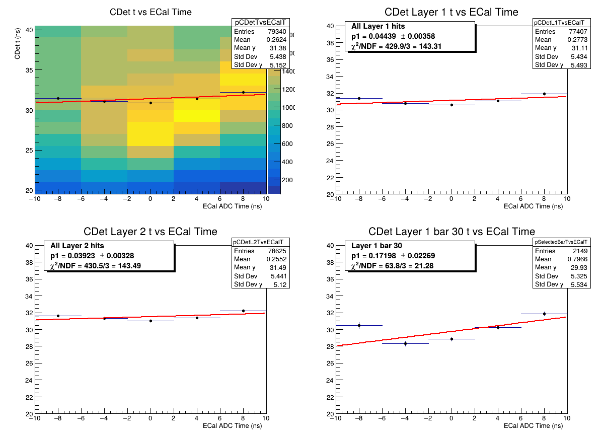](CDet_run5711_shift_diagnostics_totmin12/cCDetTvsECalTDiagnostics.png) |

### Bar 30 ECal-CDet timing

| ToT 8--35 ns | ToT 12--35 ns |
|:---:|:---:|
|  | [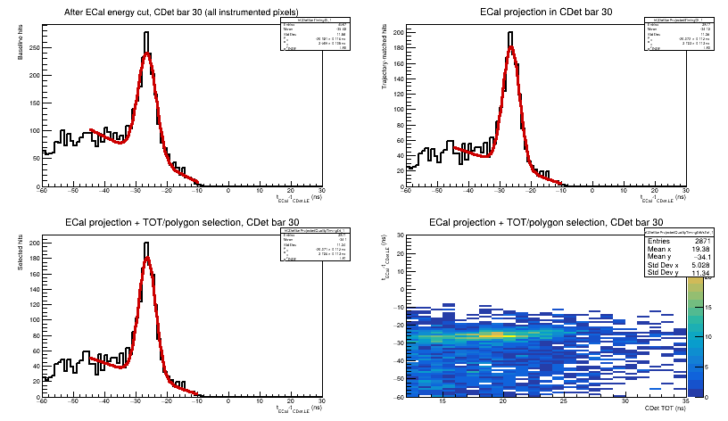](CDet_run5711_shift_diagnostics_totmin12/bar_ecal_cdet_timing/run_5711_stage_7/bar_030_amalgamated.png) |
