# CDet Run 6077 LH2 Calibration Report

This report collects the final configuration-authoritative diagnostic plots
produced for LH2 Run 6077. Unlike the Run 5711 timing-window comparison, this
report presents only the selected ECal/HCal timing window.

## Recorded calibration state

The active run-specific file currently contains:

```ini
[ECalTiming]
p1 0.000000

[GlobalTiming]
shift_ns 2.913449
```

The archived plots in this report were generated with the fitted value
`p1 = 0.002520 ns/ns`.  That value is consistent with zero and has been
superseded by the production LH2 policy `p1 = 0`; the established shift and
timing window are unchanged.

The initial projected-half-bar shift fit used a 5 ns local half-width and was
rejected because the fitted Run 6077 core width was about 7.04 ns. Repeating
the fit with an 8 ns half-width accommodated the demonstrably broader Run 6077
peak and passed the driver's physical-fit and closure gates. The final
projected-half-bar plot contains 157,312 pairs and places the modal peak near
the nominal 30 ns target.

## Analysis configuration

The final diagnostic folder was generated from
`CDet_run6077_projection.conf` with:

```text
Run:                         6077
Configured maximum events:  10,000,000 (all 768,423 available events used)
ECal ADC-time selection:     -10 to 10 ns
HCal ADC-time display range: -10 to 10 ns (default)
Good-hit ToT selection:       8 to 35 ns
Projected-x tolerance:       +/-0.08 m
Calibration stage:            7
Selected diagnostic bar:     30 (pixels 480--495)
```

The active configuration does not explicitly define an ECal energy cut. The
Bar 30 extraction routine uses its diagnostic default of 3.0--4.5 GeV, while
the main Stage-7 event selection should not be assumed to have that energy cut.

## ECal timing-window proposal

[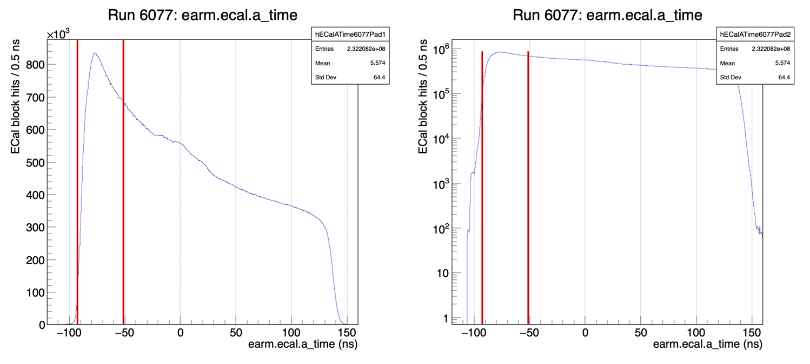](CDet_run6077_ECalTimingWindow_PROPOSAL.png)

[PDF](CDet_run6077_ECalTimingWindow_PROPOSAL.pdf)

## Final calorimeter timing correlations

### Corrected CDet time versus ECal time

[](CDet_run6077_shift_diagnostics_final/cCDetTvsECalT.png)

[PDF](CDet_run6077_shift_diagnostics_final/cCDetTvsECalT.pdf)

### CDet-versus-ECal trend diagnostics

[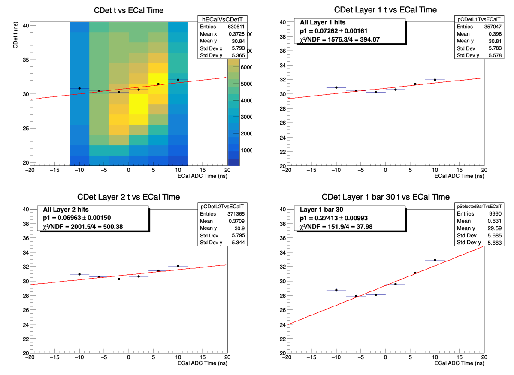](CDet_run6077_shift_diagnostics_final/cCDetTvsECalTDiagnostics.png)

[PDF](CDet_run6077_shift_diagnostics_final/cCDetTvsECalTDiagnostics.pdf)

### Corrected CDet time versus HCal time

[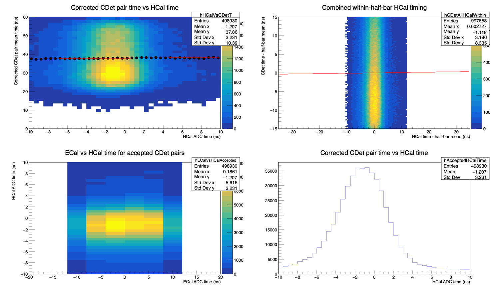](CDet_run6077_shift_diagnostics_final/cCDetTvsHCalT.png)

[PDF](CDet_run6077_shift_diagnostics_final/cCDetTvsHCalT.pdf)

## Final CDet timing distributions

### Projected-half-bar timing

[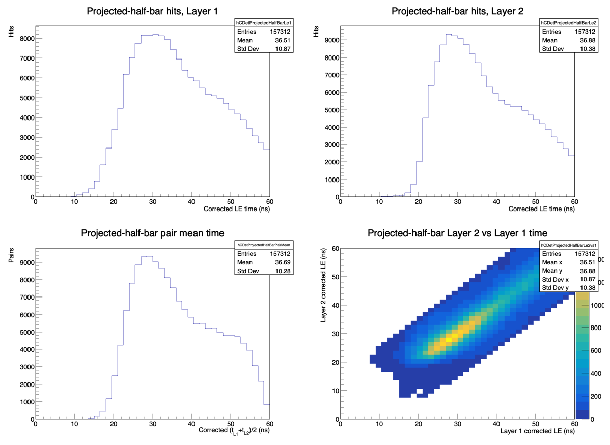](CDet_run6077_shift_diagnostics_final/CDet_projected_halfbar_timing.png)

[PDF](CDet_run6077_shift_diagnostics_final/CDet_projected_halfbar_timing.pdf)

### Layer corrected-LE spectra

[](CDet_run6077_shift_diagnostics_final/CDet_layer_LE.png)

[PDF](CDet_run6077_shift_diagnostics_final/CDet_layer_LE.pdf)

### Accepted-pair mean time

[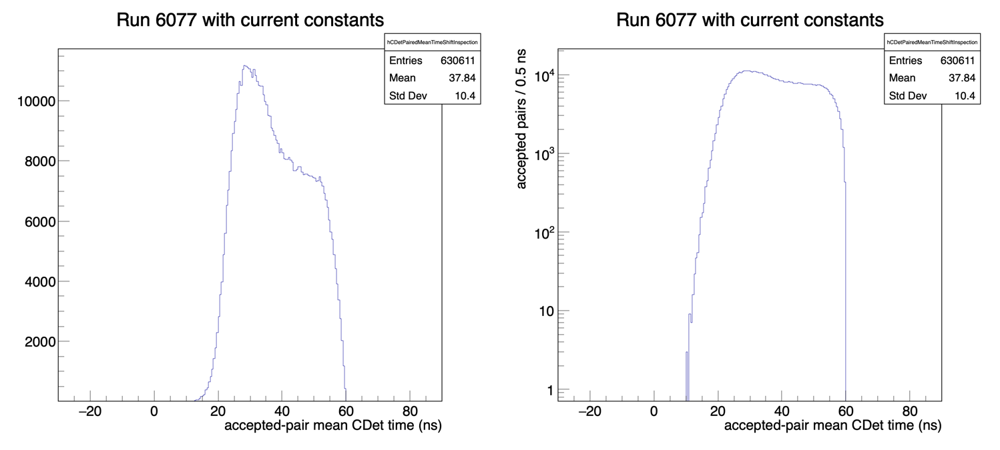](CDet_run6077_shift_diagnostics_final/CDet_paired_mean_time.png)

[PDF](CDet_run6077_shift_diagnostics_final/CDet_paired_mean_time.pdf)

## Bar 30 diagnostics

### Layer 1 corrected LE versus ToT

[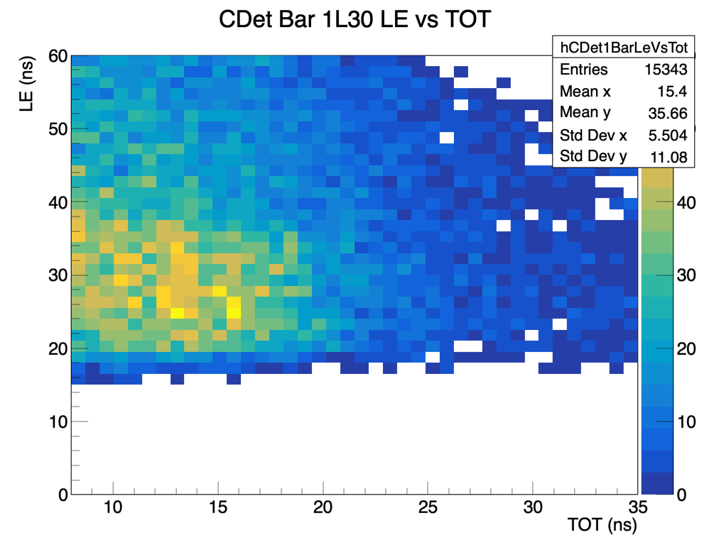](CDet_run6077_shift_diagnostics_final/CDet_bar30_layer1_LE_vs_ToT.png)

[PDF](CDet_run6077_shift_diagnostics_final/CDet_bar30_layer1_LE_vs_ToT.pdf)

### Individual-pixel corrected-LE spectra

[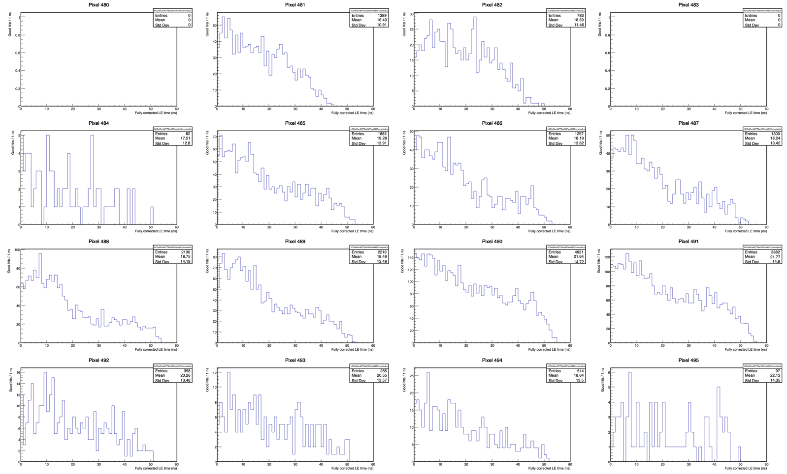](CDet_run6077_shift_diagnostics_final/CDet_bar30_layer1_corrected_LE_4x4.png)

[PDF](CDet_run6077_shift_diagnostics_final/CDet_bar30_layer1_corrected_LE_4x4.pdf)

### Amalgamated ECal-CDet timing

[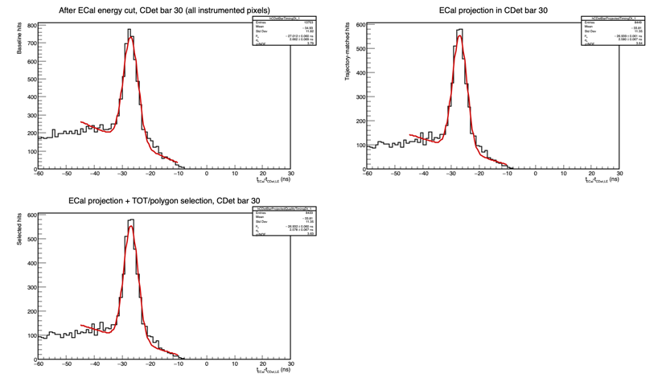](CDet_run6077_shift_diagnostics_final/bar_ecal_cdet_timing/run_6077_stage_7/bar_030_amalgamated.png)

[PDF](CDet_run6077_shift_diagnostics_final/bar_ecal_cdet_timing/run_6077_stage_7/bar_030_amalgamated.pdf)

### Individual-pixel ECal-CDet timing fits

[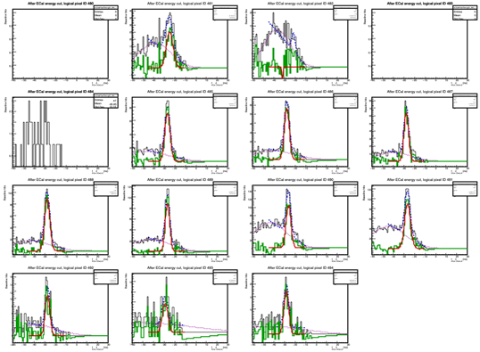](CDet_run6077_shift_diagnostics_final/bar_ecal_cdet_timing/run_6077_stage_7/bar_030_pixels_480-495.png)

[PDF](CDet_run6077_shift_diagnostics_final/bar_ecal_cdet_timing/run_6077_stage_7/bar_030_pixels_480-495.pdf)

### PDF-only Bar 30 diagnostics

- [Background-subtracted timing](CDet_run6077_shift_diagnostics_final/bar_ecal_cdet_timing/run_6077_stage_7/bar_030_background_subtracted.pdf)
- [ECal-CDet timing versus ToT](CDet_run6077_shift_diagnostics_final/bar_ecal_cdet_timing/run_6077_stage_7/bar_030_dt_vs_tot.pdf)
- [Bar 30 summary](CDet_run6077_shift_diagnostics_final/bar_ecal_cdet_timing/run_6077_stage_7/bar_030_summary.pdf)

## Exploratory timing-population views

These canvases use the region definitions introduced during the Run 5711
wide-window study. With the Run 6077 event window limited to -10--10 ns, they
should be treated as visualization aids rather than independent calibration
criteria.

### Bar 30 vertical and diagonal populations

[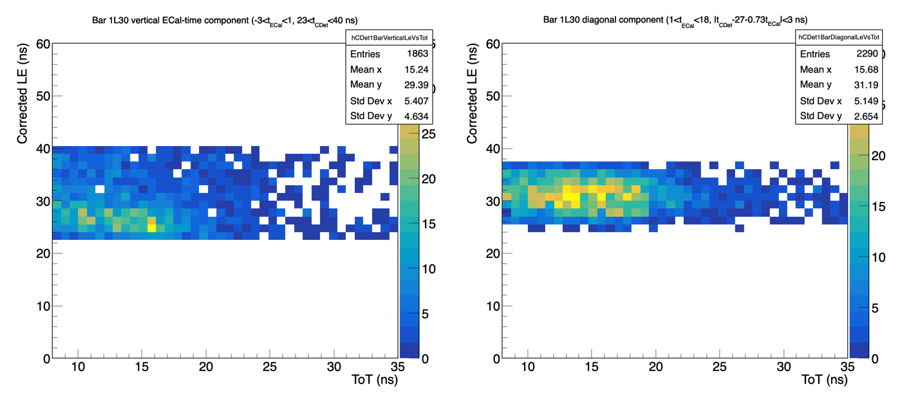](CDet_run6077_shift_diagnostics_final/CDet_bar30_vertical_vs_diagonal_LE_vs_ToT.png)

[PDF](CDet_run6077_shift_diagnostics_final/CDet_bar30_vertical_vs_diagonal_LE_vs_ToT.pdf)

### All-bars three-region comparison

[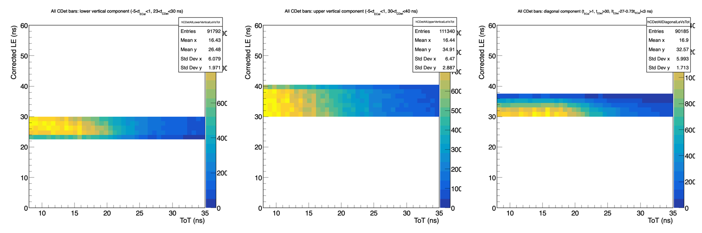](CDet_run6077_shift_diagnostics_final/CDet_allbars_three_region_LE_vs_ToT.png)

[PDF](CDet_run6077_shift_diagnostics_final/CDet_allbars_three_region_LE_vs_ToT.pdf)

## Calibration progression

The complete sequence of retained visual checkpoints is available in:

1. `CDet_run6077_shift_diagnostics_seed/`
2. `CDet_run6077_shift_diagnostics_after_initial_shift/`
3. `CDet_run6077_shift_diagnostics_p1_iteration_1/`
4. `CDet_run6077_shift_diagnostics_p1_iteration_2/`
5. `CDet_run6077_shift_diagnostics_p1_iteration_3/`
6. `CDet_run6077_shift_diagnostics_final/`

The final folder is embedded above. Earlier folders preserve the visual audit
trail but do not supersede the active run file and configuration.
