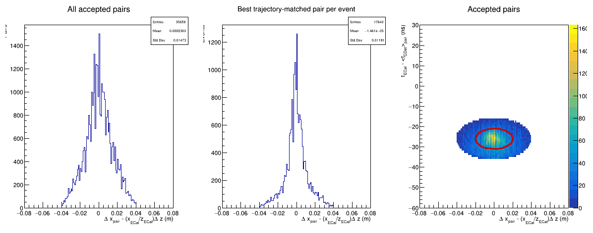
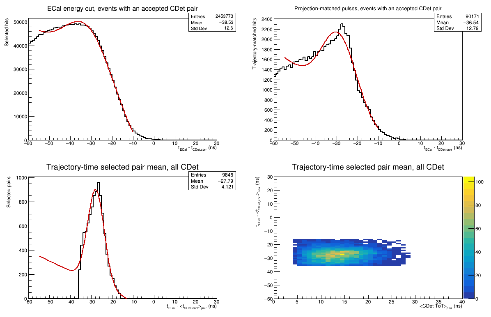
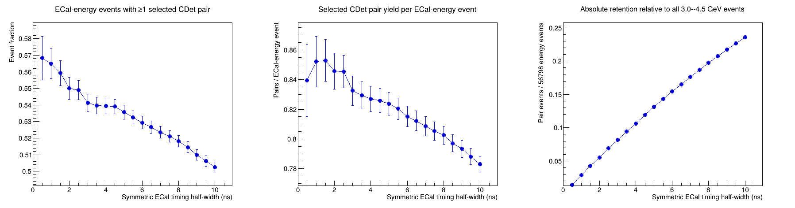
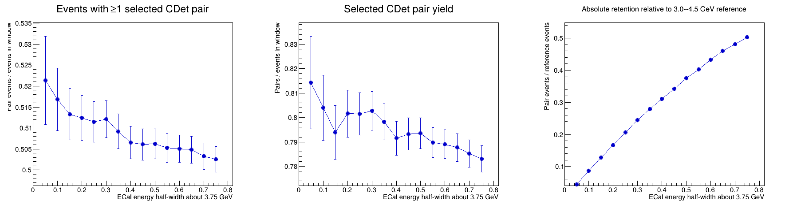
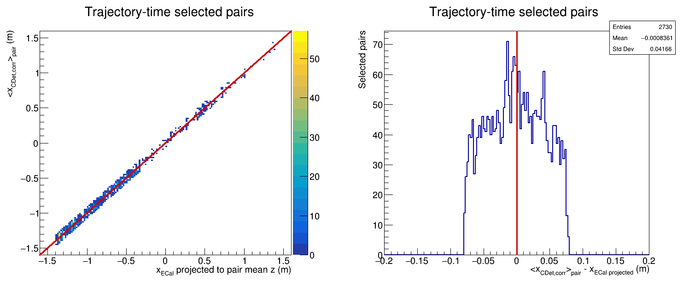
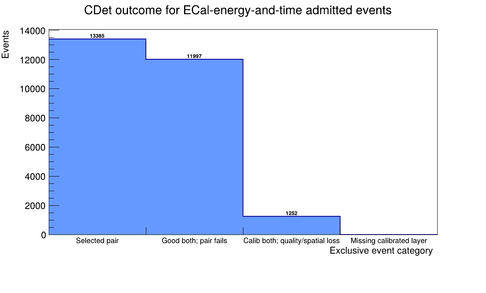

# Run 6077 CDet pair and single-layer candidate study

This note collects the Run 6077 replay-level CDet candidate-selection results
in one place. It is the Run 6077 companion to
[`CDet_RUN5711_PAIR_SELECTION_STUDY.md`](CDet_RUN5711_PAIR_SELECTION_STUDY.md).
The older [`CDet_RUN6077_CALIBRATION_REPORT.md`](CDet_RUN6077_CALIBRATION_REPORT.md)
records the macro-based timing calibration and its historical diagnostics;
this document records the subsequent analyzer-backed pulse, pair, and
single-layer recovery study.

The intended consumer is a later global region-of-interest tracker combining
ECal, CDet, GEM, and HCal information. The selections below generate plausible
CDet candidates. They are not intended to make the final track decision.

## Dataset and calibration state

The study uses the six local replay files for a total of 100,000 Run 6077
events. The analyzer reads the common pixel calibration from
`DB/db_earm.cdet.dat` and the Run 6077 policy uses:

```text
p1 = 0.000000 ns/ns
shift_ns = 2.913449 ns
ECal timing window = -10 to 10 ns
ECal energy window = 3.0 to 4.5 GeV
accepted ToT window = 8 to 35 ns
projected-x tolerance = +/-0.08 m
```

The zero ECal slope is the adopted LH2 policy. The earlier fitted value was
consistent with zero and is not used here.

## Population accounting

The principal denominators are:

| Population | Count | Fraction of all events |
| --- | ---: | ---: |
| All replayed events | 100,000 | 100.0% |
| Events passing only `3.0 < E_ECal < 4.5 GeV` | 56,798 | 56.8% |
| Events also passing `-10 < t_ECal < 10 ns` | 26,634 | 26.6% |
| Events with at least one final selected pair | 13,385 | 13.4% |

The 26,634-event energy-and-time population is the denominator for all
conditional event fractions below. The pair selection retains 50.3% of this
population.

Across the full replay sample, the analyzer produced 598,308 accepted
calibrated good-pulse candidates and 43,489 events with accepted candidates in
both layers. Within the ECal-energy-selected sample there are 102,555 stored
one-to-one pairs. After the trajectory-time selection, 20,856 pairs in 13,385
events remain.

## Pair trajectory-time selection

For a target-to-ECal trajectory, define

```text
r_x = (x_L2,corr - x_L1,corr)
      - (x_ECal / z_ECal) * (z_L2 - z_L1)

delta_t_pair = t_ECal - (t_L1,corr + t_L2,corr) / 2.
```

The adopted normalized ellipse is

```text
R^2 = (r_x / 0.020 m)^2
    + ((delta_t_pair + 26 ns) / 5 ns)^2 <= 2^2.
```

Thus its physical semiaxes are 4 cm and 10 ns. It selects:

| Quantity | Result |
| --- | ---: |
| Events with at least one selected pair | 13,385 |
| Selected pairs | 20,856 |
| Conditional selected-pair event fraction | 50.3% |
| Selected pairs per admitted event | 0.783 |
| Selected pairs per selected-pair event | 1.558 |
| Pair-mean timing mean | -27.54 ns |
| Pair-mean timing RMS | 4.27 ns |

The timing RMS is conditioned by the timing coordinate of the ellipse and is
not an independent measurement of intrinsic detector resolution.





## ECal timing-window dependence

The timing scan reconstructs the candidate selection consistently for every
symmetric ECal timing half-width. Representative points are:

| ECal timing window | Admitted events | Events with selected pair | Conditional event fraction | Pairs per admitted event |
| --- | ---: | ---: | ---: | ---: |
| +/-10 ns | 26,634 | 13,385 | 50.3% | 0.783 |
| +/-5 ns | 13,908 | 7,451 | 53.6% | 0.824 |
| +/-3 ns | 8,564 | 4,635 | 54.1% | 0.833 |
| +/-2 ns | 5,727 | 3,150 | 55.0% | 0.846 |
| +/-1 ns | 2,901 | 1,639 | 56.5% | 0.852 |
| +/-0.5 ns | 1,420 | 807 | 56.8% | 0.839 |

Narrowing the timing window modestly enriches the admitted sample but sharply
reduces absolute yield. The broad `-10 < t_ECal < 10 ns` window remains the
recommended candidate-generation selection.



## ECal energy-window dependence

With the nominal timing selection, narrowing the symmetric energy window about
3.75 GeV produces only a small change in the conditional selected-pair
fraction:

| ECal energy window | Admitted events | Events with selected pair | Conditional event fraction |
| --- | ---: | ---: | ---: |
| 3.0--4.5 GeV | 26,634 | 13,385 | 50.3% |
| 3.25--4.25 GeV | 19,717 | 9,982 | 50.6% |
| 3.5--4.0 GeV | 10,724 | 5,485 | 51.1% |
| 3.6--3.9 GeV | 6,647 | 3,412 | 51.3% |
| 3.7--3.8 GeV | 2,267 | 1,182 | 52.1% |

The small enrichment does not compensate for the lost events. Retain
`3.0 < E_ECal < 4.5 GeV` for efficiency-oriented candidate generation.



## Selected-pair x agreement

For each final pair, compare the mean corrected CDet x position with the ECal x
position projected to the pair mean z:

```text
delta_x = <x_CDet,corr>_pair - x_ECal * <z_CDet>_pair / z_ECal.
```

The 20,856 selected pairs give:

| Quantity | Result |
| --- | ---: |
| Mean x residual | +0.00012 m |
| RMS x residual | 0.0406 m |
| Linear correlation coefficient | 0.9968 |

The nearly zero mean and strong diagonal correlation support the geometrical
interpretation of the selected population. The RMS includes the bounded
spatial selection and should not be interpreted as an unconstrained detector
position resolution.



## Exclusive single-layer recovery

Single-layer recovery is considered only when an event has no final selected
pair and has complete good pulses in exactly one CDet layer. Events with good
pulses in both layers are excluded from this category even if no pair passes
the pair ellipse.

For each eligible pulse,

```text
delta_x_single = x_CDet,corr - x_ECal * z_CDet / z_ECal
delta_t_single = t_ECal - t_CDet,corr.
```

The initial single-layer ellipse is

```text
R_single^2 = (delta_x_single / 0.040 m)^2
           + ((delta_t_single + 26 ns) / 5 ns)^2 <= 2^2.
```

The maximum spatial excursion is therefore +/-8 cm at the timing center and
becomes narrower away from that center. The upstream projected-x requirement
also prevents candidates outside +/-8 cm.

| Exclusive population | Available events | Recovered events | Recovery fraction | Selected pulses |
| --- | ---: | ---: | ---: | ---: |
| Layer-1-only | 669 | 385 | 57.5% | 643 |
| Layer-2-only | 518 | 355 | 68.5% | 799 |
| Combined | 1,187 | 740 | 62.3% | 1,442 |

The selected Layer-1 pulse timing has mean `-28.14 ns` and RMS `4.23 ns`; the
Layer-2 population has mean `-27.35 ns` and RMS `4.48 ns`. Adding the 740
exclusive recovered events to the 13,385 paired events increases the candidate
event population by 5.5%, to 14,125 events or 53.0% of the ECal-admitted
denominator.


## Why admitted events are lost

Every ECal-admitted event is assigned to exactly one outcome:

| Exclusive outcome | Events | Fraction of 26,634 |
| --- | ---: | ---: |
| At least one trajectory-time selected pair | 13,385 | 50.3% |
| Good pulses in both layers, but no selected pair | 11,997 | 45.0% |
| Calibrated pulses in both layers, but good-pulse coverage lost in at least one layer | 1,252 | 4.7% |
| Missing calibrated pulse coverage in at least one layer | 0 | 0.0% |

The accounting closes exactly to 26,634 events. The substructure is:

- Of the 11,997 pair-selection failures, 366 have no stored pair and 11,631
  have stored pairs but none inside the final trajectory-time ellipse.
- The 1,252 good-pulse-coverage losses comprise 669 Layer-1-only events, 518
  Layer-2-only events, and 65 events with neither layer good.
- The zero count for a missing calibrated layer does not mean that a physical
  electron was detected in both layers. Raw Run 6077 occupancy is sufficiently
  high that complete calibratable pulses occur in both layers even when they
  fail quality or spatial compatibility.

The dominant unresolved population is therefore the 11,997 events with good
pulses in both layers but no pair inside the ellipse. That population should be
studied for correlated signal versus accidental content before loosening the
pair selection.



## Detailed explanation of the 11,997 pair-selection failures

The analyzer first forms candidate cross-layer combinations using only CDet
quantities. A combination must satisfy all three hard gates:

```text
|t_L2 - t_L1| <= 15 ns
|x_L2,corr - x_L1,corr| <= 0.15 m
|y_L2 - y_L1| <= 0.08 m.
```

Surviving combinations are ranked by the CDet-only time-and-x score and greedily
accepted one-to-one. ECal x is deliberately absent from this initial pairing.
The separate trajectory-time ellipse is applied afterward by the analysis
macro.

### Events with stored pairs outside the final ellipse

There are 11,631 events with one or more stored pairs but no pair inside the
radius-2 ellipse. For every event, the stored pair with the smallest normalized
radius was classified by which physical ellipse semiaxes it exceeds:

| Best-pair failure mode | Events | Fraction of stored-pair failures |
| --- | ---: | ---: |
| Timing axis only | 5,504 | 47.3% |
| Trajectory axis only | 2,745 | 23.6% |
| Both timing and trajectory axes | 2,305 | 19.8% |
| Inside both rectangular semiaxes, but outside the ellipse corner | 1,077 | 9.3% |
| **Total** | **11,631** | **100.0%** |

The directions of these failures are also informative. Among the 7,809 events
whose best stored pair exceeds the timing semiaxis, 7,665 are below `-36 ns`
and only 144 are above `-16 ns`: 98.2% of the timing failures are on the
late-CDet, more-negative-residual side. In contrast, the trajectory failures
are nearly symmetric, with 2,442 below `-0.04 m` and 2,608 above `+0.04 m`.
This is consistent with a broad accidental timing population combined with a
roughly symmetric spatial mismatch, rather than a simple global timing shift or
x-alignment error.

The minimum normalized radius has mean `4.01` and RMS `1.82`. Of these failed
events, 2,374 lie between radii 2 and 2.5, 4,427 lie between radii 2 and 3,
and 7,154 lie between radii 2 and 4. These counts quantify what would become
geometrically eligible if the ellipse were expanded; they do not establish
that those events are signal. The two-dimensional distribution shows a broad,
asymmetric population below the accepted timing region, so enlargement would
clearly introduce substantial accidental contamination.

### Good-both events with no stored pair

Only 366 of the 11,997 events have no analyzer-stored pair. For each event, the
cross-layer combination closest to satisfying all three analyzer gates was
identified. Its failed gates are:

| Failed analyzer gate(s) for nearest combination | Events | Fraction |
| --- | ---: | ---: |
| Inter-layer timing only | 315 | 86.1% |
| Inter-layer x only | 7 | 1.9% |
| Inter-layer y only | 20 | 5.5% |
| Timing and x | 4 | 1.1% |
| Timing and y | 20 | 5.5% |
| x and y, or all three | 0 | 0.0% |
| **Total** | **366** | **100.0%** |

Thus initial pair construction itself explains only 3.1% of the 11,997-event
loss, and that small component is overwhelmingly caused by the analyzer's
inter-layer timing gate. The final ECal-informed trajectory-time ellipse,
rather than absence of a stored CDet pair, accounts for the other 96.9%.


## Testing all combinations before greedy assignment

The high Run 6077 occupancy creates many plausible cross-layer combinations.
To test whether the initial CDet-only greedy assignment hides an otherwise
acceptable ECal-informed pair, every Layer-1/Layer-2 combination of good pulses
was examined in each of the 11,997 failed good-both events. No window was
enlarged. The test asks, in order:

1. Does any good-pulse combination lie inside the existing radius-2 ellipse?
2. Does at least one such combination also pass the existing analyzer hard
   gates of `|dt| <= 15 ns`, `|dx| <= 0.15 m`, and `|dy| <= 0.08 m`?
3. If so, was that combination absent only because the earlier CDet-only greedy
   one-to-one assignment consumed one or both pulses?

The exclusive result is:

| All-combination outcome | Events | Fraction of 11,997 failures |
| --- | ---: | ---: |
| No good-pulse combination inside the ellipse | 7,449 | 62.1% |
| An ellipse-compatible combination exists, but all fail analyzer hard gates | 2,121 | 17.7% |
| A hard-gate-eligible ellipse pair exists but was lost by greedy assignment | 2,427 | 20.2% |
| **Total** | **11,997** | **100.0%** |

The 2,427-event third category is a clean algorithmic recovery opportunity:
these events require neither a wider ECal window nor a larger final ellipse.
Selecting ECal-informed combinations before greedy one-to-one assignment would
increase the paired-event sample from 13,385 to 15,812 events, an 18.1% gain,
and raise the conditional paired-event fraction from 50.3% to 59.4%.

These recovered events contain 4,073 hard-gate-eligible combinations inside
the ellipse. The mean is 1.68 combinations per recovered event: 1,501 events
have exactly one compatible combination, 926 have at least two, and 387 have
at least three. The later global ROI tracker will therefore still need to
resolve ambiguity in a substantial minority of recovered events.

The 2,121 events rejected by the analyzer hard gates should remain separate
from the greedy recovery. For their best ellipse combination, the failed gates
are:

| Failed hard gate(s) | Events | Fraction |
| --- | ---: | ---: |
| Inter-layer timing only | 1,320 | 62.2% |
| Inter-layer y only | 600 | 28.3% |
| Timing and y | 201 | 9.5% |
| Any category involving inter-layer x | 0 | 0.0% |

Recovering this second population would require changing the analyzer's
physical hard-gate policy. It is not justified by the present study. In
contrast, the 2,427 greedy losses can be recovered while preserving every
current gate and final-ellipse boundary.


### Validation of the 2,427 greedily lost events

For each greedily lost event, the hard-gate-eligible combination with the
smallest ECal-informed normalized radius was selected as a diagnostic best
pair. Its distributions compare with the established selected-pair population
as follows:

| Quantity | Established selected pairs | Best greedy-recovered pair per event |
| --- | ---: | ---: |
| Entries | 20,856 pairs | 2,427 events |
| Pair-mean timing mean | -27.54 ns | -29.56 ns |
| Pair-mean timing RMS | 4.27 ns | 4.19 ns |
| Mean projected-x residual | +0.00012 m | -0.00189 m |
| Projected-x residual RMS | 0.0406 m | 0.0389 m |
| CDet-pair-x versus projected-ECal-x correlation | 0.99683 | 0.99679 |

The recovered sample's projected-x behavior is essentially indistinguishable
from that of the established sample, and its timing and x widths are comparable.
Its timing mean is about 2 ns more negative, consistent with preferential
occupation of the lower part of the same fixed selection ellipse. Because both
timing and trajectory residual enter the selection, these widths remain
selection-conditioned; nevertheless, the agreement supports treating the
2,427 events as a scientifically defensible candidate recovery rather than as
a window expansion.

The diagnostic chooses one best pair for comparison. All 4,073 compatible
alternatives remain relevant inputs to a global ROI tracker, which may use GEM
and calorimeter information to resolve events with multiple candidates.


## Analyzer implementation

The scientifically justified recovery is implemented in `SBSCDet` as an
optional database-controlled preselection and ranking step. The existing pulse
quality requirements and the hard pair gates (`dt`, `dx`, and `dy`) are still
applied first. Every surviving Layer-1/Layer-2 combination then receives the
same normalized trajectory-time score used above. For the LH2 database
interval, combinations outside radius 2 are removed, the remaining candidates
are ordered by this score, and the existing deterministic one-to-one greedy
assignment is applied.

The database controls are:

```text
earm.cdet.pairing.ecal_rank_enable = 1
earm.cdet.pairing.ecal_trajectory_center = 0.0
earm.cdet.pairing.ecal_timing_center = -26.0
earm.cdet.pairing.ecal_trajectory_scale = 0.020
earm.cdet.pairing.ecal_timing_scale = 5.0
earm.cdet.pairing.ecal_radius = 2.0
```

Two additional replay variables make the decision directly inspectable:
`earm.cdet.pair.trajectory_residual` and `earm.cdet.pair.ecal_score`. The
existing `earm.cdet.pair.score` retains its original CDet-only definition for
backward-compatible diagnostics. A fresh Run 6077 replay is required before
the predicted 2,427-event recovery can be confirmed from analyzer output.

## Reproduction commands

From `scripts/cdet`, regenerate the pulse, pair, x-correlation, single-layer,
and event-outcome plots with:

```bash
root -l -b -q 'Plot_CDet_GoodPulseCandidates_AllTDC.C+(6077,"/path/to/Rootfiles","CDet_run6077_good_pulse_tdc",1.0,0.0,60.0,0.0,40.0,false,0.0,-26.0,0.020,5.0,2.0,0.0,-26.0,0.040,5.0,2.0,-10.0,10.0)'
```

Regenerate the ECal timing- and energy-window scans with:

```bash
root -l -b -q 'Plot_CDet_PairYieldVsECalTimingWindow.C+(6077,"/path/to/Rootfiles","CDet_run6077_pair_timing_scan",0.5,10.0,0.5,3.0,4.5,0.0,-26.0,0.020,5.0,2.0)'
```

The generated ROOT files are local analysis products. The Markdown report,
PNG/PDF figures, and CSV scan tables are the persistent human-readable record.
