# Run 6077 CDet pair and single-layer candidate study

This note collects the Run 6077 replay-level CDet candidate-selection results
in one place. It is the Run 6077 companion to
[`CDet_RUN5711_PAIR_SELECTION_STUDY.md`](CDet_RUN5711_PAIR_SELECTION_STUDY.md).
The older [`CDet_RUN6077_CALIBRATION_REPORT.md`](CDet_RUN6077_CALIBRATION_REPORT.md)
records the macro-based timing calibration and its historical diagnostics;
this document records the subsequent analyzer-backed pulse, pair, and
single-layer recovery study.

The separate [`CDet_X_RESOLUTION_STUDY.md`](CDet_X_RESOLUTION_STUDY.md)
documents the sideband-constrained inter-layer x-resolution investigation.

The intended consumer is a later global region-of-interest tracker combining
ECal, CDet, GEM, and HCal information. The selections below generate plausible
CDet candidates. They are not intended to make the final track decision.

## Dataset and calibration state

The study uses the six local replay files for a total of 100,000 Run 6077
events. The analyzer reads the common pixel calibration from
`DB/db_earm.cdet.dat` and the Run 6077 policy uses:

```text
p1 = 0.000000 ns/ns
shift_ns = 2.913449 ns
ECal timing window = -10 to 10 ns
ECal energy window = 3.0 to 4.5 GeV
accepted ToT window = 8 to 35 ns
projected-x tolerance = +/-0.08 m
```

The zero ECal slope is the adopted LH2 policy. The earlier fitted value was
consistent with zero and is not used here.

## Population accounting

The principal denominators are:

| Population | Count | Fraction of all events |
| --- | ---: | ---: |
| All replayed events | 100,000 | 100.0% |
| Events passing only `3.0 < E_ECal < 4.5 GeV` | 56,798 | 56.8% |
| Events also passing `-10 < t_ECal < 10 ns` | 26,634 | 26.6% |
| Events with at least one final selected pair | 16,572 | 16.6% |

The 26,634-event energy-and-time population is the denominator for all
conditional event fractions below. In the final seam-aware replay, the pair
selection retains 62.22% of this population.

Across the full replay sample, the analyzer produced 598,308 accepted
calibrated good-pulse candidates and 43,489 events with accepted candidates in
both layers. Within the ECal-energy-selected sample there are 102,555 stored
one-to-one pairs in the original replay. After ECal-informed assignment and
the seam-aware y topology, 32,345 pairs in 16,572 events remain.

## Pair trajectory-time selection

For a target-to-ECal trajectory, define

```text
r_x = (x_L2,corr - x_L1,corr)
      - (x_ECal / z_ECal) * (z_L2 - z_L1)

delta_t_pair = t_ECal - (t_L1,corr + t_L2,corr) / 2.
```

The adopted normalized ellipse is

```text
R^2 = (r_x / 0.020 m)^2
    + ((delta_t_pair + 26 ns) / 5 ns)^2 <= 2^2.
```

Thus its physical semiaxes are 4 cm and 10 ns. It selects:

| Quantity | Result |
| --- | ---: |
| Events with at least one selected pair | 16,572 |
| Selected pairs | 32,345 |
| Conditional selected-pair event fraction | 62.22% |
| Selected pairs per admitted event | 1.214 |
| Selected pairs per selected-pair event | 1.952 |
| Pair-mean timing mean | -27.89 ns |
| Pair-mean timing RMS | 4.07 ns |

The timing RMS is conditioned by the timing coordinate of the ellipse and is
not an independent measurement of intrinsic detector resolution.

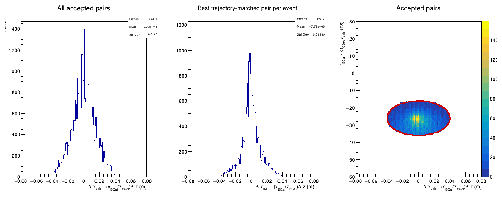

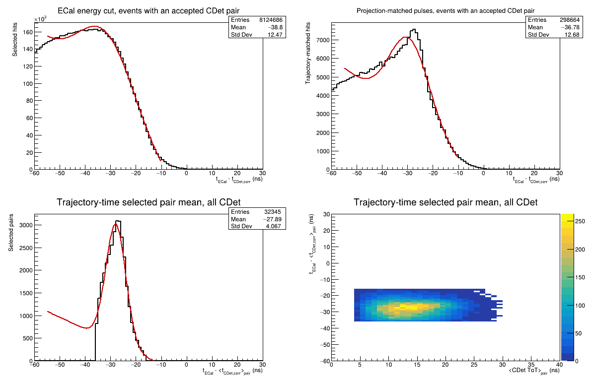

## ECal timing-window dependence

The timing scan reconstructs the candidate selection consistently for every
symmetric ECal timing half-width. Representative points are:

| ECal timing window | Admitted events | Events with selected pair | Conditional event fraction | Pairs per admitted event |
| --- | ---: | ---: | ---: | ---: |
| +/-10 ns | 26,634 | 16,572 | 62.2% | 1.214 |
| +/-5 ns | 13,908 | 9,166 | 65.9% | 1.264 |
| +/-3 ns | 8,564 | 5,716 | 66.7% | 1.277 |
| +/-2 ns | 5,727 | 3,841 | 67.1% | 1.295 |
| +/-1 ns | 2,901 | 1,986 | 68.5% | 1.303 |
| +/-0.5 ns | 1,420 | 979 | 68.9% | 1.269 |

Narrowing the timing window modestly enriches the admitted sample but sharply
reduces absolute yield. The broad `-10 < t_ECal < 10 ns` window remains the
recommended candidate-generation selection.

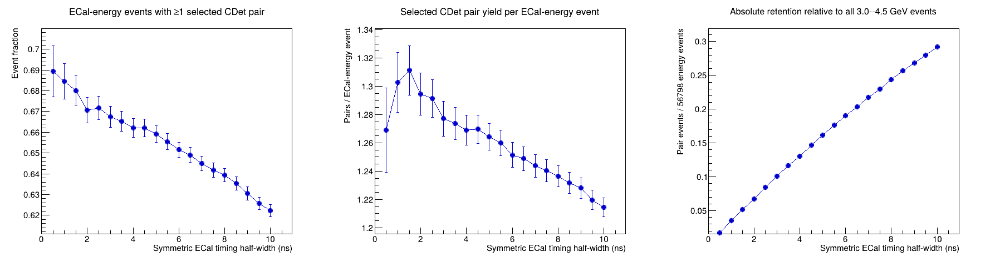

## ECal energy-window dependence

With the nominal timing selection, narrowing the symmetric energy window about
3.75 GeV produces only a small change in the conditional selected-pair
fraction:

| ECal energy window | Admitted events | Events with selected pair | Conditional event fraction |
| --- | ---: | ---: | ---: |
| 3.0--4.5 GeV | 26,634 | 16,572 | 62.2% |
| 3.25--4.25 GeV | 19,717 | 12,337 | 62.6% |
| 3.5--4.0 GeV | 10,724 | 6,796 | 63.4% |
| 3.6--3.9 GeV | 6,647 | 4,200 | 63.2% |
| 3.7--3.8 GeV | 2,267 | 1,474 | 65.0% |

The small enrichment does not compensate for the lost events. Retain
`3.0 < E_ECal < 4.5 GeV` for efficiency-oriented candidate generation.

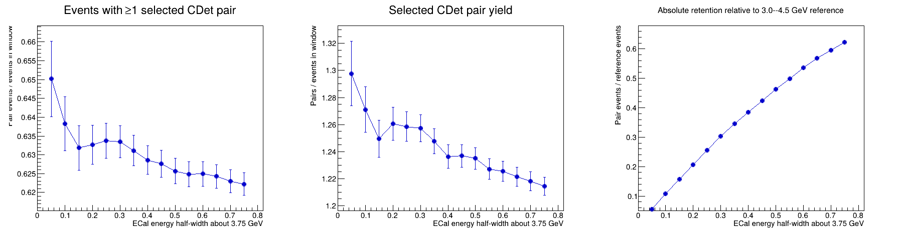

## Selected-pair x agreement

For each final pair, compare the mean corrected CDet x position with the ECal x
position projected to the pair mean z:

```text
delta_x = <x_CDet,corr>_pair - x_ECal * <z_CDet>_pair / z_ECal.
```

The 32,345 selected pairs give:

| Quantity | Result |
| --- | ---: |
| Mean x residual | -0.00079 m |
| RMS x residual | 0.0411 m |
| Linear correlation coefficient | 0.9967 |

The nearly zero mean and strong diagonal correlation support the geometrical
interpretation of the selected population. The RMS includes the bounded
spatial selection and should not be interpreted as an unconstrained detector
position resolution.

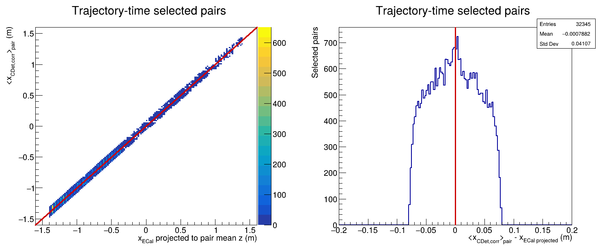

## Exclusive single-layer recovery

Single-layer recovery is considered only when an event has no final selected
pair and has complete good pulses in exactly one CDet layer. Events with good
pulses in both layers are excluded from this category even if no pair passes
the pair ellipse.

For each eligible pulse,

```text
delta_x_single = x_CDet,corr - x_ECal * z_CDet / z_ECal
delta_t_single = t_ECal - t_CDet,corr.
```

The initial single-layer ellipse is

```text
R_single^2 = (delta_x_single / 0.040 m)^2
           + ((delta_t_single + 26 ns) / 5 ns)^2 <= 2^2.
```

The maximum spatial excursion is therefore +/-8 cm at the timing center and
becomes narrower away from that center. The upstream projected-x requirement
also prevents candidates outside +/-8 cm.

| Exclusive population | Available events | Recovered events | Recovery fraction | Selected pulses |
| --- | ---: | ---: | ---: | ---: |
| Layer-1-only | 669 | 385 | 57.5% | 643 |
| Layer-2-only | 518 | 355 | 68.5% | 799 |
| Combined | 1,187 | 740 | 62.3% | 1,442 |

The selected Layer-1 pulse timing has mean `-28.14 ns` and RMS `4.23 ns`; the
Layer-2 population has mean `-27.35 ns` and RMS `4.48 ns`. Adding the 740
exclusive recovered events to the 16,572 paired events increases the candidate
event population to 17,312 events, or 65.0% of the ECal-admitted denominator.

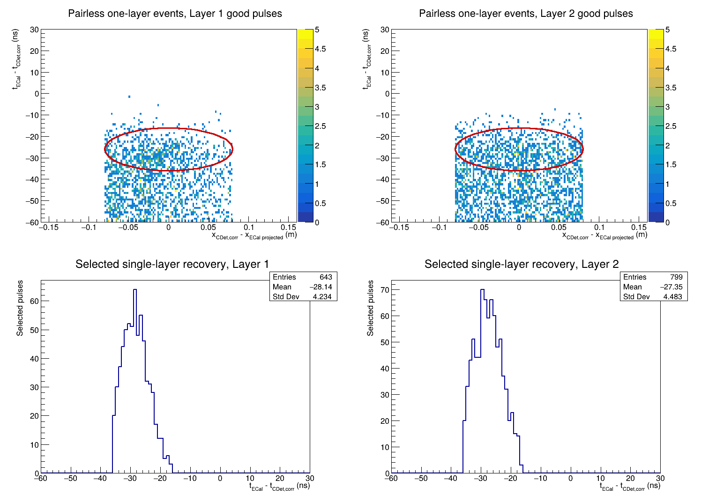

## Why admitted events are lost

Every ECal-admitted event is assigned to exactly one outcome:

| Exclusive outcome | Events | Fraction of 26,634 |
| --- | ---: | ---: |
| At least one trajectory-time selected pair | 16,572 | 62.2% |
| Good pulses in both layers, but no selected pair | 8,810 | 33.1% |
| Calibrated pulses in both layers, but good-pulse coverage lost in at least one layer | 1,252 | 4.7% |
| Missing calibrated pulse coverage in at least one layer | 0 | 0.0% |

The accounting closes exactly to 26,634 events. The final 8,810 pair-selection
failures comprise 7,449 events with no combination inside the ellipse and
1,361 with an ellipse-compatible combination rejected by a hard analyzer gate.
- The 1,252 good-pulse-coverage losses comprise 669 Layer-1-only events, 518
  Layer-2-only events, and 65 events with neither layer good.
- The zero count for a missing calibrated layer does not mean that a physical
  electron was detected in both layers. Raw Run 6077 occupancy is sufficiently
  high that complete calibratable pulses occur in both layers even when they
  fail quality or spatial compatibility.

The dominant unresolved population is therefore the 8,810 events with good
pulses in both layers but no pair inside the ellipse. That population should be
studied for correlated signal versus accidental content before loosening the
pair selection.

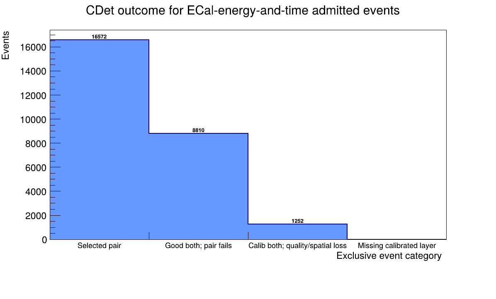

## Historical explanation of the initial 11,997 pair-selection failures

This section records the initial replay state before ECal-informed assignment
and the central-seam exception. Its counts are retained to document how the
final recovery was obtained; they are not the final production result.

The analyzer first forms candidate cross-layer combinations using only CDet
quantities. A combination must satisfy all three hard gates:

```text
|t_L2 - t_L1| <= 15 ns
|x_L2,corr - x_L1,corr| <= 0.15 m
|y_L2 - y_L1| <= 0.08 m.
```

Surviving combinations are ranked by the CDet-only time-and-x score and greedily
accepted one-to-one. ECal x is deliberately absent from this initial pairing.
The separate trajectory-time ellipse is applied afterward by the analysis
macro.

### Events with stored pairs outside the final ellipse

There are 11,631 events with one or more stored pairs but no pair inside the
radius-2 ellipse. For every event, the stored pair with the smallest normalized
radius was classified by which physical ellipse semiaxes it exceeds:

| Best-pair failure mode | Events | Fraction of stored-pair failures |
| --- | ---: | ---: |
| Timing axis only | 5,504 | 47.3% |
| Trajectory axis only | 2,745 | 23.6% |
| Both timing and trajectory axes | 2,305 | 19.8% |
| Inside both rectangular semiaxes, but outside the ellipse corner | 1,077 | 9.3% |
| **Total** | **11,631** | **100.0%** |

The directions of these failures are also informative. Among the 7,809 events
whose best stored pair exceeds the timing semiaxis, 7,665 are below `-36 ns`
and only 144 are above `-16 ns`: 98.2% of the timing failures are on the
late-CDet, more-negative-residual side. In contrast, the trajectory failures
are nearly symmetric, with 2,442 below `-0.04 m` and 2,608 above `+0.04 m`.
This is consistent with a broad accidental timing population combined with a
roughly symmetric spatial mismatch, rather than a simple global timing shift or
x-alignment error.

The minimum normalized radius has mean `4.01` and RMS `1.82`. Of these failed
events, 2,374 lie between radii 2 and 2.5, 4,427 lie between radii 2 and 3,
and 7,154 lie between radii 2 and 4. These counts quantify what would become
geometrically eligible if the ellipse were expanded; they do not establish
that those events are signal. The two-dimensional distribution shows a broad,
asymmetric population below the accepted timing region, so enlargement would
clearly introduce substantial accidental contamination.

### Good-both events with no stored pair

Only 366 of the 11,997 events have no analyzer-stored pair. For each event, the
cross-layer combination closest to satisfying all three analyzer gates was
identified. Its failed gates are:

| Failed analyzer gate(s) for nearest combination | Events | Fraction |
| --- | ---: | ---: |
| Inter-layer timing only | 315 | 86.1% |
| Inter-layer x only | 7 | 1.9% |
| Inter-layer y only | 20 | 5.5% |
| Timing and x | 4 | 1.1% |
| Timing and y | 20 | 5.5% |
| x and y, or all three | 0 | 0.0% |
| **Total** | **366** | **100.0%** |

Thus initial pair construction itself explains only 3.1% of the 11,997-event
loss, and that small component is overwhelmingly caused by the analyzer's
inter-layer timing gate. The final ECal-informed trajectory-time ellipse,
rather than absence of a stored CDet pair, accounts for the other 96.9%.

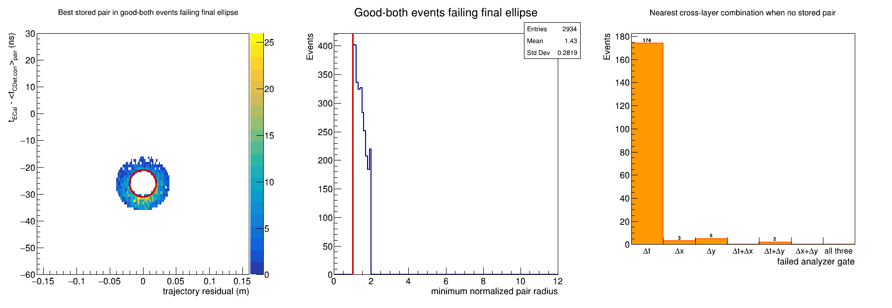

## Testing all combinations before greedy assignment

The high Run 6077 occupancy creates many plausible cross-layer combinations.
To test whether the initial CDet-only greedy assignment hides an otherwise
acceptable ECal-informed pair, every Layer-1/Layer-2 combination of good pulses
was examined in each of the 11,997 failed good-both events. No window was
enlarged. The test asks, in order:

1. Does any good-pulse combination lie inside the existing radius-2 ellipse?
2. Does at least one such combination also pass the existing analyzer hard
   gates of `|dt| <= 15 ns`, `|dx| <= 0.15 m`, and `|dy| <= 0.08 m`?
3. If so, was that combination absent only because the earlier CDet-only greedy
   one-to-one assignment consumed one or both pulses?

The exclusive result is:

| All-combination outcome | Events | Fraction of 11,997 failures |
| --- | ---: | ---: |
| No good-pulse combination inside the ellipse | 7,449 | 62.1% |
| An ellipse-compatible combination exists, but all fail analyzer hard gates | 2,121 | 17.7% |
| A hard-gate-eligible ellipse pair exists but was lost by greedy assignment | 2,427 | 20.2% |
| **Total** | **11,997** | **100.0%** |

The 2,427-event third category is a clean algorithmic recovery opportunity:
these events require neither a wider ECal window nor a larger final ellipse.
Selecting ECal-informed combinations before greedy one-to-one assignment would
increase the paired-event sample from 13,385 to 15,812 events, an 18.1% gain,
and raise the conditional paired-event fraction from 50.3% to 59.4%.

These recovered events contain 4,073 hard-gate-eligible combinations inside
the ellipse. The mean is 1.68 combinations per recovered event: 1,501 events
have exactly one compatible combination, 926 have at least two, and 387 have
at least three. The later global ROI tracker will therefore still need to
resolve ambiguity in a substantial minority of recovered events.

The 2,121 events rejected by the analyzer hard gates should remain separate
from the greedy recovery. For their best ellipse combination, the failed gates
are:

| Failed hard gate(s) | Events | Fraction |
| --- | ---: | ---: |
| Inter-layer timing only | 1,320 | 62.2% |
| Inter-layer y only | 600 | 28.3% |
| Timing and y | 201 | 9.5% |
| Any category involving inter-layer x | 0 | 0.0% |

Recovering this second population would require changing the analyzer's
physical hard-gate policy. It is not justified by the present study. In
contrast, the 2,427 greedy losses can be recovered while preserving every
current gate and final-ellipse boundary.

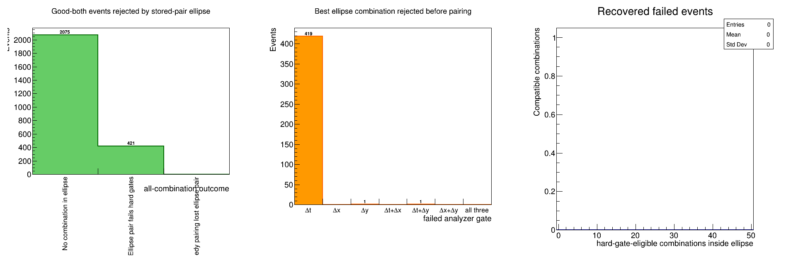

### Validation of the 2,427 greedily lost events

For each greedily lost event, the hard-gate-eligible combination with the
smallest ECal-informed normalized radius was selected as a diagnostic best
pair. Its distributions compare with the established selected-pair population
as follows:

| Quantity | Established selected pairs | Best greedy-recovered pair per event |
| --- | ---: | ---: |
| Entries | 20,856 pairs | 2,427 events |
| Pair-mean timing mean | -27.54 ns | -29.56 ns |
| Pair-mean timing RMS | 4.27 ns | 4.19 ns |
| Mean projected-x residual | +0.00012 m | -0.00189 m |
| Projected-x residual RMS | 0.0406 m | 0.0389 m |
| CDet-pair-x versus projected-ECal-x correlation | 0.99683 | 0.99679 |

The recovered sample's projected-x behavior is essentially indistinguishable
from that of the established sample, and its timing and x widths are comparable.
Its timing mean is about 2 ns more negative, consistent with preferential
occupation of the lower part of the same fixed selection ellipse. Because both
timing and trajectory residual enter the selection, these widths remain
selection-conditioned; nevertheless, the agreement supports treating the
2,427 events as a scientifically defensible candidate recovery rather than as
a window expansion.

The diagnostic chooses one best pair for comparison. All 4,073 compatible
alternatives remain relevant inputs to a global ROI tracker, which may use GEM
and calorimeter information to resolve events with multiple candidates.

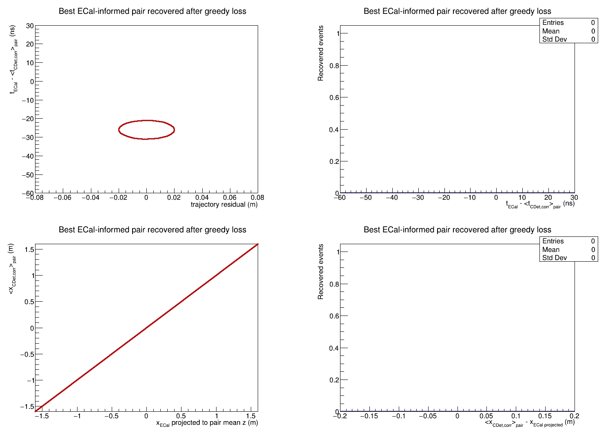

## Analyzer implementation

The scientifically justified recovery is implemented in `SBSCDet` as an
optional database-controlled preselection and ranking step. The existing pulse
quality requirements and the hard pair gates (`dt`, `dx`, and `dy`) are still
applied first. Every surviving Layer-1/Layer-2 combination then receives the
same normalized trajectory-time score used above. For the LH2 database
interval, combinations outside radius 2 are removed, the remaining candidates
are ordered by this score, and the existing deterministic one-to-one greedy
assignment is applied.

The database controls are:

```text
earm.cdet.pairing.ecal_rank_enable = 1
earm.cdet.pairing.ecal_trajectory_center = 0.0
earm.cdet.pairing.ecal_timing_center = -26.0
earm.cdet.pairing.ecal_trajectory_scale = 0.020
earm.cdet.pairing.ecal_timing_scale = 5.0
earm.cdet.pairing.ecal_radius = 2.0
```

Two additional replay variables make the decision directly inspectable:
`earm.cdet.pair.trajectory_residual` and `earm.cdet.pair.ecal_score`. The
existing `earm.cdet.pair.score` retains its original CDet-only definition for
backward-compatible diagnostics. The validation below uses a fresh Run 6077
replay containing these variables in every rollover file.

## Post-implementation 100k-event validation

Run 6077 was replayed again after enabling the ECal-informed preselection and
ranking. All six ROOT files contain the new `pair.ecal_score` and
`pair.trajectory_residual` branches and together contain exactly 100,000
events. The result confirms the all-combinations prediction exactly:

| Quantity | CDet-only greedy assignment | ECal-informed assignment | Change |
| --- | ---: | ---: | ---: |
| ECal-admitted events | 26,634 | 26,634 | 0 |
| Events with at least one selected pair | 13,385 | 15,812 | +2,427 |
| Conditional selected-pair event fraction | 50.3% | 59.4% | +9.1 percentage points |
| Selected pairs | 20,856 | 28,026 | +7,170 |
| Hard-gate ellipse events lost by greedy assignment | 2,427 | 0 | -2,427 |
| Good-both events with no selected pair | 11,997 | 9,570 | -2,427 |

Every analyzer-stored pair is inside the configured radius-2 ellipse. Of the
remaining 9,570 good-both failures, 7,449 contain no combination inside the
ellipse and 2,121 contain an ellipse combination that fails at least one
unchanged analyzer hard gate. Thus the implementation recovers the intended
population without widening any cut.

The enlarged selected-pair population retains the previously established
timing and projected-position quality:

| Quantity | ECal-informed result |
| --- | ---: |
| Pair ECal residual mean | -27.905 ns |
| Pair ECal residual RMS | 4.052 ns |
| Projected-x residual mean | -0.00032 m |
| Projected-x residual RMS | 0.04056 m |
| CDet-pair-x versus projected-ECal-x correlation | 0.99677 |
| Inter-layer trajectory residual mean | +0.00013 m |
| Inter-layer trajectory residual RMS | 0.01515 m |

These results demonstrate that the recovered events have the expected timing
and spatial correlations and that the earlier loss was an ordering artifact,
not evidence for widening the accepted physics region.

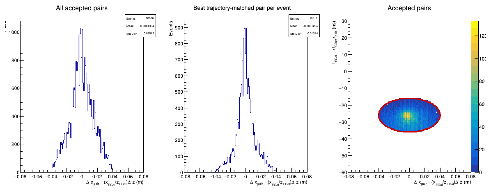

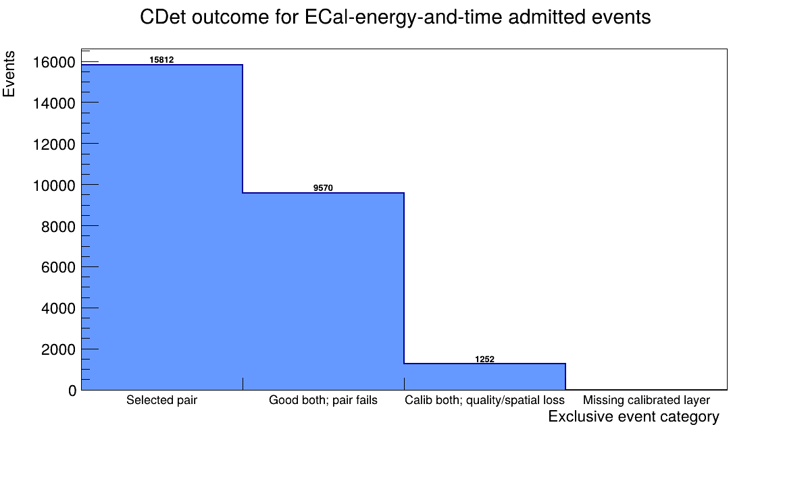

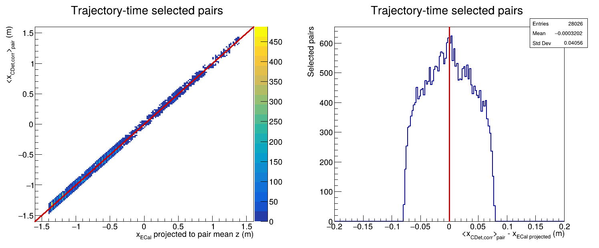

## Inter-layer y-gate investigation

The remaining hard-gate failures motivated a direct scan of the legacy
`|y_L2-y_L1| <= 0.08 m` requirement. This threshold is a one-pitch categorical
rule inherited from the original macro, not a measured resolution cut. The
study keeps the ECal trajectory-time ellipse and the analyzer `dt` and `dx`
gates fixed, then finds the smallest absolute `dy` available in each admitted
event.

The result is not a gradual resolution tail:

| `dy_max` | Selected-pair events | Added beyond 0.08 m | Conditional fraction |
| ---: | ---: | ---: | ---: |
| 0.08 m | 15,812 | 0 | 59.37% |
| 0.45 m | 15,829 | 17 | 59.43% |
| 0.52 m | 16,583 | 771 | 62.26% |
| 0.60 m | 16,585 | 773 | 62.27% |

Almost the entire additional population appears in two discrete bands at
`dy = +/-0.51 m`, corresponding to opposite CDet half-bars. Their aligned ECal
projection is centered on the boundary: the raw projected-y mean is
`-0.102 m` with `0.078 m` RMS, and the existing `+0.10 m` alignment offset
therefore places the mean at approximately zero. This is exactly the topology
expected when an electron projects near the central seam and the two layers
register opposite halves.

The 773 newly available candidates retain clean independent observables:

| Quantity | Opposite-half candidate result |
| --- | ---: |
| Pair ECal residual mean | -29.264 ns |
| Pair ECal residual RMS | 4.010 ns |
| Projected-x residual mean | -0.00553 m |
| Projected-x residual RMS | 0.04311 m |
| Aligned projected ECal y mean | approximately -0.002 m |

These data support a topology-aware central-seam exception, not a general
widening of the inter-layer y gate. The production rule retains the 8 cm
same-side condition and separately admits the opposite-half topology only when
the aligned ECal projection is compatible with the central seam. The GEP GEMs
are on the HCal/proton side and therefore cannot provide an independent track
for this electron-side topology; the validation instead uses the ECal
projection together with the independent CDet x and timing correlations.

The topology is implemented with database-controlled parameters:

```text
earm.cdet.pairing.opposite_side_enable = 1
earm.cdet.pairing.opposite_dy_center = 0.51
earm.cdet.pairing.opposite_dy_tolerance = 0.08
earm.cdet.pairing.opposite_projected_y_center = 0.0
earm.cdet.pairing.opposite_projected_y_max = 0.17
```

The exception is disabled by default and enabled for the LH2 validity interval.
Each stored pair now exposes `pair.y_topology`, with `0` for the original
same-side category and `1` for the opposite-side seam category. Applying the
new rule to the pre-replay Run 6077 pulse combinations predicted 16,572
selected events after deterministic one-to-one assignment, a gain of 760 over
the 15,812-event same-side result. The fresh analyzer replay subsequently
returned exactly 16,572 events and 32,345 pairs, validating both predicted
counts. The gain is slightly smaller than the 773 events with at least one
eligible opposite-side combination because 13 events contain one-to-one pulse
conflicts resolved by the global candidate ordering.

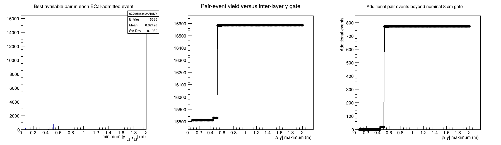

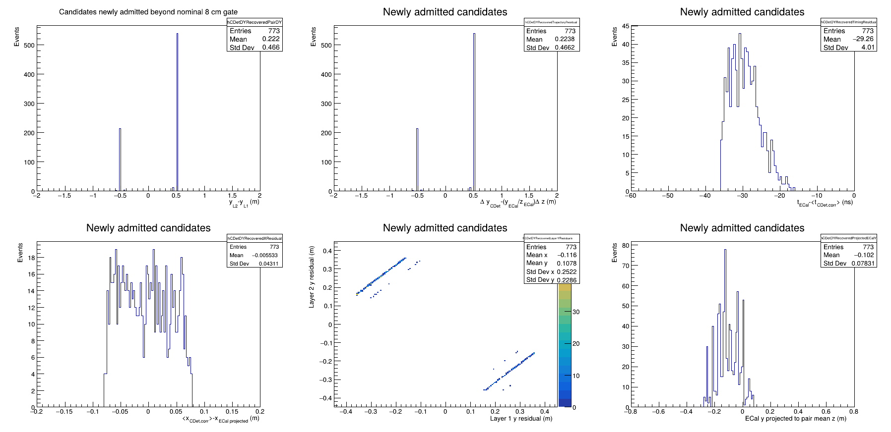

Reproduce this diagnostic with:

```bash
root -l -b -q 'Plot_CDet_DYGateStudy.C+("CDet_run6077_projection.conf","/path/to/Rootfiles","CDet_run6077_dy_gate_study",2.0,0.01)'
```

## Inter-layer timing-gate investigation

After applying the seam-aware y topology, inter-layer timing accounts for
essentially all remaining hard-gate failures. A dedicated scan therefore
holds fixed the radius-2 ECal ellipse, the `|dx| <= 0.15 m` gate, and the
same-side plus central-seam y topology. At every candidate timing threshold it
reruns the same deterministic ECal-score-ordered one-to-one assignment used by
the analyzer. This is important: simply counting all combinations would
overstate production yield in high-occupancy events with shared pulses.

Representative scan points are:

| `|dt|` maximum | Selected events | Conditional fraction | Selected pairs | Additional events vs. 15 ns | Additional pairs per additional event |
| ---: | ---: | ---: | ---: | ---: | ---: |
| 15 ns | 16,572 | 62.22% | 32,345 | 0 | -- |
| 16 ns | 16,755 | 62.91% | 33,164 | 183 | 4.48 |
| 18 ns | 17,056 | 64.04% | 34,672 | 484 | 4.81 |
| 20 ns | 17,261 | 64.81% | 35,986 | 689 | 5.28 |
| 22 ns | 17,427 | 65.43% | 37,233 | 855 | 5.72 |
| 25 ns | 17,616 | 66.14% | 38,709 | 1,044 | 6.10 |
| 30 ns | 17,779 | 66.75% | 40,587 | 1,207 | 6.83 |

The minimum available `|dt|` distribution has a continuous falling tail; it
does not reveal a second population or a natural boundary beyond 15 ns. The
event yield consequently rises smoothly rather than turning on at a physically
identifiable threshold. Meanwhile, widening from 15 to 30 ns gains 1,207
events but adds 8,242 pairs. The overall pair multiplicity rises from 1.95 to
2.28 pairs per selected event, and each additional event is accompanied by an
average of 6.83 additional pair hypotheses.

The best newly admitted pair per event at 30 ns has:

| Quantity | Result |
| --- | ---: |
| ECal pair-mean residual | `-30.92 +/- 3.65 ns` RMS |
| Projected-x residual | `-0.00497 +/- 0.04438 m` RMS |
| Inter-layer trajectory residual | `+0.00125 +/- 0.0161 m` RMS |

The x and trajectory agreement remains compatible with the selected sample.
However, the pair-mean timing agreement is not an independent validation: it
is explicitly bounded by the ECal timing coordinate of the selection ellipse.
The scan therefore demonstrates a possible lower-confidence candidate tail,
but does not provide a physics-motivated reason to replace 15 ns with another
hard threshold.

The recommended production policy is to retain `|t_L2-t_L1| <= 15 ns` for
normal selected pairs. If a later global ROI tracker needs additional
hypotheses, combinations in a separately labelled timing sideband could be
exported as lower-confidence candidates; they should not be mixed with the
primary pair collection merely by widening the production gate.

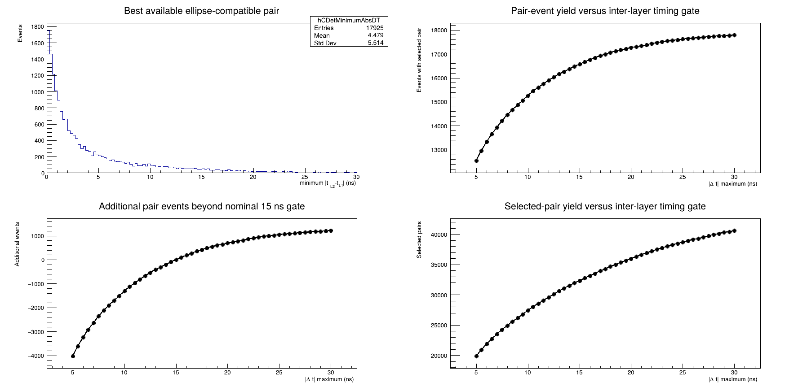

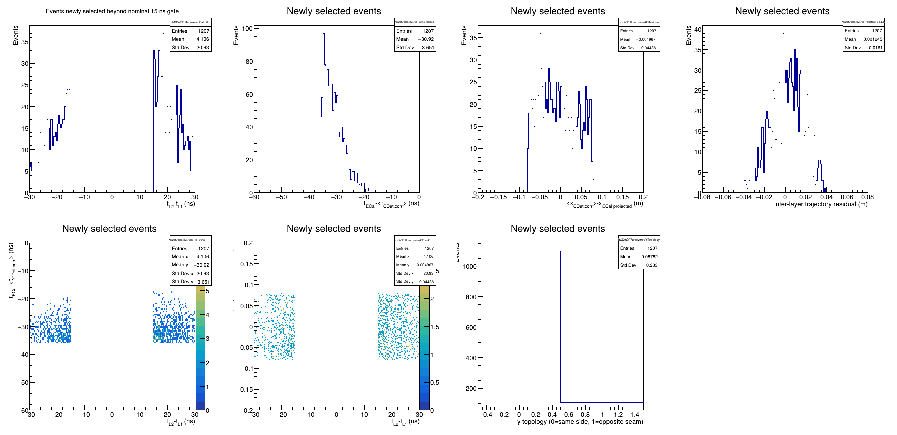

Reproduce this diagnostic with:

```bash
root -l -b -q 'Plot_CDet_DTGateStudy.C+("CDet_run6077_projection.conf","/path/to/Rootfiles","CDet_run6077_dt_gate_study",5.0,30.0,0.5)'
```

## Half-bar occupancy and active-channel inventory

The first step toward an acceptance-corrected denominator is to identify
coherently inactive detector regions. Each multi-anode PMT occupies a
16-channel electronic block, but only 14 channels are connected to WLS fibers
from physical paddles. The two unused electronic slots are not fixed local
channel numbers. The inventory therefore reads `earm.cdet.xpos` from
`DB/db_earm.cdet.dat` and treats only finite positions with magnitude below
900 m as physical pixels. It uses detector pixel IDs 0--2687 and ignores the
following reference-time block.

For each of the 168 half-bars, the study counts:

- complete calibrated pulse triplets in each of its 14 physical pixels; and
- the subset also satisfying the analyzer broad-quality good-pulse policy.

No ECal cut is applied to this detector-health inventory. A half-bar is called
coherently low only when its *highest-count* physical pixel is below a chosen
fraction of the median physical-pixel count in the same layer. Thus a single
active pixel prevents an entire half-bar from being labelled inactive.

For the 100k-event Run 6077 replay, the layer medians are:

| Population | Layer 1 pixel median | Layer 2 pixel median |
| --- | ---: | ---: |
| Complete calibrated triplets | 11,928 | 17,858.5 |
| Broad-quality good pulses | 10,065 | 14,825.5 |

Six half-bars form a clearly separated coherent low-occupancy population:

| Global half-bar | Layer | Half-bar within layer | Complete min/median/max | Good min/median/max | Maximum complete fraction of layer median |
| ---: | ---: | ---: | ---: | ---: | ---: |
| 7 | 1 | 7 | 0 / 0 / 0 | 0 / 0 / 0 | 0 |
| 24 | 1 | 24 | 0 / 0 / 329 | 0 / 0 / 273 | 0.0276 |
| 70 | 1 | 70 | 0 / 0 / 0 | 0 / 0 / 0 | 0 |
| 136 | 2 | 52 | 0 / 0 / 0 | 0 / 0 / 0 | 0 |
| 137 | 2 | 53 | 0 / 0 / 0 | 0 / 0 / 0 | 0 |
| 155 | 2 | 71 | 0 / 0 / 0 | 0 / 0 / 0 | 0 |

The classification is insensitive to the precise low threshold: the same six
half-bars are selected when the maximum-pixel threshold is anywhere from 3%
through 20% of the corresponding layer median. Five are completely empty;
half-bar 24 has a small residual population but remains coherently suppressed
across all 14 physical pixels. The next-nearest half-bar is already at 24.9%
of its layer median, leaving a substantial gap from this six-bar population.

Pulse records associated with the database sentinel slots are deliberately
ignored. Their presence in the electronic readout does not make those slots
physical CDet pixels and must not contribute to the active-area denominator.

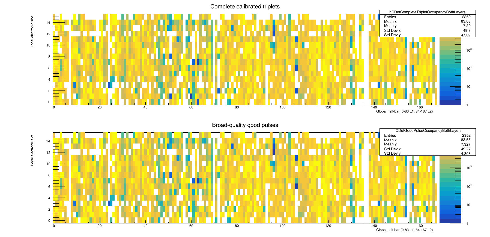

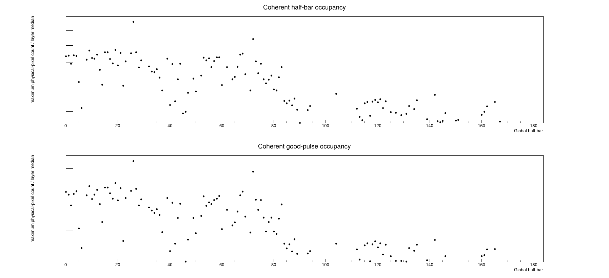

Reproduce this inventory with:

```bash
root -l -b -q 'Plot_CDet_HalfBarOccupancyStudy.C+(6077,"/path/to/Rootfiles","CDet_run6077_halfbar_occupancy","../../DB/db_earm.cdet.dat",0.10)'
```

### ECal-trajectory intersection with physical CDet geometry

The 26,634 ECal-admitted rays were projected from the target through the two
CDet planes at `z = 5.75 m` and `5.85 m`. These are the Kin3 database positions
applicable to Run 6077. The ECal target distance is `6.144 m`, so the two CDet
planes are 0.394 m and 0.294 m upstream of ECal. The database also contains an
earlier Kin1 `zpos` block at 7.75/7.85 m; those values do not apply to this run
and must not be used for this projection.

The projection uses the same CDet/ECal alignment as the analyzer: the database
x centers are transformed by the layer x scale `1.07` and alignment `0.03 m`,
and the projected y coordinate is shifted by `+0.10 m`. Each of the 14 physical
pixels in a half-bar is represented by its aligned 5 mm paddle width and the
0.30 m half-length used by the original cross-target macro, giving a 0.60 m
full y extent. The six suppressed half-bars above are retained as physical
geometry but classified separately.

The few tenths of a millimeter between wrapped paddles, and the similarly small
module seams, are far below the ECal-to-CDet projection resolution. They are
therefore treated as continuous physical coverage: a projected point inside
the detector envelope and inside a half-bar's y extent is assigned to the
nearest physical paddle. Exact geometric intersections with Mylar/Tedlar seams
are not classified as acceptance losses.

The mutually exclusive event classification is:

| Trajectory category | Events | Fraction of 26,634 |
| --- | ---: | ---: |
| Crosses an active physical pixel in both layers | 24,900 | 93.49% |
| Crosses physical pixels in both layers, but at least one is in a suppressed half-bar | 1,729 | 6.49% |
| Genuinely uncovered internal topology | 0 | 0.00% |
| At least one layer is outside the detector envelope | 5 | 0.02% |
| **Total** | **26,634** | **100.00%** |

The layer-by-layer classification is:

| Layer | Active physical pixel | Suppressed half-bar | Internal gap | Outside |
| ---: | ---: | ---: | ---: | ---: |
| 1 | 25,427 | 1,207 | 0 | 0 |
| 2 | 25,690 | 939 | 0 | 5 |

The six suppressed half-bars receive 2,146 layer intersections in total. Their
individual projected counts are 26, 557, 624, 64, 51, and 824 for global
half-bars 7, 24, 70, 136, 137, and 155, respectively. Exclusive event
accounting reduces this to 1,729 events because some events intersect suppressed
regions in both layers.

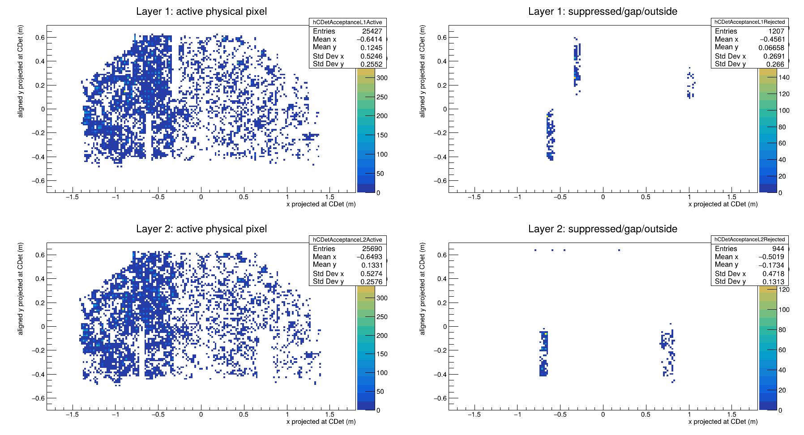

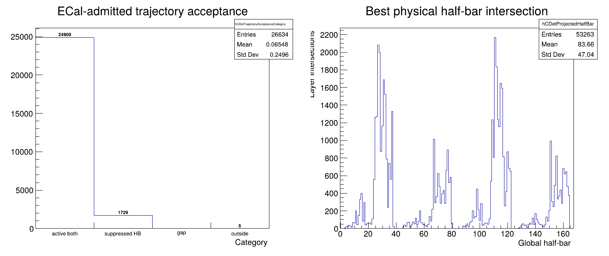

Reproduce the trajectory classification with:

```bash
root -l -b -q 'Plot_CDet_TrajectoryAcceptanceStudy.C+("CDet_run6077_projection.conf","/path/to/Rootfiles","CDet_run6077_trajectory_acceptance","../../DB/db_earm.cdet.dat",0.005,0.60)'
```

This result materially refines the denominator, but it also exposes an
important limitation of a simple efficiency ratio. In the final seam-aware
replay, events with a stored selected pair divide by geometry as:

| Trajectory category | Events with stored pair | Fraction within category |
| --- | ---: | ---: |
| Active in both layers | 16,171 | 64.94% |
| Suppressed half-bar | 401 | 23.19% |
| Internal gap | 0 | -- |
| Outside | 0 | 0.00% |
| **All categories** | **16,572** | **62.22% of all admitted events** |

Consequently, `16,171 / 24,900 = 64.94%` is the geometry-conditioned selected-
candidate fraction for the final replay, not an intrinsic two-layer detector
efficiency. Measuring intrinsic efficiency would additionally require a
signal/background treatment of the matched timing population or an independent
electron-side track, which is not available from the GEP GEM system.

The final replay has 10,062 ECal-admitted events without a stored selected
pair. Their physically relevant geometry breakdown is:

| Unrecovered-event trajectory | Events | Fraction of 10,062 |
| --- | ---: | ---: |
| Active half-bars in both layers | 8,729 | 86.75% |
| At least one suppressed half-bar | 1,328 | 13.20% |
| Outside | 5 | 0.05% |

Thus the suppressed regions plausibly account for approximately one eighth of
the currently unrecovered sample. The remaining 8,729 active-both failures are
the appropriate population for studying pulse detection and pair-selection
inefficiency; ordinary physical seams should not be invoked to explain them.

## Final status after the seam-aware replay

### Replay-validated conclusions

- Complete calibrated pulse triplets are the only accepted pulse candidates.
- The radius-2 ECal trajectory-time ellipse is retained; widening it adds a
  visibly broad accidental population and is not recommended.
- ECal-informed ranking before one-to-one assignment recovers all 2,427 events
  previously lost by CDet-only greedy pairing. The 100k-event replay increased
  the selected sample from 13,385 to 15,812 events, or 59.37% of the 26,634
  ECal-admitted events, while retaining the expected timing and x correlations.
- The topology-aware central-seam rule then increases the sample from 15,812
  to 16,572 events and from 28,026 to 32,345 pairs. These are fresh analyzer
  results and exactly match the independent pre-replay prediction.
- The final selected-pair fraction is 62.22% of all ECal-admitted events. After
  conditioning on trajectories through active regions of both layers, it is
  `16,171 / 24,900 = 64.94%`; neither ratio is an intrinsic detector efficiency.
- The inter-layer x gate is not responsible for the remaining hard-gate loss:
  no remaining best ellipse-compatible combination fails `dx`.
- Exclusive single-layer selection provides 740 additional, lower-confidence
  events. These candidates should be retained for the global ROI tracker, but
  should not be promoted to artificial two-layer pairs.
- Multiple valid CDet pairs should remain available to the later global
  tracker rather than forcing CDet alone to select one final track hypothesis.

### Seam-aware replay validation

The topology-aware central-seam exception described above is implemented in
`SBSCDet`, the database, and the analysis configuration. It preserves the
original same-side `|dy| <= 0.08 m` rule and adds only the physically distinct
opposite-half topology near the aligned ECal central-seam projection. The new
`pair.y_topology` output records which rule admitted each pair.

The independent calculation made before replay and the fresh analyzer output
agree exactly:

| Quantity | Same-side replay | Seam-aware prediction | Seam-aware replay |
| --- | ---: | ---: | ---: |
| ECal-admitted events | 26,634 | 26,634 | 26,634 |
| Events with at least one selected pair | 15,812 | 16,572 | 16,572 |
| Conditional selected-pair event fraction | 59.37% | 62.22% | 62.22% |
| Selected pairs | 28,026 | 32,345 | 32,345 |
| Good-both events with no selected pair | 9,570 | 8,810 | 8,810 |

The validated gain is 760 events rather than the raw 773-event opposite-half
population because deterministic one-to-one assignment resolves pulse
conflicts in 13 events.

### Remaining two-layer failure population after the seam replay

The observed 8,810 good-both failures divide cleanly into:

| Remaining outcome | Events | Interpretation |
| --- | ---: | --- |
| No pulse combination inside the radius-2 ellipse | 7,449 | No defensible CDet+ECal recovery identified |
| Ellipse combination exists, but all fail a hard gate | 1,361 | Bounded hard-gate diagnostic population |
| Eligible pair lost through greedy assignment | 0 | Resolved by ECal-informed ranking |

The 1,361 hard-gate failures comprise:

| Failed gate(s) for the best ellipse-compatible combination | Events |
| --- | ---: |
| Inter-layer timing only | 1,348 |
| Inter-layer y only | 9 |
| Timing and y | 4 |
| Any category involving inter-layer x | 0 |

The seam rule therefore resolves essentially all of the scientifically
motivated `dy` population. Inter-layer timing is now the only material hard
gate question left.

### Scientifically justified next use

The bounded inter-layer timing scan is complete and does not justify a change
to the 15 ns production gate. The appropriate next use is:

1. **Preserve lower-confidence hypotheses.** Keep the established single-layer
   candidates and all valid two-layer alternatives available to the global ROI
   tracker. This requires no loosening of the clean pair selection.

The 7,449 no-ellipse events should not be recovered by simply widening the
ellipse, the x window, the ToT window, or the general y window. Without an
independent electron-side trajectory measurement, CDet plus ECal alone does
not currently provide a scientifically clean discriminator for that broad
population. The GEP GEMs are on the HCal/proton side and cannot supply that
missing electron-side constraint.

The bounded `dt`, `dy`, and geometrical-acceptance studies and the validating
replay are now complete. Retain the established 15 ns timing policy and use
the final replay products as inputs to the global ROI-tracking development.
Report both the all-admitted candidate fraction and the geometry-conditioned
active-both fraction without labelling either as intrinsic detector efficiency.

## Reproduction commands

From `scripts/cdet`, regenerate the pulse, pair, x-correlation, single-layer,
and event-outcome plots with:

```bash
root -l -b -q 'Plot_CDet_GoodPulseCandidates_AllTDC.C+("CDet_run6077_projection.conf","/path/to/Rootfiles","CDet_run6077_good_pulse_tdc")'
```

Regenerate the ECal timing- and energy-window scans with:

```bash
root -l -b -q 'Plot_CDet_PairYieldVsECalTimingWindow.C+("CDet_run6077_projection.conf","/path/to/Rootfiles","CDet_run6077_pair_timing_scan")'
```

Or generate both suites with the same configuration in one command:

```bash
root -l -b -q 'Run_CDet_GoodPulseDiagnostics.C+("CDet_run6077_projection.conf","/path/to/Rootfiles")'
```

The original positional interfaces remain supported for backward
compatibility and deliberate sensitivity studies.

The generated ROOT files are local analysis products. The Markdown report,
PNG/PDF figures, and CSV scan tables are the persistent human-readable record.

## Final recovery summary

The common denominator for the cumulative recovery accounting is the 26,634
events passing the adopted ECal energy and timing selections. The rows below
are mutually exclusive additions, so the cumulative total can be read directly.

| Recovery stage and source | Newly recovered events | Cumulative events | Cumulative fraction of ECal-admitted events | Incremental gain |
| --- | ---: | ---: | ---: | ---: |
| Initial CDet-only one-to-one pairing plus radius-2 trajectory-time ellipse | 13,385 | 13,385 | 50.25% | 50.25 percentage points |
| ECal-informed global pair ranking, recovering candidates lost by greedy CDet-only assignment | 2,427 | 15,812 | 59.37% | 9.11 percentage points |
| Topology-aware central-seam pairing | 760 | 16,572 | 62.22% | 2.85 percentage points |
| Exclusive single-layer candidates in events with no selected pair | 740 | 17,312 | 65.00% | 2.78 percentage points |

The final two-layer paired sample is therefore 16,572 events, or 62.22% of
the ECal-admitted denominator. Including the explicitly lower-confidence,
exclusive single-layer sample gives at least one retained CDet candidate in
17,312 events, or 65.00%.

The complementary final accounting is:

| Final exclusive outcome | Events | Fraction of 26,634 |
| --- | ---: | ---: |
| At least one selected two-layer pair | 16,572 | 62.22% |
| No selected pair, but an accepted exclusive single-layer candidate | 740 | 2.78% |
| Good pulses in both layers, but no defensible selected pair | 8,810 | 33.08% |
| Good-pulse coverage lost and no accepted single-layer candidate | 512 | 1.92% |
| **Total** | **26,634** | **100.00%** |

For the separate geometry-conditioned statement, 24,900 admitted events
project through active regions in both CDet layers, and 16,171 of them contain
a selected pair. This gives a 64.94% geometry-conditioned candidate-recovery
fraction. It uses a different denominator from the cumulative table and must
not be combined with the 740-event single-layer increment. None of these
fractions is, by itself, an intrinsic detector efficiency; they quantify
candidate recovery under the stated ECal and CDet selections.

### Recovery after rejecting non-working-bar trajectories

The modified denominator removes the 1,729 ECal-admitted events whose projected
trajectory intersects at least one of the six coherently suppressed half-bars.
It also removes the five trajectories outside the physical CDet boundary,
leaving 24,900 events projected through working regions of both layers.

| Two-layer recovery stage and source | Newly recovered events | Cumulative events | Fraction of 24,900 working-geometry events | Incremental gain |
| --- | ---: | ---: | ---: | ---: |
| ECal-informed same-side pairing | 15,458 | 15,458 | 62.08% | 62.08 percentage points |
| Topology-aware central-seam pairing | 713 | 16,171 | 64.94% | 2.86 percentage points |
| No selected two-layer pair | -- | 8,729 | 35.06% | -- |

The seam rule recovers 713 events in the working-geometry population. The
remaining 47 events in its full 760-event gain project through a suppressed
half-bar and are therefore absent from this table. Similarly, the final full
sample contains 401 selected-pair events in the suppressed-half-bar category;
they are deliberately excluded from both the numerator and denominator here.

This table reports two-layer pair recovery only. The 740 exclusive single-layer
candidates cannot yet be added consistently because their event-by-event
intersection with the suppressed-half-bar mask has not been tabulated. Quoting
`(16,171 + 740) / 24,900` would therefore mix denominators and overstate the
working-geometry recovery.
