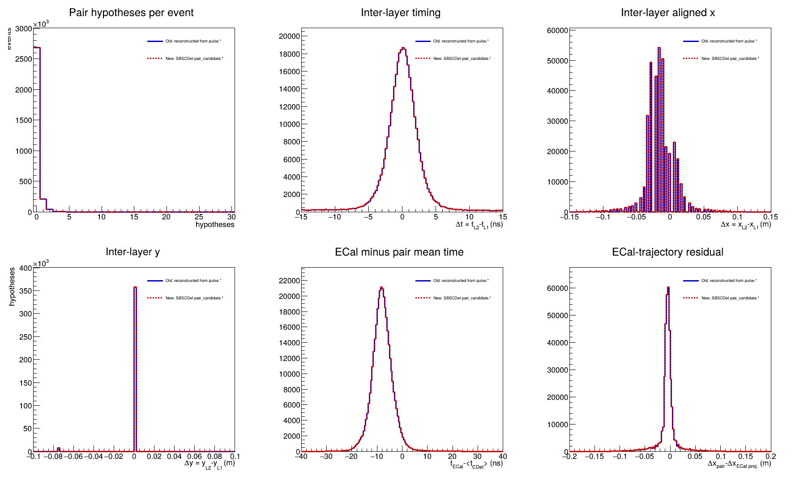
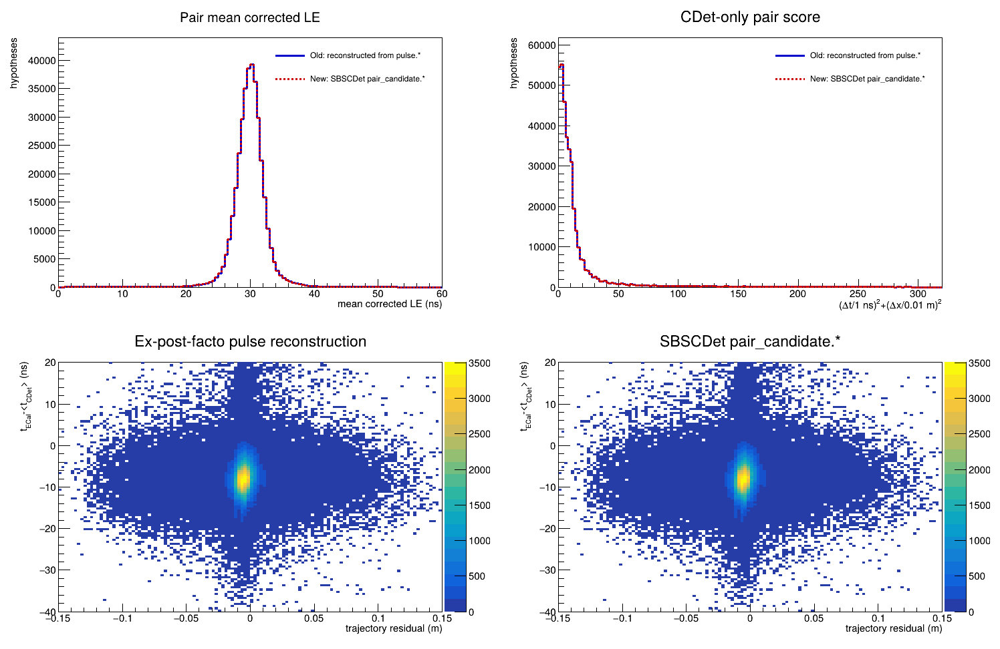
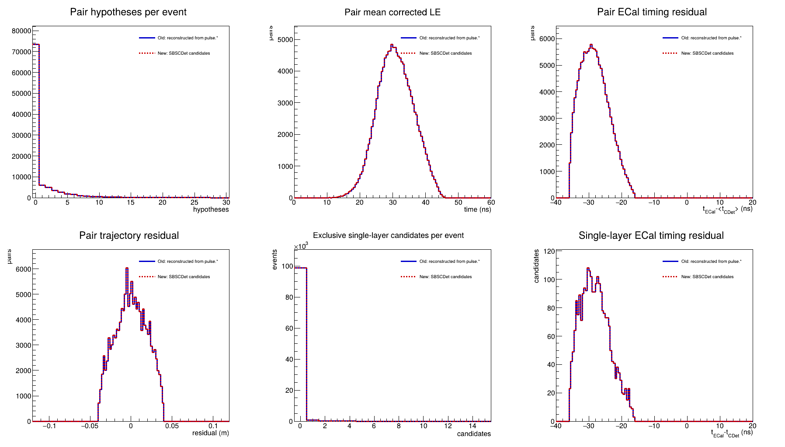
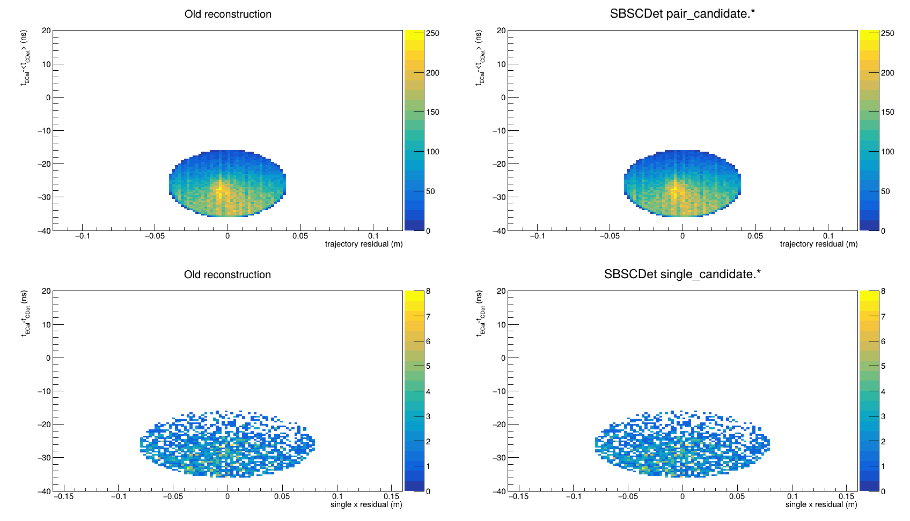
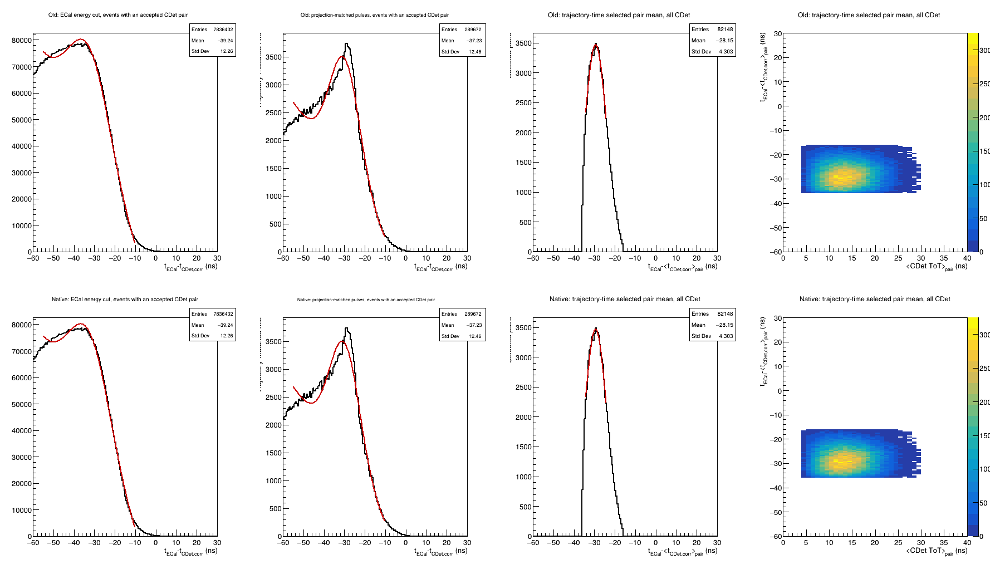
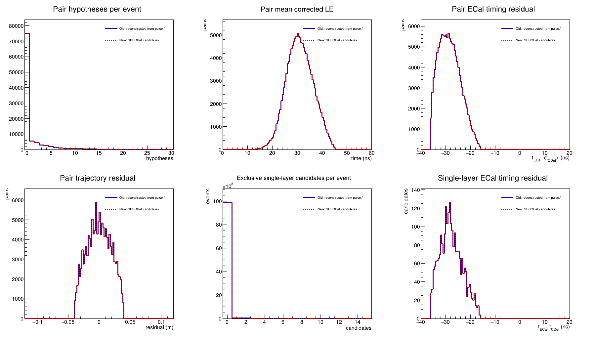
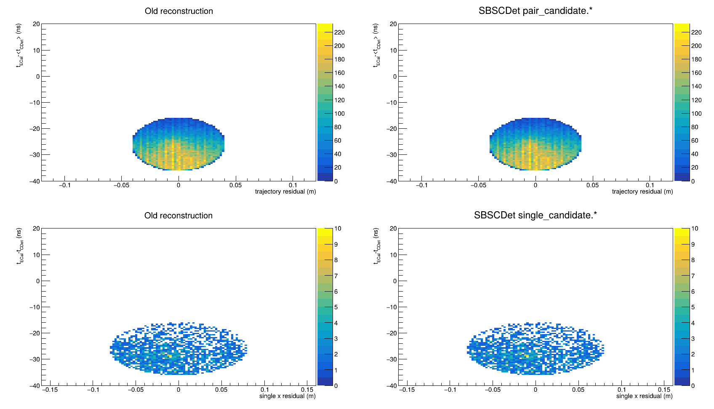
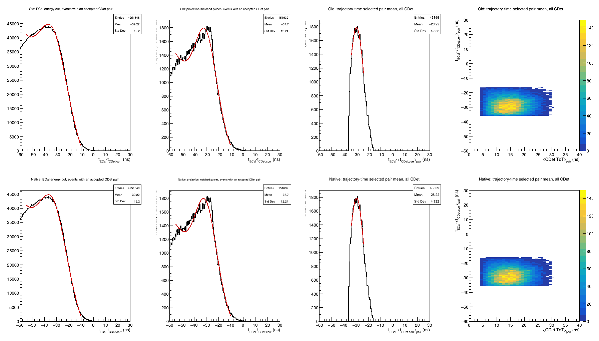

# CDet candidate integration into the SBS-offline ROI algorithm

Status: implementation in progress. This document records the interface and
data-model work needed to make the calibrated CDet candidates available to the
event-level region-of-interest (ROI) algorithm in SBS-offline.

## Objective

The calibration and diagnostic macros read reconstructed quantities from ROOT
trees. The eventual ROI algorithm instead runs inside the analyzer and must
consume the same CDet information directly from `SBSCDet`, before an output
tree exists. Detector-local reconstruction should remain owned by `SBSCDet`;
the global ROI module should combine the resulting CDet hypotheses with ECal,
HCal, and tracking information.

The implementation must preserve the existing `hit.*`, `pulse.*`, and `pair.*`
ROOT output and must not silently change the current pulse or pair selection.

## Current state

| Capability | State at start | Current state |
|---|---|---|
| Build complete LE/TE/ToT pulse candidates | Implemented in `SBSCDet` | Implemented |
| Apply pixel, time-walk, run-shift, p1, and y corrections | Implemented | Implemented |
| Apply broad pulse-quality and ECal-projection decisions | Implemented | Implemented |
| Build and rank Layer-1/Layer-2 pairs | Implemented | Implemented |
| Store final greedy-selected, one-to-one pairs | Implemented as `pair.*` | Implemented |
| Public read-only C++ pulse/pair interface | Not implemented | **Implemented in Step 1** |
| Preserve all valid alternate pair hypotheses | Not implemented | **Implemented in Step 2** |
| Produce accepted exclusive single-layer candidates | Macro study only | **Implemented in Step 3** |
| Consume CDet candidates in `SBSGEPRegionOfInterestModule` | Not implemented | Not implemented |

The ROOT branches are suitable for post-replay analysis, but they are not an
appropriate in-process interface between analyzer modules. Before Step 1, the
underlying pulse and pair vectors were protected members of `SBSCDet`.

## Responsibility boundary

`SBSCDet` is responsible for:

- complete-pulse construction and stable pulse identity;
- timing calibration and detector-coordinate corrections;
- detector-local quality and projection decisions;
- Layer-1/Layer-2 candidate construction and detector-local scores;
- exposing event-local candidates through a read-only interface.

The global ROI module is responsible for:

- combining CDet candidates with ECal, HCal, and tracking information;
- resolving ambiguous detector-level hypotheses using global information;
- deciding which hypotheses belong in the event ROI.

The ROI module should not reproduce CDet calibration or reach into protected
`SBSCDet` storage.

## Implementation sequence

1. Add a stable, public, read-only C++ interface for the existing pulse
   candidates and greedy-selected pairs.
2. Preserve every pair hypothesis that passes the detector-local hard gates
   and ECal ellipse before greedy pulse-sharing resolution. Keep the existing
   `pair.*` collection unchanged for backward compatibility. **Implemented.**
3. Implement explicit exclusive Layer-1-only and Layer-2-only ROI candidates,
   using the selection validated by the hydrogen studies. **Implemented.**
4. Add the remaining database-backed policy needed by the new candidate
   collections and expose their classifications and scores. **Implemented.**
4a. Migrate the principal diagnostic macro to prefer the analyzer candidate
   collections while retaining its independent reconstruction for old files
   and regression tests. **Implemented and validated on a limited sample.**
5. Connect `SBSGEPRegionOfInterestModule` to `SBSCDet` and consume the public
   candidate interface after ECal-dependent CDet calibration has run.
6. Validate candidate identity, multiplicity, backward compatibility, and ROI
   behavior with the established Run 5710 and hydrogen samples.

## Step 1: public read-only pulse and pair interface

Status: implemented.

`SBSCDet.h` now defines two event-local snapshot types:

- `SBSCDet::PulseCandidate`, containing the complete pulse identity,
  coordinates, raw and calibrated timing values, ECal residuals, and the three
  existing selection flags;
- `SBSCDet::LayerPair`, containing the two source-pulse indices and pixel IDs,
  member and mean times, layer residuals, CDet and ECal scores, and y topology.

The corresponding accessors are:

```cpp
Int_t GetNumPulseCandidates() const;
Bool_t GetPulseCandidate(Int_t index, PulseCandidate& pulse) const;

Int_t GetNumLayerPairs() const;
Bool_t GetLayerPair(Int_t index, LayerPair& pair) const;
```

Each accessor copies one immutable snapshot and returns `false` for an invalid
index. Callers therefore cannot mutate `SBSCDet` storage or retain a reference
that becomes invalid when the next event is cleared. Pulse indices stored in a
`LayerPair` refer to the same event's pulse-candidate collection.

Step 1 intentionally exposes only the already existing collections. In
particular, `GetLayerPair()` returns the current greedy-selected pairs. It does
not yet provide alternate hypotheses or single-layer candidates; those remain
separate, explicitly testable implementation steps.

No ROOT branch names, calibration calculations, selection cuts, greedy-pairing
behavior, or default replay configuration are changed by Step 1.

### Step 1 verification

The SBS-offline ROOT dictionary and complete `libsbs` shared-library target
were rebuilt successfully after adding the nested snapshot types and accessors:

```text
cmake --build ../build --target sbs -- -j4
[100%] Built target sbs
```

Both SBS-offline and SBS-replay pass `git diff --check`. A replay-data parity
test is not required for this slice because no reconstruction path or output
definition changed; event-level parity will be checked when the candidate
collections themselves are extended in Steps 2 and 3.

## Step 2: preserve valid pair hypotheses before greedy assignment

Status: implemented.

`SBSCDet::BuildLayerPairs()` already constructs every Layer-1/Layer-2
combination from pulses passing the pulse-quality, ECal-eligibility, and
per-pulse spatial decisions. Each combination must then pass the configured
hard limits on `dt`, `dx`, and y topology. When ECal-informed ranking is
enabled, it must also lie inside the configured trajectory-time ellipse.

Previously, these valid combinations existed only in a temporary local vector.
After sorting, the greedy assignment retained a subset in `pair.*` and
discarded every alternative sharing either pulse with a better-ranked pair.

Step 2 preserves the complete sorted vector as a new parallel collection:

```text
earm.cdet.pair_candidate.*
```

It contains the same fields as `pair.*`: source pulse indices and pixel IDs,
corrected member and mean times, `dt`, `dx`, `dy`, the CDet-only score, ECal
timing residual, trajectory residual, ECal score, and y topology. Candidate
indices are ranks in the sorted hypothesis list. A source pulse may appear in
multiple candidates by design.

The in-process read-only interface is:

```cpp
Int_t GetNumLayerPairCandidates() const;
Bool_t GetLayerPairCandidate(Int_t index, LayerPair& pair) const;
```

The accessor reuses the Step 1 `LayerPair` snapshot because a pre-greedy
hypothesis and a selected pair carry the same physical quantities. Their
collection membership gives them different semantics:

- `GetLayerPairCandidate()` / `pair_candidate.*`: every ranked hypothesis
  passing detector-local gates, including hypotheses that share pulses;
- `GetLayerPair()` / `pair.*`: the existing one-to-one greedy winners.

The new collection is filled only after candidate scoring and sorting, and
immediately before the pre-existing greedy loop. That loop, its ordering, its
one-pulse-use rule, and `pairing.allow_multiple` behavior are unchanged.

### Step 2 verification

The complete ROOT dictionary and `libsbs` target rebuild successfully:

```text
cmake --build ../build --target sbs -- -j4
[100%] Built target sbs
```

The diff confirms that the existing candidate gates, scores, sorting
comparison, and greedy assignment were not modified. The only insertion in
that path copies the already-ranked temporary candidates into the new parallel
collection before greedy assignment. Both repositories pass
`git diff --check`.

A fresh 100-event Run 5710 replay was then run with the rebuilt library and a
freshly compiled replay macro using the matching source header. It completed
normally and wrote all `pair_candidate.*` branches. The sample contained:

| Check | Result |
|---|---:|
| Physics events | 100 |
| Events with at least one valid pair candidate | 9 |
| Events with more candidates than greedy-selected pairs | 2 |
| Events with `candidate count < selected-pair count` | 0 |
| Events where candidate rank 0 did not match selected pair 0 | 0 |

The last two checks confirm the expected subset and ordering relationships in
this validation sample. Because this was deliberately a short interface test,
larger-sample multiplicity and physics-distribution comparisons remain part of
the final validation step.

## Step 3: exclusive single-layer candidates

Status: implemented.

The hydrogen macro study defines this recovery sample at the event level. A
pulse is first required to pass all four existing analyzer decisions:

```text
calibration valid
AND broad pulse quality
AND ECal eligibility
AND projected spatial compatibility.
```

The event is eligible only when these fully selected pulses populate exactly
one CDet layer. Events with pulses in both layers are excluded even if no pair
survives pairing. This makes the collection exclusive from both the two-layer
candidate population and unresolved two-layer ambiguities.

For every eligible pulse, `SBSCDet` computes

```text
delta_x_single = x_CDet,corr - x_ECal,projected
delta_t_single = t_ECal - t_CDet,corr

R_single^2 = ((delta_x_single - x0) / sx)^2
             + ((delta_t_single - t0) / st)^2.
```

The validated hydrogen working point is `x0 = 0 m`, `sx = 0.040 m`,
`t0 = -26 ns`, `st = 5 ns`, and `R_single <= 2`. Every pulse inside the
ellipse is retained; no detector-local best-candidate choice is imposed.

The new output collection is:

```text
earm.cdet.single_candidate.*
```

It stores the collection index, source pulse-array index, pixel ID, layer,
corrected leading-edge time, ECal timing residual, projected-x residual, and
normalized ellipse score. The corresponding read-only C++ interface is:

```cpp
Int_t GetNumSingleLayerCandidates() const;
Bool_t GetSingleLayerCandidate(Int_t index,
                              SingleLayerCandidate& candidate) const;
```

The source pulse index connects each entry to the complete Step 1
`PulseCandidate` information without duplicating every pulse field.

### Configuration behavior

`SBSCDet` recognizes the following optional database keys:

```text
single_layer.enable
single_layer.residual_center
single_layer.timing_center
single_layer.residual_scale
single_layer.timing_scale
single_layer.radius
```

For backward compatibility with older database files, a missing
`single_layer.enable` inherits `pairing.ecal_rank_enable`, and missing numerical
keys use the validated hydrogen working point above. Step 4 makes all of these
values explicit in the authoritative database. Invalid enabled scales or
radius cause database initialization to fail rather than silently accepting an
ill-defined cut.

### Step 3 verification

The ROOT dictionary and complete `libsbs` target rebuild successfully, and
both repositories pass `git diff --check`.

A normal 100-event Run 5710 replay using the unchanged authoritative database
completed successfully and wrote the new branches. Since Run 5710 is a
cross-target block with ECal-informed pairing disabled, the inherited default
correctly left single-layer recovery disabled.

For a direct functional test, a temporary database copy explicitly enabled the
validated single-layer policy for a 2,000-event Run 5710 replay. This changed no
repository database file. The result was:

| Check | Result |
|---|---:|
| Physics events | 2,000 |
| Events with accepted single-layer candidates | 33 |
| Accepted single-layer candidates | 33 |
| Events containing both a single-layer candidate and selected pair | 0 |
| Single-candidate events containing candidates from mixed layers | 0 |
| Candidates outside the configured ellipse | 0 |
| Candidates with invalid source-pulse indices | 0 |

An independent tree-level implementation of the macro definition then
reconstructed the expected source pulse indices and scores from `pulse.*`.
Across all 2,000 events it found zero count mismatches, zero identity
mismatches, and zero score mismatches.

## Step 4: explicit policy and candidate classification

Status: implemented.

### Authoritative database policy

`DB/db_earm.cdet.dat` now defines the validated single-layer ellipse once in
the common calibration block:

```text
earm.cdet.single_layer.residual_center = 0.0
earm.cdet.single_layer.timing_center = -26.0
earm.cdet.single_layer.residual_scale = 0.040
earm.cdet.single_layer.timing_scale = 5.0
earm.cdet.single_layer.radius = 2.0
```

The enable switch is explicit in every target-policy validity block. It is
kept synchronized with the established ECal-informed hydrogen candidate mode:

- `single_layer.enable = 1` for non-cross-target/hydrogen intervals;
- `single_layer.enable = 0` for cross-target intervals.

All 47 `pairing.ecal_rank_enable` policy declarations have a matching
`single_layer.enable` declaration with the same state. This removes dependence
on the compatibility fallback for the current five-pass database while keeping
older database files readable.

### Pair-hypothesis classification

Every `pair_candidate.*` hypothesis now includes:

```text
greedy_selected
selected_pair_index
```

`greedy_selected` is one when the hypothesis also appears in the existing
one-to-one `pair.*` collection. `selected_pair_index` gives that collection's
index, or `-1` for an alternate hypothesis rejected only by greedy pulse-use
resolution. The `LayerPair` C++ snapshot exposes the same two fields. A
snapshot read through `GetLayerPair()` is always marked selected; a snapshot
read through `GetLayerPairCandidate()` reports its actual classification.

### Event-level classification

The scalar `earm.cdet.roi.status`, also available through
`GetROICandidateStatus()`, provides a compact mutually exclusive event result:

| Value | Meaning |
|---:|---|
| 0 | No accepted ROI candidate |
| 1 | At least one two-layer pair hypothesis |
| 2 | Accepted exclusive Layer-1-only candidate(s) |
| 3 | Accepted exclusive Layer-2-only candidate(s) |

Candidate-level scores remain available as `pair_candidate.score`,
`pair_candidate.ecal_score`, and `single_candidate.score`. The source pulse
indices retain the full connection to `pulse.*`.

### Step 4 verification

The ROOT dictionary and full `libsbs` target rebuilt successfully. A fresh
2,000-event Run 5710 replay with the authoritative database completed normally.
The cross-target policy produced no single-layer candidates, as configured.
For its pair hypotheses:

- every event had exactly as many `greedy_selected` flags as `pair.*` entries;
- all classification flags were either zero or one;
- every selected candidate had a nonnegative selected-pair index;
- every alternate candidate had selected-pair index `-1`;
- every event with pair hypotheses had ROI status 1.

The explicit-enabled 2,000-event functional sample from Step 3 was replayed
with the Step 4 classification code. Its 33 single-candidate events divided
into 25 Layer-1-only status-2 events and 8 Layer-2-only status-3 events, with
zero status/layer mismatches and zero pair-status mismatches.

An automated database audit found 47 paired target-policy declarations and no
state mismatch between `pairing.ecal_rank_enable` and
`single_layer.enable`. Both repositories pass `git diff --check`.

## Step 4.5: analyzer-native plotting and regression path

Status: implemented and validated on a limited Run 5710 sample.

`Plot_CDet_GoodPulseCandidates_AllTDC.C` now chooses its candidate source from
the branches actually present in the input tree:

- new trees use `pair_candidate.*` and `single_candidate.*` directly;
- older trees without those branches retain the existing `pair.*` and
  macro-level single-layer reconstruction;
- each run prints the selected source explicitly, so the fallback cannot be
  mistaken for analyzer-native operation.

The macro still reconstructs the single-layer selection independently from
`pulse.*` on new trees. It compares the analyzer and reconstructed source-pulse
indices event by event and reports count and identity mismatches. It also
checks each `pair_candidate.greedy_selected` classification against the
corresponding `pair.*` identity and checks `roi.status` against the candidate
collections. Thus the duplicated logic has become a regression oracle rather
than the nominal source of ROI candidates.

This first comparison exposed a bookkeeping defect before ROI integration:
the geometry element layer field was zero for pixels in both physical layers.
Pair construction was unaffected because it already uses the authoritative
pixel ranges, but `pulse.layer` and consequently `single_candidate.layer` were
incorrect for physical Layer 2. `SBSCDet` now defines the exported layer as
`pixel_id / 1344`, with 0 denoting Layer 1 and 1 denoting Layer 2.

After rebuilding `libsbs`, a fresh 2,000-event replay with single-layer
selection explicitly enabled gave:

| Regression check | Result |
|---|---:|
| ECal-energy-selected pair hypotheses | 49 |
| Pair classification count-mismatch events | 0 |
| Pair classification identity mismatches | 0 |
| Analyzer single-candidate events | 13 |
| Analyzer/reconstruction count mismatches | 0 |
| Analyzer/reconstruction identity mismatches | 0 |
| ROI-status consistency mismatches | 0 |
| Recovered Layer-1-only events/pulses | 12 / 12 |
| Recovered Layer-2-only events/pulses | 1 / 1 |

The macro also compiled successfully and automatically selected its legacy
fallback on the existing pre-candidate Run 5710 files. The subsequent full-run
comparison is documented below; hydrogen comparisons remain part of the final
validation step.

## Full Run 5710 old-versus-new candidate validation

Status: complete for the two-layer pair-hypothesis path.

Run 5710 was replayed from all six local EVIO files using the updated
`SBSCDet`. The replay completed normally and analyzed 2,951,891 physics
events. Its five rollover ROOT files were kept as one isolated dataset under:

```text
/Users/brash/CDet_replay/sbs/Rootfiles/
  CDet_run5710_SBSCDet_candidate_validation/
```

`Compare_CDet_Run5710_CandidateBranches.C` then processed the complete replay
through two independent paths on every event:

1. **Old/ex-post-facto path:** reconstruct all Layer-1/Layer-2 hypotheses from
   `pulse.*`, applying the established four pulse flags followed by the Run
   5710 `dt`, `dx`, and same-side `dy` gates.
2. **New/analyzer path:** read the hypotheses already produced inside
   `SBSCDet` from `pair_candidate.*`.

Run 5710 is a cross-target run. Its authoritative database policy has
`pairing.ecal_rank_enable = 0`, `opposite_side_enable = 0`, and
`single_layer.enable = 0`. This comparison therefore tests the complete
detector-local pair-hypothesis construction without adding a later hydrogen
trajectory-time ellipse. The hydrogen-only opposite-side and single-layer
paths require the separate Run 5711/6077 validation samples.

### Exact event-level audit

| Check | Full-run result |
|---|---:|
| Physics events | 2,951,891 |
| Old reconstructed pair hypotheses | 365,256 |
| New `pair_candidate.*` hypotheses | 365,256 |
| Malformed pulse-array events | 0 |
| Events with different old/new multiplicity | 0 |
| Events with different source-pulse identities | 0 |
| Numerical value mismatches | 0 |
| Numerical comparison tolerance | `1e-10` |

The numerical audit compares pair mean time, `dt`, `dx`, `dy`, CDet-only
score, ECal timing residual, and ECal-trajectory residual for every hypothesis,
matched by its Layer-1 and Layer-2 source-pulse indices. Thus the result checks
candidate identity and stored physics values, not merely agreement between
binned histograms.

### Visual comparison

The blue solid curves are reconstructed ex post facto from `pulse.*`; the red
dashed curves are read from `SBSCDet::pair_candidate.*`. The curves overlap
bin-for-bin for multiplicity, inter-layer timing and position, ECal timing,
and ECal-trajectory residual:



The pair mean time and CDet-only score also agree. The independent
trajectory-residual-versus-ECal-timing panels have identical structure and
normalization:



The comparison directory also contains PDF versions, the underlying ROOT
histograms, and `CDet_Run5710_CandidateBranchComparison.txt`, which records the
exact audit counts above.

## Run 6077 hydrogen-policy validation

Status: complete on a fresh 100,000-event replay.

Run 6077 exercises the candidate policies that are deliberately disabled for
cross-target Run 5710: ECal-informed trajectory-time selection, opposite-side
seam recovery, and exclusive single-layer candidates. The farm replay was
written as six ROOT rollover files using the analyzer filename form
`_firstevent1_nevent100000[_N].root`. `CDetRunDataset.h` now recognizes that
form directly, while retaining support for all previously accepted names.

`Compare_CDet_HydrogenCandidateBranches.C` again uses two independent paths:

1. reconstruct candidates ex post facto from `pulse.*`, including the same-side
   and opposite-side y topologies and the pair and single-layer ellipses;
2. consume `pair_candidate.*`, `single_candidate.*`, and `roi.status` directly.

### Exact event-level audit

| Check | Run 6077 result |
|---|---:|
| Physics events | 100,000 |
| Old reconstructed pair hypotheses | 134,995 |
| New `pair_candidate.*` hypotheses | 134,995 |
| Old reconstructed single-layer candidates | 2,412 |
| New `single_candidate.*` candidates | 2,412 |
| Pair multiplicity-mismatch events | 0 |
| Pair source-identity-mismatch events | 0 |
| Pair numerical-value mismatches | 0 |
| Single-layer multiplicity-mismatch events | 0 |
| Single-layer source-identity-mismatch events | 0 |
| Single-layer numerical-value mismatches | 0 |
| ROI-status mismatch events | 0 |
| Malformed pulse-array events | 0 |
| Numerical comparison tolerance | `1e-10` |

For pairs, the numerical audit covers mean time, `dt`, `dx`, `dy`, ECal timing
residual, trajectory residual, and ECal score. For single-layer candidates it
covers physical layer, corrected time, ECal timing residual, x residual, and
ellipse score.

### Visual comparison

The old reconstruction is blue and solid; the analyzer collections are red
and dashed. Pair and single-layer multiplicities and timing/trajectory spectra
overlap bin-for-bin:



The independently filled pair and single-layer two-dimensional spectra also
have identical shapes and normalization:



The detector-amalgamated comparison reproduces the four normal-analysis
views from `CDetGoodPulse_Detector_Amalgamated.pdf`. The independently
reconstructed quantities occupy the top row and the native `SBSCDet`
quantities occupy the bottom row: all calibrated/ECal-eligible pulses in
accepted-candidate events, projection-matched pulses in those events,
candidate pair-mean timing, and candidate pair-mean timing versus mean ToT.
Both paths contain 82,148 ellipse-qualified pair-hypothesis entries and agree
panel-for-panel. These are deliberately candidate-level validation plots, not
the final one-to-one `pair.*` collection used by the normal-analysis canvas:



The comparison directory contains the PNG and PDF figures, ROOT histograms,
and a plain-text audit summary.

## Run 5711 hydrogen-policy validation

Status: complete on a fresh 100,000-event replay.

Run 5711 provides an independent hydrogen-run check of the same ECal-informed
pair, opposite-side seam, exclusive single-layer, and event-classification
paths tested with Run 6077. Its six analyzer rollover files were read as one
coherent 100,000-event dataset. The comparison reconstructed the candidates
from `pulse.*` and independently read the native `pair_candidate.*`,
`single_candidate.*`, and `roi.status` branches.

### Exact event-level audit

| Check | Run 5711 result |
|---|---:|
| Physics events | 100,000 |
| Old reconstructed pair hypotheses | 135,783 |
| New `pair_candidate.*` hypotheses | 135,783 |
| Old reconstructed single-layer candidates | 2,389 |
| New `single_candidate.*` candidates | 2,389 |
| Pair multiplicity-mismatch events | 0 |
| Pair source-identity-mismatch events | 0 |
| Pair numerical-value mismatches | 0 |
| Single-layer multiplicity-mismatch events | 0 |
| Single-layer source-identity-mismatch events | 0 |
| Single-layer numerical-value mismatches | 0 |
| ROI-status mismatch events | 0 |
| Malformed pulse-array events | 0 |
| Numerical comparison tolerance | `1e-10` |

### Visual comparison

The old reconstruction is blue and solid; the analyzer collections are red
and dashed. All overlaid pair and single-layer spectra coincide bin-for-bin:



The independently filled two-dimensional distributions also have identical
shapes and normalization:



The corresponding detector-amalgamated canvas uses the same four quantities
and top-row/bottom-row organization as the Run 6077 comparison. Both paths
contain 43,369 ellipse-qualified pair-hypothesis entries and agree
panel-for-panel. As for Run 6077, this is a candidate-level comparison rather
than a count of final one-to-one `pair.*` entries:



The comparison directory contains the PNG and PDF figures, ROOT histograms,
and a plain-text audit summary. Together, the full Run 5710 comparison and
the independent Run 5711 and Run 6077 hydrogen comparisons validate the
cross-target pair path and the hydrogen-specific pair, opposite-side seam,
exclusive single-layer, and event-classification paths.
