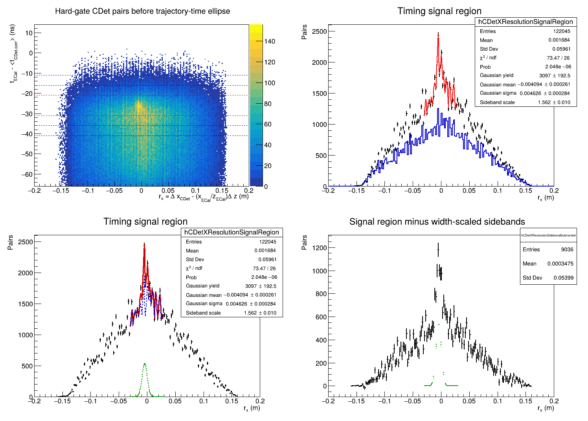

# CDet x-resolution study

## Purpose

This is a parallel diagnostic study. It does not change the analyzer pairing
or the production Run 6077 candidate selection. Its purpose is to estimate the
width of the correlated inter-layer x residual without biasing that width with
the trajectory-time ellipse.

For every Layer-1/Layer-2 pulse combination, define

```text
r_x = (x_L2,corr - x_L1,corr)
      - (x_ECal / z_ECal) * (z_L2 - z_L1).
```

The first term is the observed displacement between the CDet layers. The
second is the displacement expected from the target-to-ECal trajectory. A
true associated pair should therefore produce a narrow structure near zero,
up to alignment offsets. Accidental combinations produce a broad background.

## Selection used by the study

`Plot_CDet_XResolutionStudy.C` reads the analyzer pulse arrays rather than the
stored final pairs. It requires complete calibrated good pulses and applies
the production hard pair requirements:

```text
|t_L2 - t_L1| <= 15 ns
|x_L2,corr - x_L1,corr| <= 0.15 m
same-side or configured central-seam y topology
```

It deliberately does **not** apply the trajectory-time ellipse or any direct
cut on `r_x`. This distinction is essential: the analyzer-stored final pairs
have already been ECal-ranked and do not provide usable timing sidebands.

The default timing regions relative to the configured pair timing center of
`-26 ns` are:

```text
signal:       |delta_t + 26 ns| <= 5 ns
sidebands:    10 ns <= |delta_t + 26 ns| <= 15 ns
```

The combined sideband width equals the signal-region width. The fit model is a
Gaussian correlated component plus the fixed binned `r_x` shape measured in
the timing sidebands. The sideband-template normalization is allowed to float,
because the accidental rate is not constant with ECal-CDet time.

## Run 6077 command

From `scripts/cdet`, run:

```bash
root -l -b -q 'Plot_CDet_XResolutionStudy.C+("CDet_run6077_projection.conf","/path/to/Rootfiles","CDet_run6077_x_resolution")'
```

The macro writes a PDF, PNG, ROOT file, and text summary into the requested
output directory.

## Initial Run 6077 result

The six-file, 100,000-event replay gives:

| Quantity | Result |
| --- | ---: |
| ECal-admitted events | 26,634 |
| Hard-gate pulse combinations before the ellipse | 632,221 |
| Combinations in the timing signal region | 122,045 |
| Combinations in the timing sidebands | 79,383 |
| Fitted residual mean | -4.09 +/- 0.26 mm |
| Fitted inter-layer residual width | 4.63 +/- 0.28 mm |
| Nominal equal-layer estimate, `sigma(r_x)/sqrt(2)` | 3.27 mm |
| Fit chi-square/NDF | 73.5/26 |



Changing the signal half-width from 5 ns to 3 ns and using sidebands from
8--13 ns gives an inter-layer width of 4.72 +/- 0.23 mm and a nominal
single-layer value of 3.34 mm. The stability suggests that approximately
`3.3 mm` is a useful current scale for the single-layer x resolution.

## Interpretation and limitation

The nominal conversion

```text
sigma_x,CDet = sigma(r_x) / sqrt(2)
```

assumes equal, independent Layer-1 and Layer-2 resolutions and neglects the
smaller ECal, vertex, and alignment contributions. The ECal position term is
suppressed by the layer separation divided by the target-to-ECal distance,
approximately `0.10 / 6.144`.

The Gaussian fit is not statistically adequate: the residual peak visibly
contains the discrete CDet channel structure, and the default fit has a poor
chi-square probability. Therefore `3.3 mm` should be described as a
**preliminary effective resolution scale**, not yet as a final intrinsic CDet
resolution. A final extraction should model the discrete channel response,
or quote a resolution interval obtained from documented binning, fit-range,
and timing-sideband variations.
