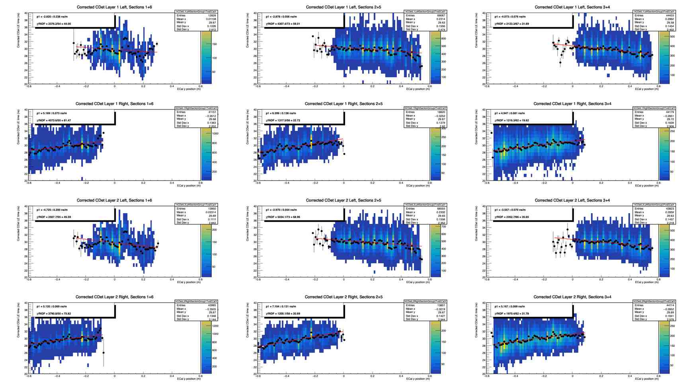
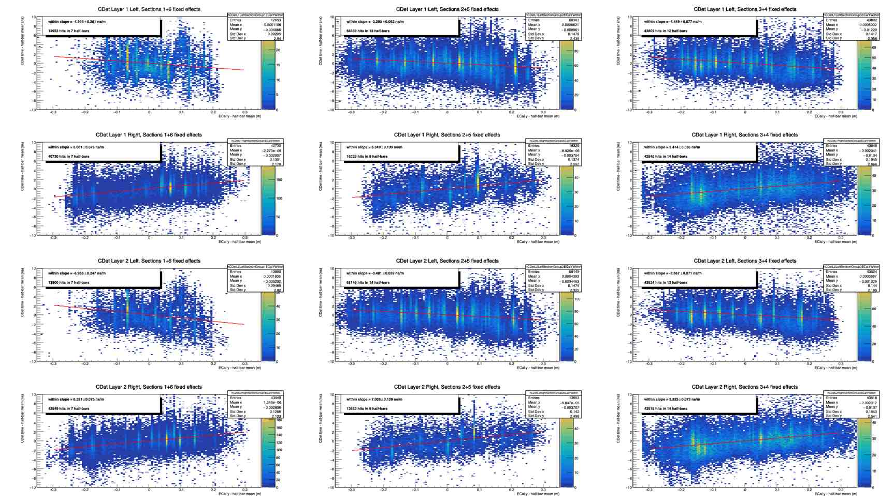
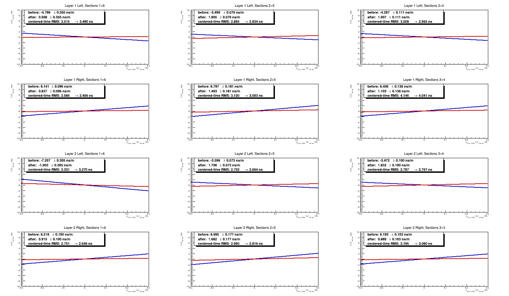
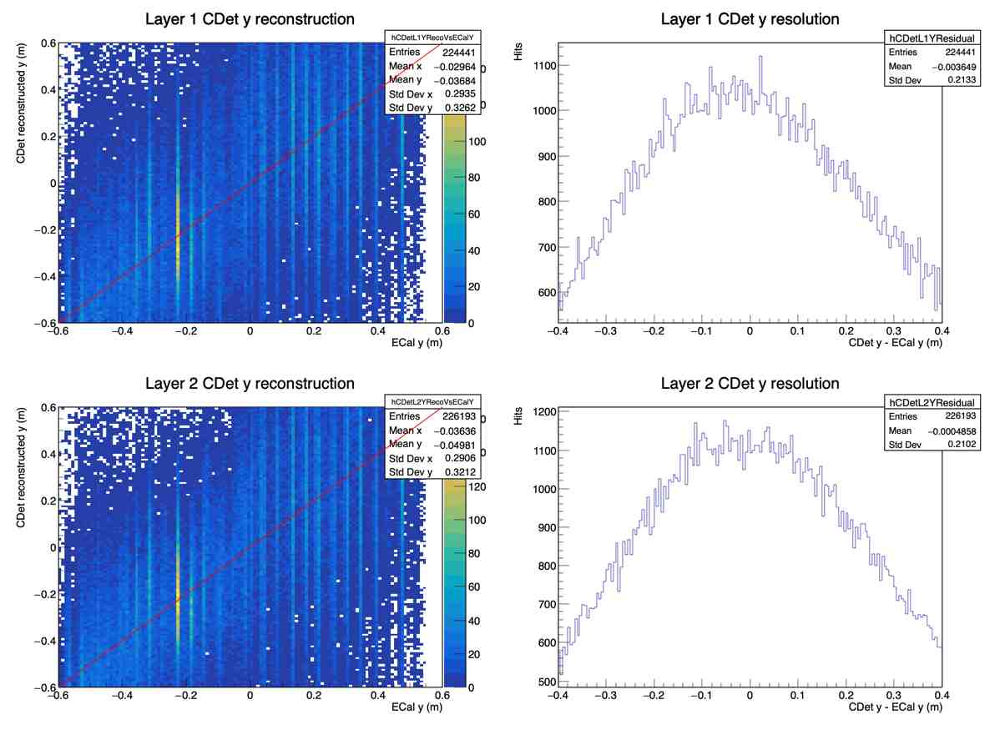
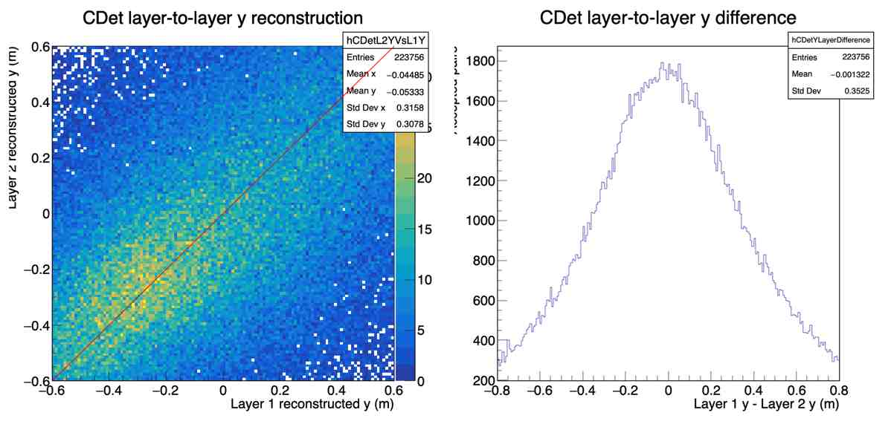

# CDet y-position reconstruction from leading-edge timing

## Purpose and scope

CDet has good segmentation in its transverse x direction, but each half-bar is
long in y. Its geometric y measurement is therefore coarse. Light-propagation
time along a scintillator provides an additional position-sensitive observable:
a hit closer to the photosensor arrives earlier than a hit farther away.

This study uses run 5710 cross-target data to measure that response and form an
approximate CDet y-position from corrected CDet leading-edge (LE) time.

The distinction between the two uses of ECal y in this study is important:

- ECal **time** supplies the event-time reference used by the CDet timing
  calibration.
- For the empirical CDet-only position response, ECal **y-position** is an
  external training and validation coordinate. Those fitted position-response
  constants are not applied to the production CDet timing calibration.
- Separately, the physics-motivated timing test projects ECal y to CDet and
  applies the propagation correction calculated from `n = 1.59`. This produces
  parallel y-corrected timing diagnostics without changing the accepted pairs
  or the master timing constants.
- The position constants are written to `CDet_y_position_calibration.dat`, not
  to `CDet_calibration_dt.dat`.

## Detector grouping

The logical CDet channels are divided into two layers and two readout sides.
The side ranges in logical pixel ID are:

| Population | Logical pixel IDs |
|---|---:|
| Layer 1 Left | 0--671 |
| Layer 1 Right | 672--1343 |
| Layer 2 Left | 1344--2015 |
| Layer 2 Right | 2016--2687 |

Each 672-channel layer/side population contains six vertical sections of seven
half-bars each. Sections 1 and 6 have the same central y geometry, as do 2 and
5, and 3 and 4. The analysis therefore uses twelve response groups:

```text
2 layers x 2 sides x 3 section pairs = 12 groups
```

The section pairs are `1+6`, `2+5`, and `3+4`. Left and right sides must remain
separate because their propagation-time slopes have opposite signs.

## Initial diagnostic

`plotCDetLayersTimeComp(...)` fills corrected CDet LE time versus reconstructed
ECal y for accepted Layer-1/Layer-2 hit pairs. The
`cCDetLayerTimeVsECalY` canvas contains twelve panels arranged as:

| Row | Readout population |
|---|---|
| 1 | Layer 1 Left |
| 2 | Layer 1 Right |
| 3 | Layer 2 Left |
| 4 | Layer 2 Right |

The three columns are section pairs `1+6`, `2+5`, and `3+4`. The canvas uses a
linear color scale, displays 20--40 ns, and suppresses bins below five entries
for clarity. These are display choices only; the underlying histograms retain
their full contents.

Profile fits show an unmistakable pattern: every left-side group has a negative
slope and every right-side group has a positive slope. Direct fits to the
pooled panels are useful visual diagnostics, but they can mix the physical
within-half-bar response with residual differences among half-bar intercepts.



*The opposite slopes on the left and right readout sides are the expected
signature of light propagation along the scintillator.*

## Fixed-effects propagation slopes

To isolate the response within a half-bar, the analysis removes the mean ECal y
and mean CDet time separately for every half-bar:

```text
y' = y_ECal - <y_ECal>_half-bar
t' = t_CDet - <t_CDet>_half-bar
```

The centered hits in each layer/side/section group are then combined and fitted
through the origin:

```text
t' = b_group y'
```

Equivalently, the unbinned fixed-effects estimate is

```text
b_group = sum(y' t') / sum(y'^2)
```

Only half-bars with at least 100 accepted hits contribute. The error on each
slope is calculated from the unbinned residual variance, with one fitted mean
removed for every contributing half-bar. The resulting distributions are shown
on `cCDetECalYFixedEffects`.

The run-5710 slopes archived for this proof of concept are:

| Layer | Side | Sections | Slope (ns/m) | Error (ns/m) |
|---:|---|---|---:|---:|
| 1 | Left | 1+6 | -4.944 | 0.281 |
| 1 | Left | 2+5 | -3.293 | 0.062 |
| 1 | Left | 3+4 | -4.449 | 0.077 |
| 1 | Right | 1+6 | +6.001 | 0.078 |
| 1 | Right | 2+5 | +6.349 | 0.139 |
| 1 | Right | 3+4 | +5.474 | 0.086 |
| 2 | Left | 1+6 | -6.966 | 0.247 |
| 2 | Left | 2+5 | -3.491 | 0.059 |
| 2 | Left | 3+4 | -3.667 | 0.071 |
| 2 | Right | 1+6 | +6.251 | 0.075 |
| 2 | Right | 2+5 | +7.005 | 0.139 |
| 2 | Right | 3+4 | +5.825 | 0.073 |

The sign reversal and its repetition in both layers are the principal evidence
that the observed correlation is a real propagation-time effect.



*Removing each half-bar's mean isolates the propagation response from
half-bar-to-half-bar timing-intercept differences.*

## Physics-motivated propagation-time correction

As a first event-by-event timing test, Run 5710 uses the fiber refractive index
`n = 1.59` rather than fitting twelve independent correction constants.  This
gives

```text
v = c/n = 18.8549 cm/ns
|dt/dy| = 1/v = 5.30367 ns/m
```

For each accepted hit, ECal y is projected to that CDet layer.  The correction
uses the displacement from the center of the hit half-bar and the readout-side
sign:

```text
y_projected = y_ECal z_CDet/z_ECal
b_left  = -5.30367 ns/m
b_right = +5.30367 ns/m
t_y_corrected = t_corrected - b_side (y_projected - y_half-bar-center)
```

Pair selection is completed using the original corrected times before this
diagnostic correction is evaluated.  The before/after comparison therefore
contains exactly the same accepted events and hits.  It is enabled for Run
5710 by

```text
display.y_correction_refractive_index: 1.59
```

in `CDet_run5710_projection.conf`.  Zero or an omitted key disables the test.
Running the normal analysis followed by
`plotCDetLayersTimeComp("CDet_run5710_projection.conf")` writes the comparison
as `CDet_y_propagation_correction_comparison.pdf` and `.png`.  It also creates
parallel corrected versions of the principal timing canvases without replacing
their uncorrected counterparts:

```text
cCDetLayerTimesYCorrected.jpg
cCDetProjectedHalfBarTimingYCorrected.jpg
cCDetTDiffYCorrected.jpg
```



For the 434,278 accepted hits in the twelve fixed-effects groups, the
entry-weighted centered-time RMS changes from 3.027 ns to 2.953 ns, a 2.45%
reduction.  The unweighted mean absolute group slope changes from 5.47 ns/m to
1.31 ns/m.  All twelve group RMS values improve.  The remaining slopes show
that one common physical speed does not absorb every geometry-dependent
correlation, but it removes most of the effect without introducing twelve
empirical calibration constants.

On the full Run 5710 accepted-pair sample, the principal timing RMS values are:

| Distribution | Before (ns) | After (ns) |
|---|---:|---:|
| All accepted Layer 1 hits | 3.171 | 3.117 |
| All accepted Layer 2 hits | 2.892 | 2.833 |
| Projected-half-bar Layer 1 hits | 2.815 | 2.749 |
| Projected-half-bar Layer 2 hits | 2.548 | 2.480 |
| Projected-half-bar pair mean | 2.414 | 2.340 |
| Layer 2 minus Layer 1 | 2.550 | 2.549 |

The near-invariance of the layer difference is expected because the two hits
usually have the same readout-side sign and nearly the same projected y, so
their propagation corrections largely cancel in `t_L2 - t_L1`.  The pair mean,
which retains the common propagation contribution, shows the clearer timing
improvement.

### Timing-resolution interpretation

The directly observed post-correction projected-half-bar pair-mean RMS is

```text
sigma(pair mean) = 2.340 ns.
```

This is the least assumption-dependent measure of the realized event-by-event
CDet timing performance.  It therefore supports quoting an operational CDet
pair-time resolution of approximately **2.3 ns RMS**.

The post-correction layer-time-difference RMS is 2.549 ns.  If the two layers
are assumed to have equal and statistically independent timing errors, the
corresponding single-layer resolution is

```text
sigma(layer) = sigma(L2 - L1)/sqrt(2)
             = 2.549/sqrt(2)
             = 1.80 ns.
```

Under the same assumptions, the intrinsic independent-layer contribution to
the average of two layers would be

```text
sigma(pair mean, independent layers) = sigma(layer)/sqrt(2)
                                     = 1.27 ns.
```

The measured pair-mean RMS is substantially wider than this ideal 1.27 ns.
Consequently, the data contain a common-mode or event-dependent contribution
that does not cancel when the two layers are averaged.  Possible contributions
include ECal reference-time resolution, residual channel offsets, event-time
variation, and non-Gaussian tails.  The 1.80 ns single-layer and 1.27 ns ideal
pair values are therefore model-dependent decompositions; neither should be
quoted as the realized full-system resolution.  The result directly justified
by these data is approximately **2.3 ns RMS** for the corrected CDet pair time.

## Position-calibration constants

Run the extractor after `plotCDetLayersTimeComp(...)`:

```cpp
extractCDetYPositionCalibration(
    "CDet_y_position_calibration.dat",
    100
)
```

The output is a ROOT `TEnv`-style file containing:

- twelve fixed-effects slopes and their uncertainties;
- a validity flag for every half-bar;
- a timing intercept for every half-bar passing the entry requirement.

For half-bar `i` belonging to response group `g`, the intercept is

```text
a_i = <t>_i - b_g <y_ECal>_i
```

and the CDet-only position estimate is

```text
y_CDet = (t_CDet - a_i) / b_g.
```

Once `a_i` and `b_g` have been determined, evaluating this expression uses
only CDet channel identity and corrected CDet LE time. It does not use the ECal
position of the event.

## Validation

Validate the calibration with:

```cpp
plotCDetYPositionResolution(
    "CDet_y_position_calibration.dat"
)
```

`cCDetYPositionResolution` compares the reconstructed CDet coordinate with
ECal y and plots `y_CDet - y_ECal` separately for each layer. For run 5710:

| Layer | Mean residual | Residual RMS |
|---:|---:|---:|
| 1 | -0.00365 m | 0.2133 m |
| 2 | -0.00486 m | 0.2102 m |

These approximately 21 cm widths include CDet resolution, ECal position
resolution, projection effects, backgrounds, and non-Gaussian tails. They are
therefore not direct measurements of an intrinsic Gaussian CDet resolution.



*The ECal comparison gives residual RMS widths of approximately 21 cm in each
layer for this proof-of-concept calibration.*

The same validation call creates `cCDetYLayerComparison`. It uses accepted
Layer-1/Layer-2 hit pairs and does not include ECal y in the event-by-event
residual:

```text
mean(y_L1 - y_L2) = -0.00132 m
RMS(y_L1 - y_L2)  =  0.3525 m
```

If the two layers have equal and independent errors, the corresponding
single-layer estimate is

```text
0.3525 / sqrt(2) = 0.249 m.
```

The visible Layer-1/Layer-2 correlation is important independent evidence that
CDet timing contains usable y information. The `1/sqrt(2)` interpretation is
only approximate because the two layer errors need not be equal or completely
independent.



*The layer-to-layer correlation demonstrates that the position information is
present in CDet timing itself rather than being an artifact of plotting both
layers against ECal y.*

## Complete interactive workflow

Starting from a fresh ROOT session in `scripts/cdet`:

```cpp
.L PlotElastic_Calibration_Master_stageflag_singlefile_crosstarget.C+

PlotElastic_Calibration_Master_stageflag_singlefile_crosstarget(
    "CDet_run5710_projection.conf")

plotCDetLayersTimeComp("CDet_run5710_projection.conf")

extractCDetYPositionCalibration(
    "CDet_y_position_calibration.dat",
    100
)

plotCDetYPositionResolution(
    "CDet_y_position_calibration.dat"
)
```

After the main analysis and `plotCDetLayersTimeComp(...)` have run, the
extractor and validation functions may be repeated without rerunning the event
loop, provided the same ROOT session remains active.

## Interpretation and limitations

This is an encouraging proof of concept, not yet a production reconstruction:

- The calibration and quoted ECal residuals use the same run, so an independent
  run or train/test split is needed to measure out-of-sample performance.
- A single slope is shared by each section pair. More statistics may justify
  testing finer groupings without overfitting.
- The residual distributions are broad and non-Gaussian; both RMS and a robust
  core-width measure should be reported in future studies.
- Timing uncertainty is magnified by `1/|b|`, so groups with smaller slopes
  naturally have poorer position resolution.
- Half-bars below the 100-hit threshold currently receive no position estimate.
- Run dependence and stability across detector conditions have not yet been
  established.

Most importantly, none of this work changes the established Run 5710 master or
run-specific timing constants. It adds two optional analysis products: a
separate response model that converts calibrated CDet time into an approximate
position, and parallel timing diagnostics with the physics-motivated ECal-y
propagation correction applied event by event.

## Archived record

The canonical plots and calibration file are preserved in:

```text
scripts/cdet/CDet_run5710_y_position_proof_of_concept_archive/
```

The corresponding Git tag is:

```text
cdet-run5710-y-position-proof-of-concept-v1.0
```

Additional loose session outputs were moved outside the repository to:

```text
~/CDet_replay/local_calibration_archives/run5710_diagnostics_2026-09-05/
```
