# Run 5710 CDet timing-calibration visual acceptance review

Date generated: 2026-09-11

## Current configuration-authoritative qualification

The comparison below records the earlier matched qualification that selected
the reproducible workflow. The workflow was subsequently rerun from a clean
state with `CDet_run5710_projection.conf` authoritative for every analysis and
plotting stage. The project lead visually accepted the resulting
`plotCDetLayersTimeComp` canvases on 2026-09-11.

The current production constants and closure are:

```text
master p0       = 14.807420 ns
master p1       = 0.810203 ns/ns
master delta    = 31.680784 ns
time walk L1/L2 = 13.987991 / 15.764852
time-walk fit ToT range = 5--25 ns
analysis ToT acceptance = 4--30 ns
run shift_ns    = 1.195534 ns
accepted pairs  = 217367 before / 217367 after
core centroid   = 30.0000 +/- 0.0042 ns
residual slope  = 0.000005 +/- 0.001681 ns/ns
```

These values supersede the earlier candidate constants quoted later in this
historical comparison package. The earlier plots and measurements remain here
as provenance for the workflow-selection decision; they are not the active
calibration files.

This package compares the established Run 5710 calibration
(`CDet_calibration_dt_run5710_gold_comparison.dat`) with the accepted
clean-workflow result (`CDet_calibration_dt_run5710_accepted.dat`). Both files were applied to the
same 2,951,891 Run 5710 events using the same current analysis macro, Stage 7
selection, cuts, binning, fit ranges, and diagnostic functions.

Parameter identity is not an acceptance requirement. The established file was
the endpoint of a developmental sequence that was not recorded as a fully
replayable transformation. Acceptance is based on calibrated observables.

## Quantitative comparison

| Observable | Gold | Candidate | Assessment |
|---|---:|---:|---|
| Accepted pairs | 222,426 | 222,245 | Equivalent (-0.081%) |
| Pair-time mean (ns) | 29.3757 | 28.4032 | Global-origin shift; not a resolution metric |
| Full pair-time RMS (ns) | 2.20947 +/- 0.00331 | 2.17220 +/- 0.00326 | Candidate narrower by 1.69% |
| Gaussian core sigma (ns) | 2.02040 +/- 0.00380 | 1.96747 +/- 0.00400 | Candidate narrower by 2.62% |
| Combined fixed-effects ECal slope (ns/ns) | 0.001293 +/- 0.001388 | -0.000217 +/- 0.001373 | Both consistent with zero |
| Validated half-bars | 122 / 168 | 121 / 168 | Equivalent |
| Between-half-bar intercept RMS (ns) | 0.213408 | 0.107787 | Candidate narrower |
| Projected pair-mean RMS (ns) | 2.06253 | 2.02285 | Candidate narrower by 1.92% |

The approximately 0.97 ns difference in the mean calibrated time is an
absolute-origin (gauge) difference. It does not broaden either layer or create
a residual ECal-time slope. A downstream analysis that requires a particular
absolute CDet time origin should state that requirement separately.

## Matched visual comparisons

### Paired-layer timing resolution

| Gold | Candidate |
|---|---|
| 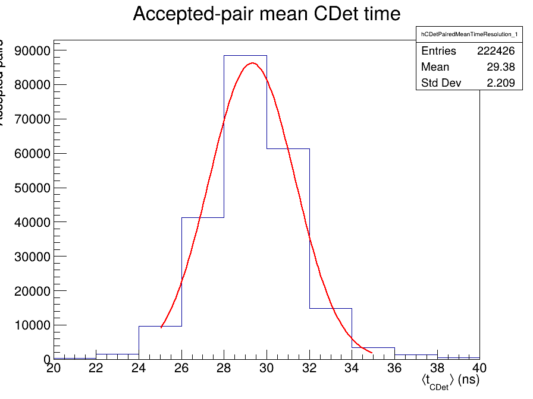 | 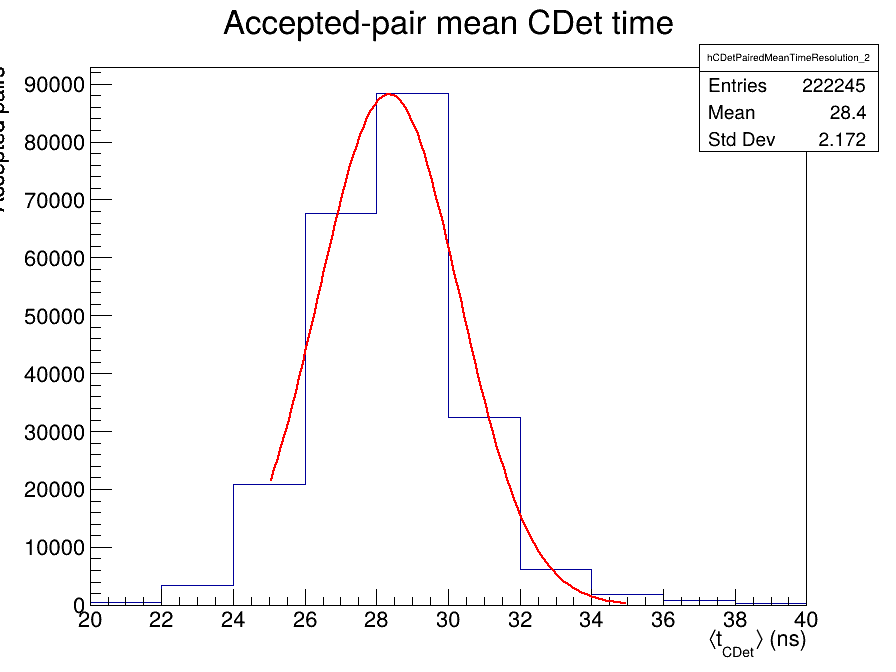 |

Review for core width, asymmetry, secondary peaks, and long tails. The candidate
has a slightly narrower full distribution and Gaussian core; no new component
or tail is apparent.

### Within-half-bar ECal-time closure

| Gold | Candidate |
|---|---|
| 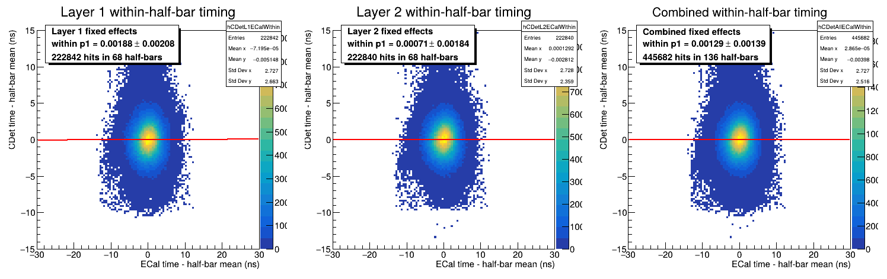 | 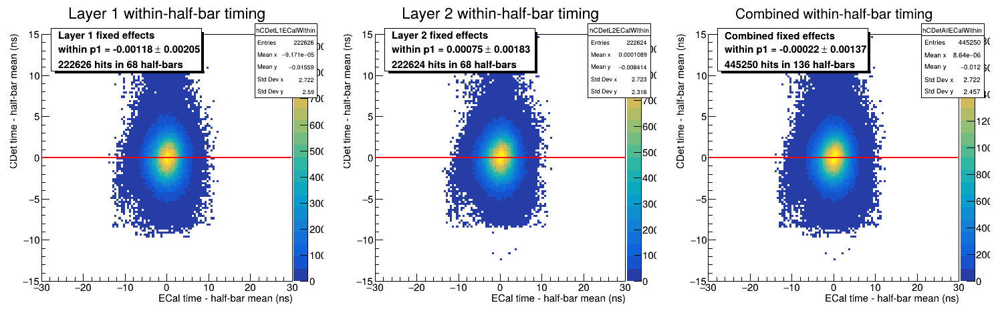 |

Review for a residual diagonal trend separately in each layer and combined.
Both slopes are statistically consistent with zero. The candidate cloud is
slightly narrower vertically.

### Half-bar intercept alignment

| Gold | Candidate |
|---|---|
| 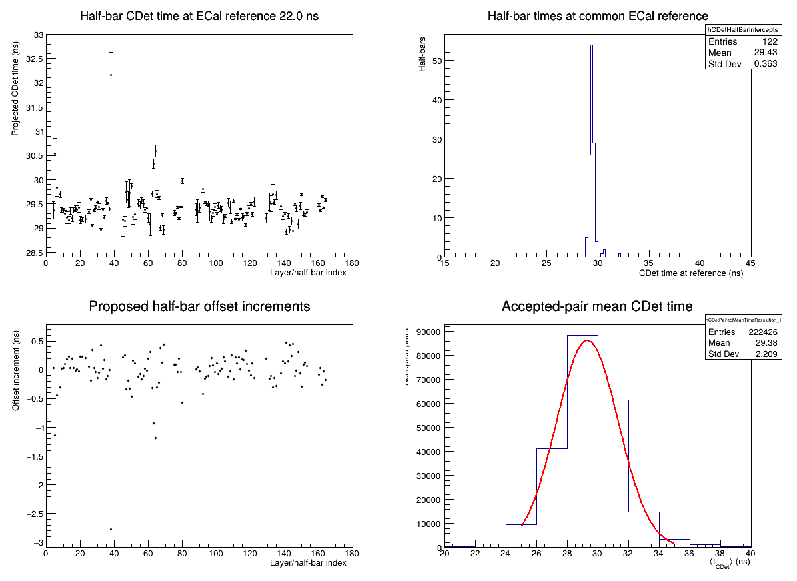 | 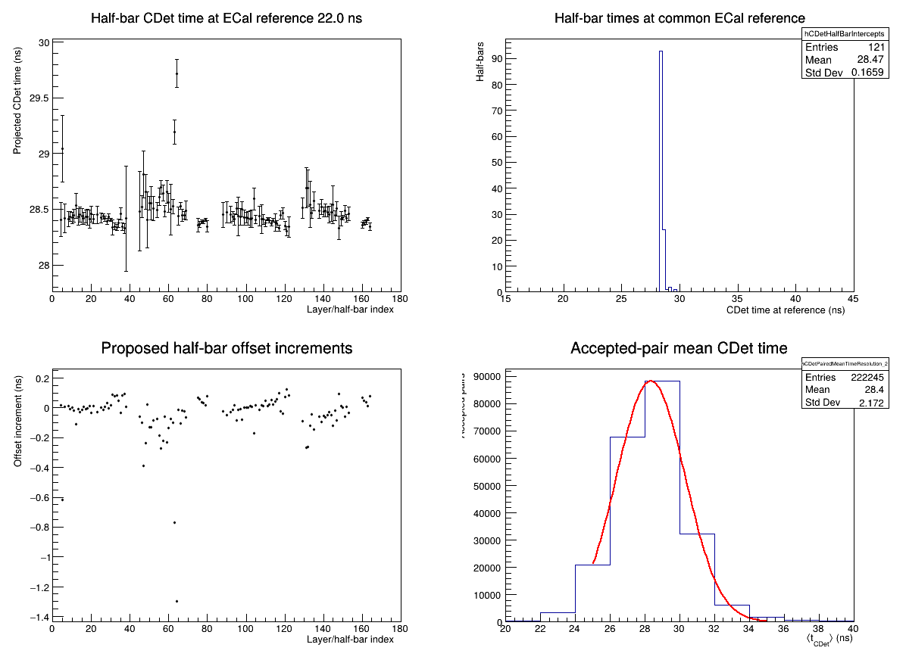 |

Review the intercept sequence for coherent bank/section structure and isolated
outliers. The candidate is visibly tighter overall and requires smaller
prospective corrections. It has one fewer half-bar passing the common quality
threshold; the identity of that half-bar should be checked if channel-level
completeness is a hard requirement.

### Residual leading-edge time versus ToT

| Gold | Candidate |
|---|---|
| 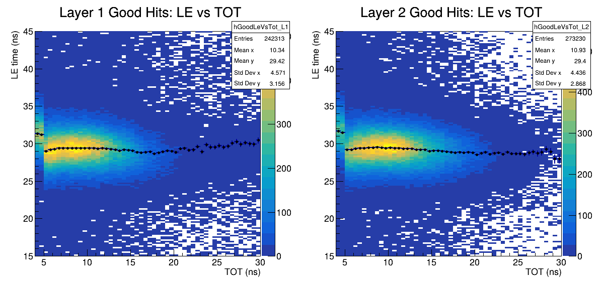 | 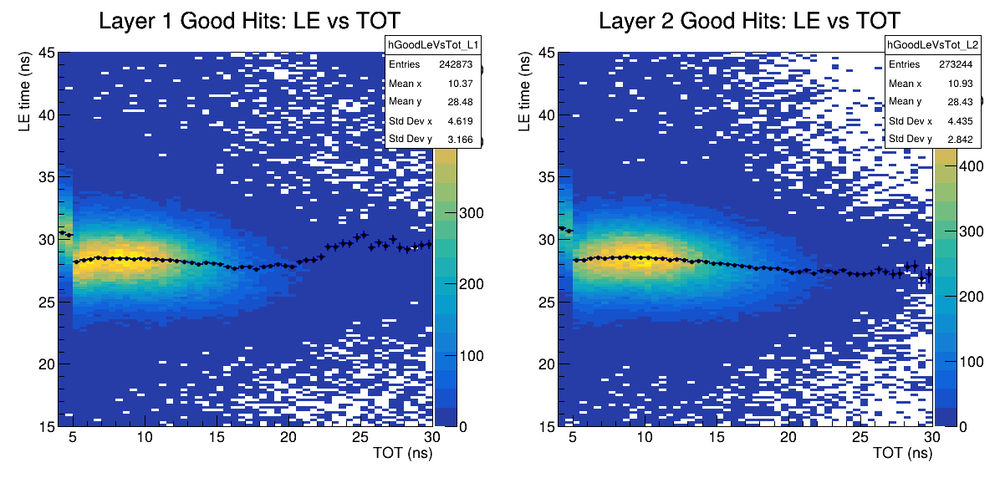 |

Review for systematic curvature or a layer-specific slope across the populated
ToT range. The candidate and gold show comparable residual structure. Neither
is perfectly flat at sparsely populated high ToT, so this plot should remain a
routine diagnostic rather than an exact-equality gate.

### Layer timing spectra

| Gold | Candidate |
|---|---|
| 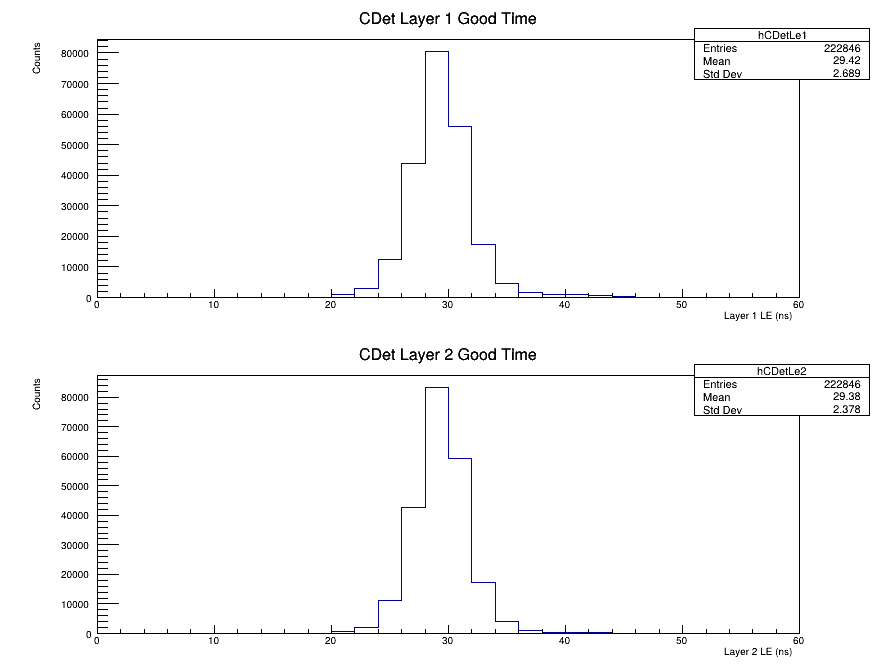 | 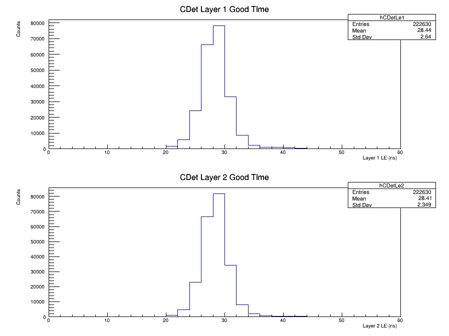 |

The candidate preserves the layer-to-layer agreement and tail structure while
shifting the common absolute origin.

### ECal-projected half-bar timing

| Gold | Candidate |
|---|---|
| 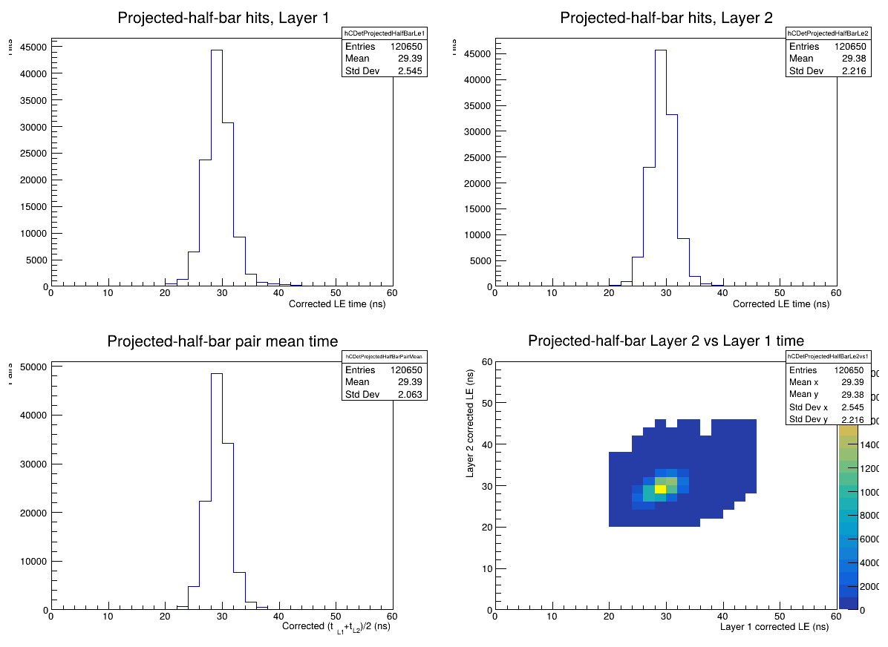 | 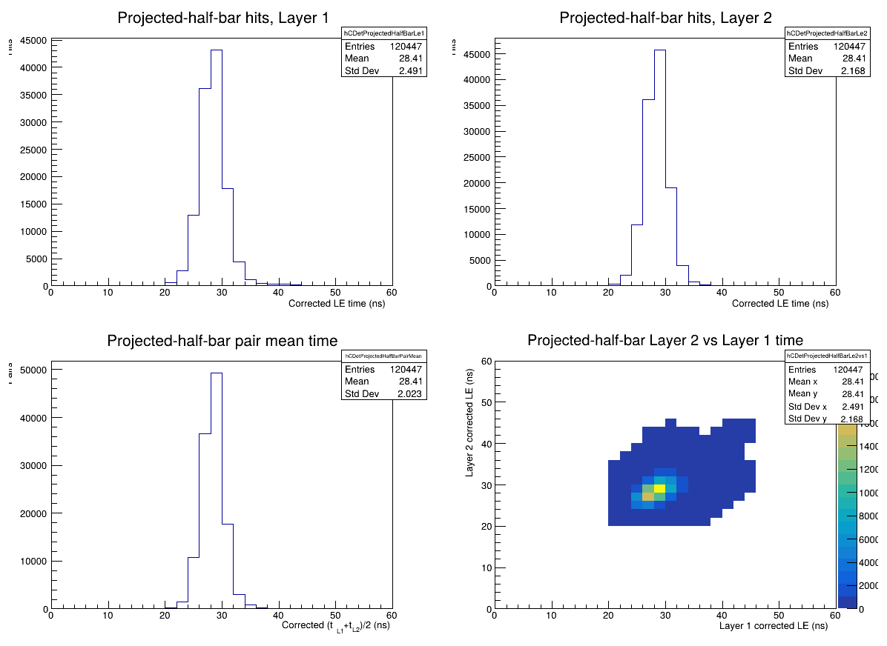 |

The candidate has slightly narrower Layer 1, Layer 2, and pair-mean widths.
The two-dimensional layer correlation shows no new population.

Additional matched plots are available in `diagnostics/gold/` and
`diagnostics/candidate/`, in both PNG and PDF form.

## Human sign-off

- [x] No unacceptable new tail, satellite peak, or multimodal structure.
- [x] Layer 1 and Layer 2 remain mutually aligned.
- [x] Residual ECal-time dependence is acceptably flat.
- [x] Residual ToT dependence is acceptably small over the populated range.
- [x] Half-bar structure and isolated outliers are acceptable.
- [x] The one-half-bar difference in validation count is understood or accepted.
- [x] The approximately 0.97 ns absolute-origin shift is acceptable for downstream analyses.
- [x] Candidate calibration accepted for the documented workflow.

Reviewer: Project lead (sign-off recorded in the associated Codex session)

Date: 2026-09-11

Comments:

All eight human-review points and the technical recommendation were explicitly
accepted.

The matched evaluation completed successfully as Codex Process Job
`job-mtwsp0ir-485a2fb3`. The accepted constants were produced by the corrected
clean Stage-8 seed followed by the preserved 102-cut review, fixed-effects
ECal closure, and half-bar alignment sequence now implemented in
`../Run_CDet_Calibration_Run5710_Accepted.C`.

The production driver was subsequently run end-to-end from an isolated blank
directory over all 2,951,891 events as Codex Process Job
`job-mtwt0piv-13c824c2`. It completed successfully and regenerated the accepted
calibration byte-for-byte. Both files have SHA-256:

```text
da138752364886d0bf634c5bc88f8a54122ecc2692be2a466a3e27fcb75e6092
```

That verification produced final ECal parameters `p0 = 15.323476 ns`,
`p1 = 0.816888 ns/ns`, and `delta = 31.718756 ns`; time-walk parameters
`13.678258` and `15.663342 ns*sqrt(ns)`; half-bar intercept RMS `0.109896 ns`;
full paired-time RMS `2.17159 ns`; and Gaussian core sigma `1.96634 ns`.

## Preliminary technical recommendation

Accept the candidate on timing performance, subject to human confirmation of
the channel-completeness and absolute-origin items above. On the matched Run
5710 sample, the candidate is not merely close to the gold calibration: it is
slightly better on every reported width and is equivalently closed against
ECal time.
